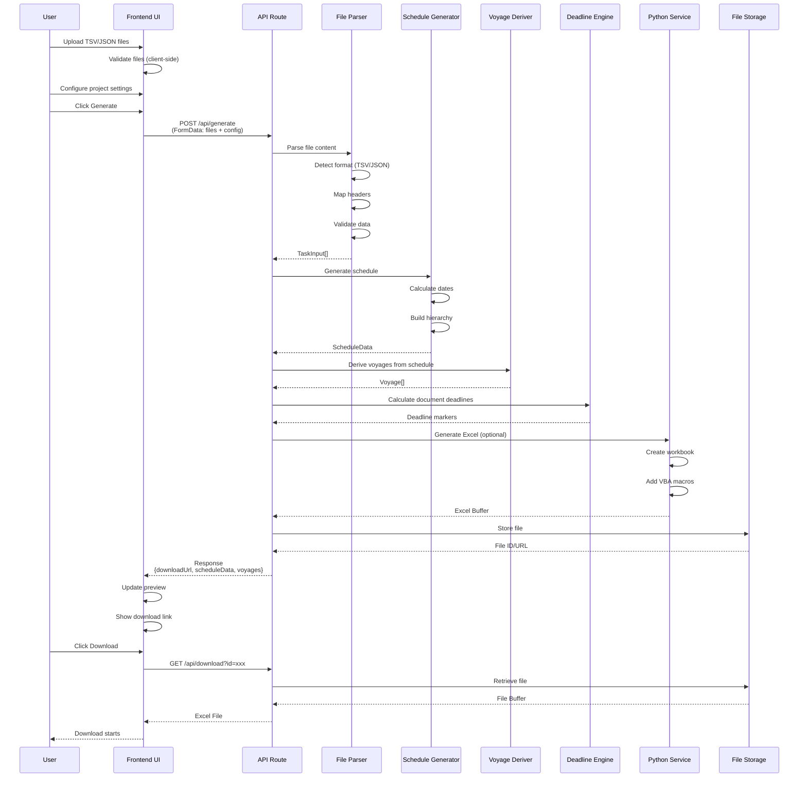
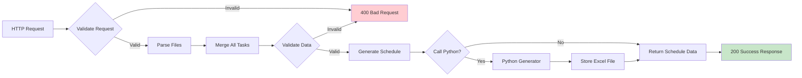

AGI TR Gantt Generator

**Multi-scenario Excel Gantt Chart Workbook Generator Web Application**

[](https://nextjs.org/)
[](https://www.typescriptlang.org/)
[](https://reactjs.org/)
[](https://tailwindcss.com/)

## 📋 Overview

AGI TR Gantt Generator is a modern web application for generating professional multi-scenario Gantt chart Excel workbooks from TSV/JSON task data files. The application supports hierarchical Work Breakdown Structure (WBS) with 3-level activity IDs and generates interactive Excel files with VBA automation capabilities.

### Key Features

- 📤 **Multi-format File Upload**: Supports TSV, CSV, and JSON input files
- 📊 **3-Level WBS Hierarchy**: Activity ID (1), (2), (3) for project organization
- 🎯 **Multi-scenario Generation**: Optimistic, Baseline, and Pessimistic scenarios
- 📈 **Interactive Excel Output**: Generated workbooks with VBA macros
- 📋 **Voyage Documents Management**: Document checklist, deadline tracking, workflow state management (Submit/Approve/Reset/Reopen actions)
- 📅 **Deadline Overlay**: Document deadline visualization on Gantt chart
- 📊 **Docs Progress Overlay**: Document progress display on Gantt Trip rows (click to navigate to Docs tab)
- 🌊 **Water Tide Data**: Comprehensive tide data visualization with date selection, high/low tide windows, and height tracking
- 🎨 **Modern UI**: Built with Next.js, React, and Tailwind CSS
- 🌙 **Dark Mode Support**: Automatic theme switching
- ⚡ **Real-time Preview**: Visual Gantt chart preview with 6 tab views before download
- 🔄 **Bulk Processing**: Upload and process multiple files simultaneously

## 🏗️ System Architecture

### High-Level Architecture

```mermaid
graph TB
    subgraph "Client Browser"
        UI[Next.js Frontend<br/>React 19 + TypeScript]
        UI --> |User Actions| Upload[File Upload]
        UI --> |User Actions| Config[Configuration Panel]
        UI --> |Display| Preview[Gantt Preview]
    end

    subgraph "Next.js Server"
        API[API Routes<br/>App Router]
        Parser[File Parser<br/>lib/file-parser.ts]
        Scheduler[Schedule Generator<br/>app/api/generate/route.ts]
        VoyageDeriver[Voyage Deriver<br/>lib/voyage/derive-voyages.ts]
        DeadlineEngine[Deadline Engine<br/>lib/documents/deadline-engine.ts]
    end

    subgraph "External Services"
        Python[Python Excel Generator<br/>Optional Integration]
        Storage[File Storage<br/>S3/Filesystem/Redis]
    end

    Upload --> |HTTP POST| API
    Config --> |HTTP POST| API
    API --> Parser
    Parser --> Scheduler
    Scheduler --> VoyageDeriver
    VoyageDeriver --> DeadlineEngine
    Scheduler --> |Schedule Data + Voyage| Preview
    DeadlineEngine --> |Deadline Info| Preview
    Scheduler --> |Optional| Python
    Python --> Storage
    Storage --> |Download URL| UI

### Component Architecture

```mermaid
graph TD
    Root[GanttGenerator<br/>Root Component]

    Root --> FileUpload[FileUploader<br/>- Drag & Drop<br/>- Validation<br/>- Multi-file]
    Root --> ConfigPanel[ConfigurationPanel<br/>- Project Start Date<br/>- Scenario Selection]
    Root --> GenStatus[GenerationStatus<br/>- Generate Button<br/>- Progress Indicator<br/>- Download Link]
    Root --> Preview[GanttPreview<br/>- Visual Chart<br/>- Task Hierarchy<br/>- Timeline View<br/>- 6 Tab Views]
    Root --> WaterTidePanel[WaterTidePanel<br/>- Compact Tide Display<br/>- Date Selection]
    Preview --> WaterTideTab[WaterTideTab<br/>- Detailed Tide View<br/>- High/Low Tide Info]

    FileUpload --> |Files| Root
    ConfigPanel --> |Config| Root
    GenStatus --> |API Call| Root
    Root --> |Schedule Data| Preview
```

### Data Flow



### File Processing Pipeline

```mermaid
flowchart LR
    Input[Input File<br/>TSV/JSON] --> Detect{Detect Format}
    Detect -->|TSV/CSV| TSVParser[TSV Parser]
    Detect -->|JSON| JSONParser[JSON Parser]

    TSVParser --> HeaderMap[Header Mapping<br/>Normalize column names]
    JSONParser --> Validate[Validate Structure]
    HeaderMap --> Validate

    Validate --> Transform[Transform to TaskInput]
    Transform --> Hierarchy[Build WBS Hierarchy<br/>Level 1, 2, 3]
    Hierarchy --> Output[TaskInput[]<br/>Validated Tasks]

    style Input fill:#e1f5ff
    style Output fill:#c8e6c9
```

### API Request Flow



## 🇰🇷 Korean Documentation

The main documentation for this project is available in Korean.

- **[README (한국어)](./README_KO.md)** - Project overview and quick start
- **[시스템 아키텍처](./SYSTEM_ARCHITECTURE_KO.md)** - Technical architecture documentation
- **[시스템 레이아웃](./SYSTEM_LAYOUT.md)** - Component structure and UI layout
- **[배포 가이드](./DEPLOYMENT_KO.md)** - Detailed deployment instructions

## 📚 English Documentation

English documentation is available in the `docs/en/` directory:

- **[README (English)](./docs/en/README.md)** - Project overview and quick start
- **[System Architecture](./docs/en/SYSTEM_ARCHITECTURE.md)** - Technical architecture documentation
- **[System Layout](./docs/en/SYSTEM_LAYOUT_EN.md)** - Component structure and UI layout
- **[Deployment Guide](./docs/en/DEPLOYMENT.md)** - Detailed deployment instructions
- **[Document Workflow Guide](./docs/DOCUMENT_WORKFLOW_GUIDE.md)** - Deadline calculation logic and hybrid layout usage guide

## 🚀 Quick Start

### Prerequisites

- **Node.js** 18.0 or higher
- **pnpm** (recommended) or npm/yarn

### Installation

```bash
# Clone the repository
git clone https://github.com/macho715/agi-tr-gantt.git
cd agi-tr-gantt

# Install dependencies
pnpm install

# Run development server
pnpm dev
```

Open [http://localhost:3000](http://localhost:3000) in your browser.

### Production Build

```bash
# Build for production
pnpm build

# Start production server
pnpm start
```

## 📁 Input File Format

### TSV/CSV Format

Your input file must include the following columns (case-insensitive):

| Column Name       | Required           | Description                                     |
| ----------------- | ------------------ | ----------------------------------------------- |
| Activity ID (1)   | Optional           | WBS Level 1 identifier                          |
| Activity ID (2)   | Optional           | WBS Level 2 identifier (used for trip grouping) |
| Activity ID (3)   | Optional           | WBS Level 3 identifier                          |
| Activity Name     | **Required** | Task/activity description                       |
| Original Duration | **Required** | Duration in days                                |
| Planned Start     | **Required** | Start date (YYYY-MM-DD)                         |
| Planned Finish    | **Required** | End date (YYYY-MM-DD)                           |

#### Example TSV

```tsv
Activity ID (1)	Activity ID (2)	Activity ID (3)	Activity Name	Original Duration	Planned Start	Planned Finish
1.0	1.1	1.1.1	Site Preparation	14	2025-02-01	2025-02-15
1.0	1.1	1.1.2	Foundation Work	21	2025-02-16	2025-03-09
1.0	1.2	1.2.1	Material Procurement	30	2025-02-01	2025-03-03
```

### JSON Format

```json
{
  "tasks": [
    {
      "activityId1": "1.0",
      "activityId2": "1.1",
      "activityId3": "1.1.1",
      "activityName": "Site Preparation",
      "originalDuration": 14,
      "plannedStart": "2025-02-01",
      "plannedFinish": "2025-02-15"
    }
  ]
}
```

## 🏗️ Project Structure

```
agi-tr-gantt/
├── app/                      # Next.js App Router
│   ├── api/                  # API Routes
│   │   ├── generate/         # Excel generation endpoint
│   │   └── download/        # File download endpoint
│   ├── layout.tsx            # Root layout
│   ├── page.tsx              # Home page
│   └── globals.css           # Global styles
├── components/               # React components
│   ├── ui/                   # shadcn/ui components
│   ├── documents/            # Document management components
│   │   ├── document-checklist.tsx
│   │   └── voyage-mini-grid.tsx
│   ├── overlays/             # Overlay components
│   │   ├── deadline-ladder-overlay.tsx
│   │   └── docs-progress-overlay.tsx
│   ├── water-tide-panel.tsx  # Water Tide compact panel
│   ├── water-tide-tab.tsx    # Water Tide detailed tab view
│   ├── configuration-panel.tsx
│   ├── file-uploader.tsx
│   ├── gantt-generator.tsx
│   ├── gantt-preview.tsx
│   └── generation-status.tsx
├── contexts/                 # React Context
│   └── voyage-context.tsx    # Voyage state management
├── lib/                      # Utility libraries
│   ├── documents/            # Document-related logic
│   │   ├── deadline-engine.ts
│   │   ├── to-deadline-markers.ts
│   │   └── workflow.ts
│   ├── voyage/               # Voyage-related logic
│   │   ├── derive-voyages.ts
│   │   └── trip-groups.ts
│   ├── file-parser.ts        # File parsing logic
│   ├── types.ts              # TypeScript type definitions
│   └── utils.ts              # Helper functions
├── data/                     # Sample data files
│   ├── activity-data.json
│   ├── doc-templates.json    # Document template definitions
│   ├── milestone-map.json    # Milestone pattern mapping
│   ├── tide-data.json        # Legacy tide data (legacy format)
│   ├── tide-data-2026Q1.json # Water Tide dataset (2026 Q1)
│   └── weather-data.json
├── hooks/                    # Custom React hooks
├── public/                   # Static assets
└── styles/                   # Additional stylesheets
```

## 🔧 Configuration

### Project Configuration

- **Project Start Date**: Base date for schedule calculations
- **Scenarios**: Select which scenarios to generate (Optimistic, Baseline, Pessimistic)

### Environment Variables

Create a `.env.local` file for production deployment:

```env
# Python Integration (for Excel generation)
PYTHON_API_URL=https://your-python-api.com/generate
PYTHON_API_KEY=your-api-key

# File Upload Limits
MAX_FILE_SIZE=10485760  # 10MB in bytes
GENERATION_TIMEOUT=60000  # 60 seconds in milliseconds
```

## 📦 API Endpoints

### POST `/api/generate`

Generates Excel workbook from uploaded files.

**Request:**

- `files`: Array of File objects (TSV/JSON)
- `config`: JSON string with project configuration

**Response:**

```json
{
  "success": true,
  "downloadUrl": "/api/download?id=1234567890",
  "filename": "gantt_schedule_2025-01-01.xlsx",
  "scenarioCount": 3,
  "taskCount": 45,
  "scheduleData": { ... }
}
```

### GET `/api/download?id={id}`

Downloads the generated Excel file.

## 🛠️ Technology Stack

- **Framework**: Next.js 16 (App Router)
- **UI Library**: React 19
- **Language**: TypeScript 5
- **Styling**: Tailwind CSS 4
- **UI Components**: Radix UI + shadcn/ui
- **Date Handling**: date-fns
- **Charts**: Recharts
- **Icons**: Lucide React
- **Package Manager**: pnpm

## 🧪 Development

```bash
# Run development server with hot reload
pnpm dev

# Run linter
pnpm lint

# Type checking
pnpm type-check  # if configured in package.json
```

## 🚢 Deployment

See [DEPLOYMENT.md](./docs/en/DEPLOYMENT.md) or [DEPLOYMENT_KO.md](./DEPLOYMENT_KO.md) for detailed deployment instructions.

### Vercel (Recommended)

[](https://vercel.com/new/clone?repository-url=https://github.com/macho715/agi-tr-gantt)

1. Push your code to GitHub
2. Import project in Vercel
3. Configure environment variables
4. Deploy!

## 📝 Python Integration

For Excel workbook generation, integrate with a Python backend. See [`docs/en/DEPLOYMENT.md`](./docs/en/DEPLOYMENT.md) or [`DEPLOYMENT_KO.md`](./DEPLOYMENT_KO.md) for integration options:

- Subprocess execution
- Docker container
- Serverless function (AWS Lambda)

## 📚 Documentation

- [Deployment Guide](./docs/en/DEPLOYMENT.md) / [배포 가이드 (한국어)](./DEPLOYMENT_KO.md) - Detailed deployment instructions
- [System Architecture](./docs/en/SYSTEM_ARCHITECTURE.md) / [시스템 아키텍처 (한국어)](./SYSTEM_ARCHITECTURE_KO.md) - Technical architecture documentation
- [System Layout](./SYSTEM_LAYOUT.md) / [System Layout (English)](./docs/en/SYSTEM_LAYOUT_EN.md) - Detailed component structure
- [Document Workflow Guide](./docs/DOCUMENT_WORKFLOW_GUIDE.md) - Deadline calculation logic and hybrid layout usage guide

## 🤝 Contributing

Contributions are welcome! Please feel free to submit a Pull Request.

## 📄 License

This project is private and proprietary.

## 📞 Support

For issues and questions, please open an issue on GitHub.

---

**Built with ❤️ using Next.js and TypeScript**
