# System Architecture

**AGI TR Gantt Generator - Technical Architecture Document**

Version: 1.0.0
Last Updated: 2025-01-01

---

## Table of Contents

1. [System Overview](#system-overview)
2. [Architecture Diagrams](#architecture-diagrams)
3. [Component Architecture](#component-architecture)
4. [Data Flow](#data-flow)
5. [API Architecture](#api-architecture)
6. [File Processing Pipeline](#file-processing-pipeline)
7. [State Management](#state-management)
8. [Technology Stack](#technology-stack)
9. [Security Architecture](#security-architecture)
10. [Performance Considerations](#performance-considerations)
11. [Scalability](#scalability)

---

## System Overview

AGI TR Gantt Generator is a client-server web application built on the Next.js framework. The system processes structured task data (TSV/JSON) and generates multi-scenario Excel Gantt chart workbooks.

### Core Objectives

- **Input Processing**: Parse and validate TSV/JSON task files with hierarchical WBS structure
- **Schedule Generation**: Transform task data into schedule scenarios (Optimistic, Baseline, Pessimistic)
- **Excel Output**: Generate interactive Excel workbooks with VBA automation
- **User Experience**: Provide intuitive UI with real-time preview and status feedback

---

## Architecture Diagrams

### High-Level System Architecture

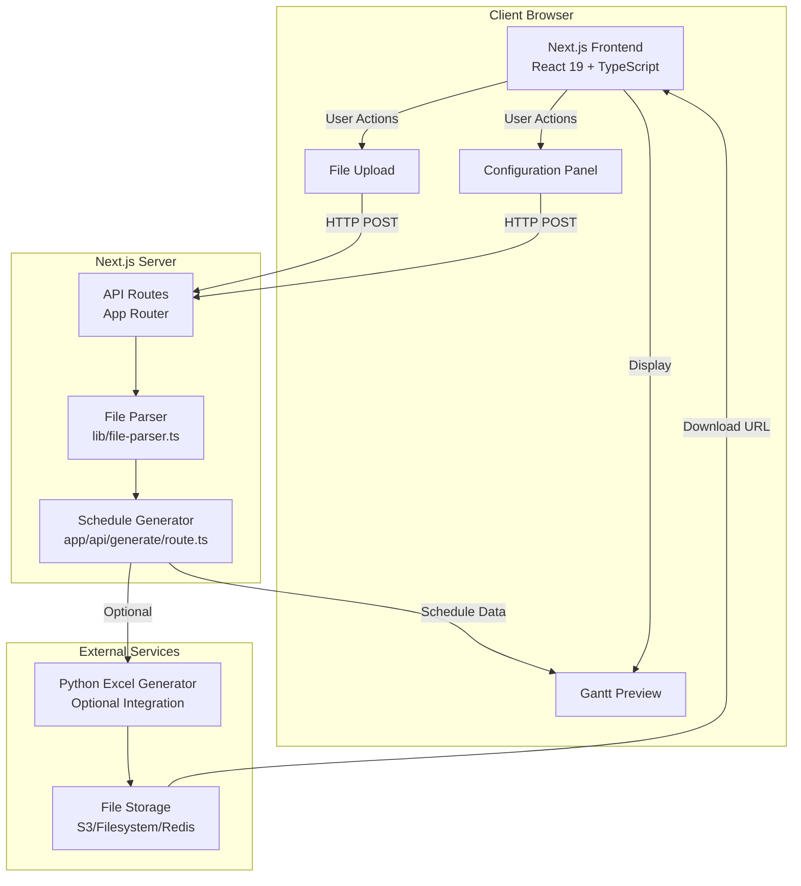

### Component Architecture

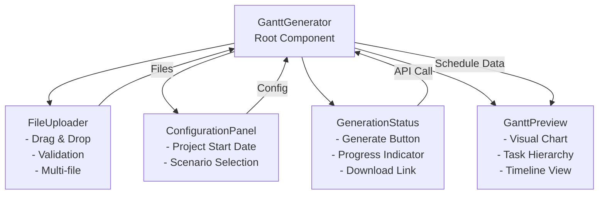

### Data Flow Diagram

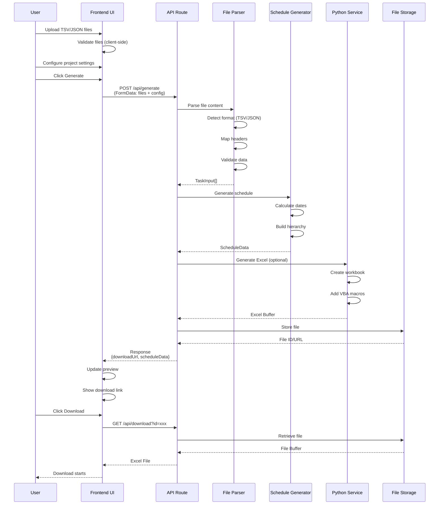

### File Processing Pipeline

```mermaid
flowchart LR
    Input[Input File<br/>TSV/JSON] --> Detect{Detect Format}
    Detect -->|TSV/CSV| TSVParser[TSV Parser]
    Detect -->|JSON| JSONParser[JSON Parser]

    TSVParser --> HeaderMap[Header Mapping<br/>Normalize column names]
    JSONParser --> Validate[Validate Structure]
    HeaderMap --> Validate

    Validate --> Transform[Transform to TaskInput]
    Transform --> Hierarchy[Build WBS Hierarchy<br/>Level 1, 2, 3]
    Hierarchy --> Output[TaskInput[]<br/>Validated Tasks]

    style Input fill:#e1f5ff
    style Output fill:#c8e6c9
```

### API Request Flow

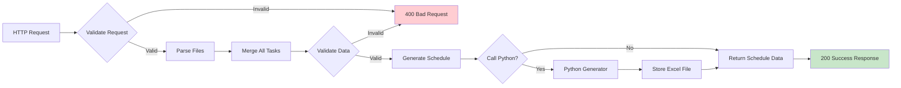

---

## Component Architecture

### Frontend Components

#### 1. **GanttGenerator** (Container Component)
- **Location**: `components/gantt-generator.tsx`
- **Responsibility**: Main orchestrator component
- **State Management**:
  - `uploadedFiles`: Array of parsed file data
  - `config`: Project configuration (start date, scenarios)
  - `isGenerating`: Loading state
  - `result`: Generation result with download URL
  - `error`: Error messages
  - `scheduleData`: Parsed schedule for preview

#### 2. **FileUploader**
- **Location**: `components/file-uploader.tsx`
- **Responsibility**: File upload and validation
- **Features**:
  - Drag & drop support
  - Multiple file selection
  - File type validation (TSV/JSON)
  - Size limit enforcement (10MB)
  - Real-time parsing feedback

#### 3. **ConfigurationPanel**
- **Location**: `components/configuration-panel.tsx`
- **Responsibility**: Project settings
- **Configurable**:
  - Project start date
  - Scenario selection (Optimistic, Baseline, Pessimistic)

#### 4. **GanttPreview**
- **Location**: `components/gantt-preview.tsx`
- **Responsibility**: Visual Gantt chart preview
- **Features**:
  - Interactive timeline view (5 tab views: Gantt Chart, Table View, Voyage Summary, Documents, Summary)
  - Task hierarchy visualization
  - Color-coded by WBS level
  - Deadline overlay visualization
  - **Docs Progress Overlay**: Document progress visualization on Trip rows
    - Click interaction: Navigate to Docs tab + auto-select Voyage
    - Keyboard accessibility support (Tab, Enter/Space)
    - Focus ring styling (focus-visible)
  - Responsive design

#### 5. **DocumentChecklist**
- **Location**: `components/documents/document-checklist.tsx`
- **Responsibility**: Voyage document checklist management
- **Features**:
  - Hybrid layout: Card view ↔ Table view toggle
  - Category-based document grouping (Accordion or Tabs)
  - Workflow state machine (`not_started → submitted → approved`)
  - Submit/Approve buttons for status transitions (state machine guard)
  - Due date calculation and Due state display (on_track/at_risk/overdue)
  - D-countdown display (days until due, Card/Table views)
  - Progress tracking (Progress bar, per category)
  - Automatic history logging (on state changes)

#### 6. **DocsProgressOverlay**
- **Location**: `components/overlays/docs-progress-overlay.tsx`
- **Responsibility**: Document progress visualization on Gantt Trip rows
- **Features**:
  - Approved/Total ratio visualization (Progress bar + Badge)
  - Click interaction: Navigate to Docs tab + auto-select Voyage
  - Keyboard accessibility support (Tab, Enter/Space)
  - Focus ring styling (focus-visible)

#### 7. **GenerationStatus**
- **Location**: `components/generation-status.tsx`
- **Responsibility**: Generation control and status
- **Features**:
  - Generate button
  - Progress indicators
  - Success/error messaging
  - Download link

---

## Data Flow

### File Upload Flow

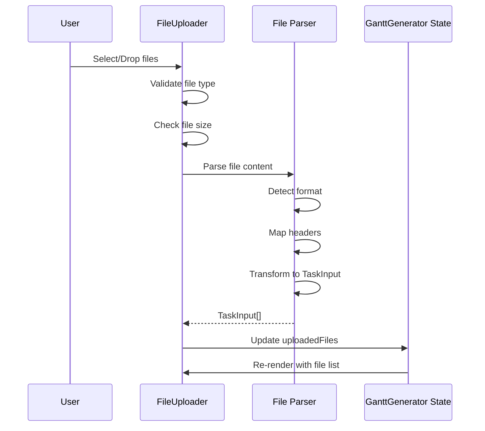

### Generation Flow

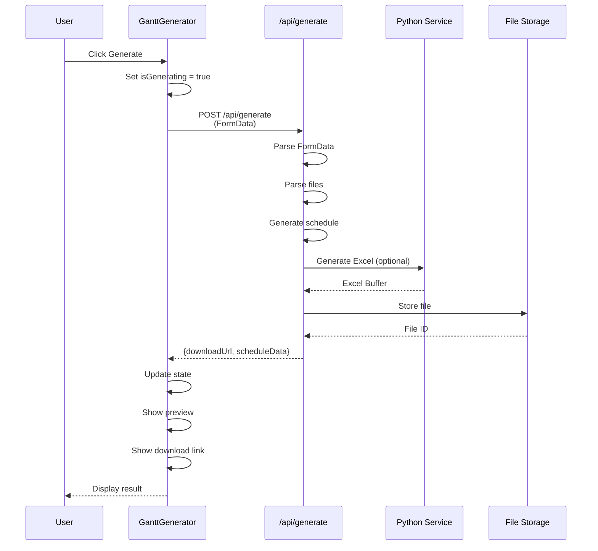

---

## API Architecture

### Endpoint: POST `/api/generate`

**Purpose**: Generate Excel workbook from uploaded task files

**Request Flow**:
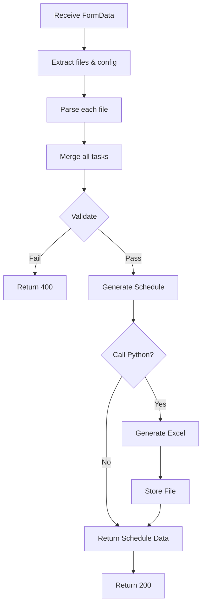

**Response Structure**:
```typescript
{
  success: boolean
  downloadUrl: string
  filename: string
  scenarioCount: number
  taskCount: number
  scheduleData: ScheduleData
}
```

### Endpoint: GET `/api/download?id={id}`

**Purpose**: Download generated Excel file

**Flow**:
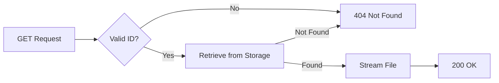

---

## File Processing Pipeline

### Parser Architecture

```mermaid
graph TD
    Input[File Content<br/>String] --> Format{Detect Format}

    Format -->|TSV/CSV| TSV[TSV Parser]
    Format -->|JSON| JSON[JSON Parser]

    TSV --> Header[Header Detection<br/>Delimiter Detection]
    Header --> Map[Header Mapping<br/>Normalize Names]

    JSON --> ValidateJSON[Validate Structure]

    Map --> Transform[Row Processing]
    ValidateJSON --> Transform

    Transform --> Build[Build Task Objects]
    Build --> ValidateTask[Validate Required Fields]
    ValidateTask --> Output[TaskInput[]]

    style Input fill:#e1f5ff
    style Output fill:#c8e6c9
```

### Header Mapping System

The system uses a flexible header mapping to handle various column name formats:

```mermaid
graph LR
    RawHeader[Raw Header<br/>e.g., 'Activity ID (1)'] --> Normalize[Normalize<br/>Lowercase, Trim]
    Normalize --> Lookup[Lookup in<br/>COLUMN_MAPPINGS]
    Lookup --> Mapped[Mapped Field<br/>e.g., 'activityId1']
    Mapped --> TaskField[TaskInput Field]

    style RawHeader fill:#fff3e0
    style TaskField fill:#c8e6c9
```

---

## State Management

### Client-Side State (React)

```mermaid
graph TD
    Root[GanttGenerator<br/>Root State] --> Files[uploadedFiles<br/>UploadedFile[]]
    Root --> Config[config<br/>ProjectConfig]
    Root --> Generating[isGenerating<br/>boolean]
    Root --> Result[result<br/>GenerationResult | null]
    Root --> Error[error<br/>string | null]
    Root --> Schedule[scheduleData<br/>ScheduleData | null]

    Files --> FileUploader[FileUploader Component]
    Config --> ConfigPanel[ConfigurationPanel Component]
    Generating --> GenStatus[GenerationStatus Component]
    Result --> GenStatus
    Error --> GenStatus
    Schedule --> Preview[GanttPreview Component]
```

### Server-Side State

- **Stateless**: API routes are stateless (no server-side state)
- **File Storage**: Generated Excel files stored temporarily (in-memory, filesystem, or cloud storage)
- **Session Management**: File download IDs are ephemeral (timestamp-based)

---

## Technology Stack

### Frontend

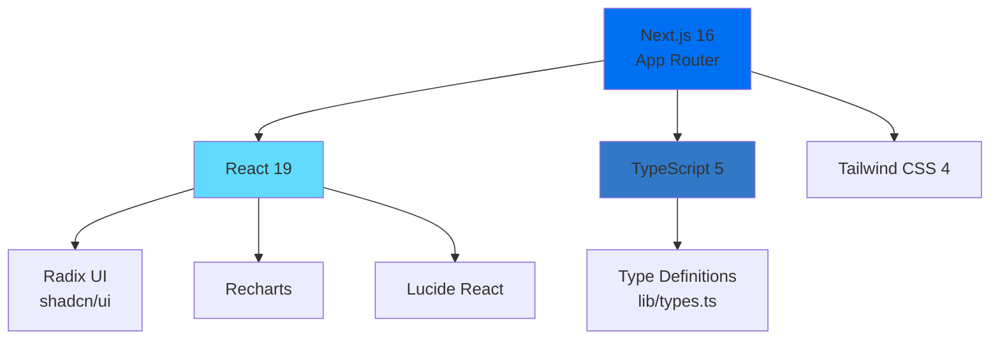

### Backend

- **Framework**: Next.js 16 (App Router)
- **Runtime**: Node.js 18+
- **API**: Next.js API Routes
- **File Processing**: Custom parsers (lib/file-parser.ts)

---

## Security Architecture

### Input Validation Flow

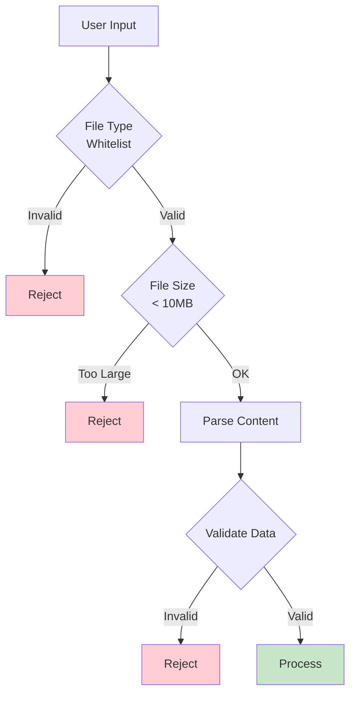

### Security Layers

1. **Client-Side Validation**: Immediate feedback
2. **Server-Side Validation**: Final security check
3. **File Type Whitelist**: Only TSV/JSON allowed
4. **Size Limits**: 10MB maximum
5. **Content Sanitization**: Input field validation

---

## Performance Considerations

### Optimization Strategies

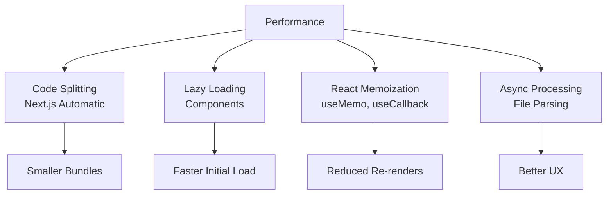

### Caching Strategy

- **Static Assets**: CDN caching
- **API Responses**: No caching (dynamic content)
- **Generated Files**: Temporary storage with TTL

---

## Scalability

### Current Architecture

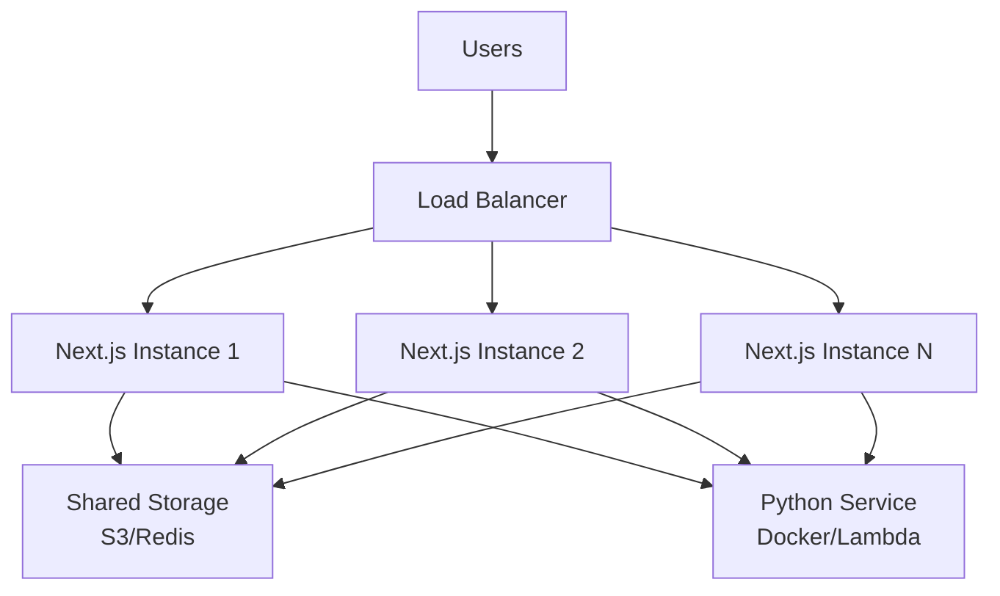

### Scaling Strategies

1. **Horizontal Scaling**: Multiple Next.js instances
2. **Stateless API**: Easy to scale
3. **External Services**: Python service can scale independently
4. **File Storage**: Cloud storage (S3) for scalability

---

## Future Enhancements

### Planned Features

#### Phase 1 (Active)
- ✅ Python Integration
- ✅ File Storage
- ✅ Download Endpoint

#### Phase 2 (Planned)
- 📋 User Authentication
- 📋 Saved Projects
- 📋 Generation History

#### Phase 3 (Future)
- 🔮 Task Dependencies
- 🔮 Resource Allocation
- 🔮 Critical Path

#### Phase 4 (Future)
- 🔮 Custom Templates
- 🔮 Advanced Charts
- 🔮 API Documentation
```

---

## Related Documentation

- [System Layout](./SYSTEM_LAYOUT.md) / [System Layout (English)](./SYSTEM_LAYOUT_EN.md) - Component hierarchy and UI layout details
- [Deployment Guide](./DEPLOYMENT.md) / [배포 가이드 (한국어)](./DEPLOYMENT_KO.md) - Deployment instructions

---

**Document Version**: 1.0.0
**Last Updated**: 2025-01-01
**Maintainer**: Development Team
