# 시스템 아키텍처

**AGI TR Gantt Generator - 기술 아키텍처 문서**

버전: 1.0.0
최종 업데이트: 2025-01-01

---

## 목차

1. [시스템 개요](#시스템-개요)
2. [아키텍처 다이어그램](#아키텍처-다이어그램)
3. [컴포넌트 아키텍처](#컴포넌트-아키텍처)
4. [데이터 흐름](#데이터-흐름)
5. [API 아키텍처](#api-아키텍처)
6. [파일 처리 파이프라인](#파일-처리-파이프라인)
7. [상태 관리](#상태-관리)
8. [기술 스택](#기술-스택)
9. [보안 아키텍처](#보안-아키텍처)
10. [성능 고려사항](#성능-고려사항)
11. [확장성](#확장성)

---

## 시스템 개요

AGI TR Gantt Generator는 Next.js 프레임워크를 기반으로 구축된 클라이언트-서버 웹 애플리케이션입니다. 시스템은 구조화된 작업 데이터(TSV/JSON)를 처리하고 다중 시나리오 Excel Gantt 차트 워크북을 생성합니다.

### 핵심 목표

- **입력 처리**: 계층적 WBS 구조를 가진 TSV/JSON 작업 파일 파싱 및 검증
- **일정 생성**: 작업 데이터를 일정 시나리오로 변환 (낙관적, 기준선, 비관적)
- **Excel 출력**: VBA 자동화가 포함된 대화형 Excel 워크북 생성
- **사용자 경험**: 직관적인 UI와 실시간 미리보기 및 상태 피드백 제공

---

## 아키텍처 다이어그램

### 고수준 시스템 아키텍처

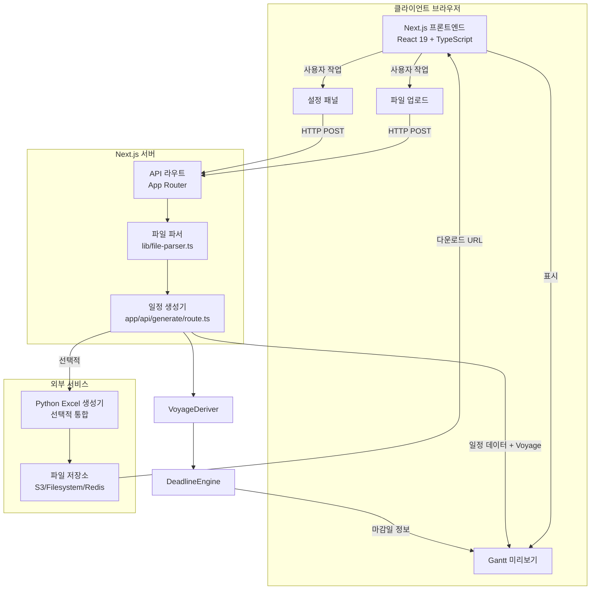

### 컴포넌트 아키텍처

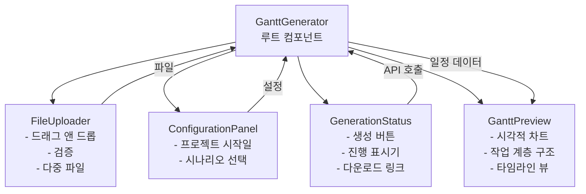

### 데이터 흐름 다이어그램

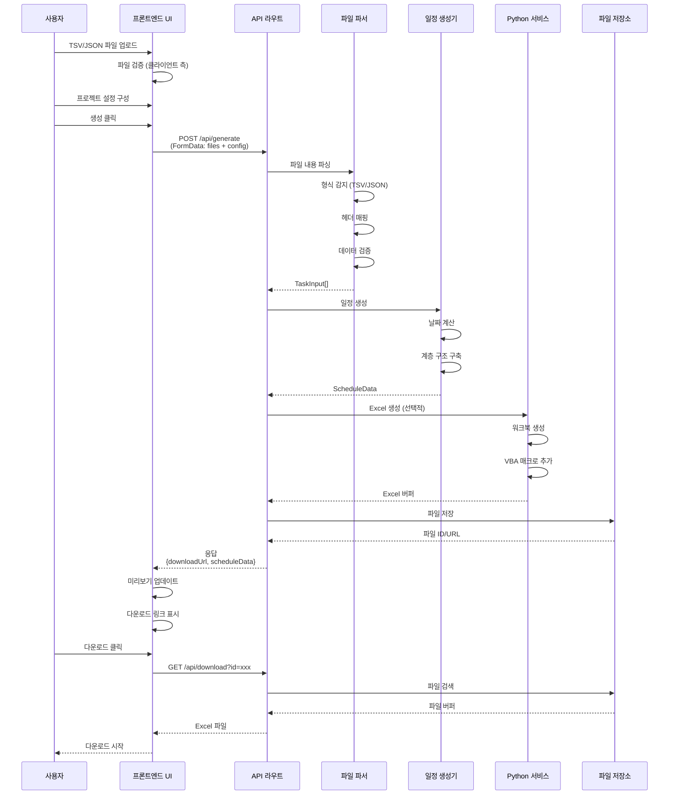

### 파일 처리 파이프라인

```mermaid
flowchart LR
    Input[입력 파일<br/>TSV/JSON] --> Detect{형식 감지}
    Detect -->|TSV/CSV| TSVParser[TSV 파서]
    Detect -->|JSON| JSONParser[JSON 파서]

    TSVParser --> HeaderMap[헤더 매핑<br/>컬럼 이름 정규화]
    JSONParser --> Validate[구조 검증]
    HeaderMap --> Validate

    Validate --> Transform[TaskInput로 변환]
    Transform --> Hierarchy[WBS 계층 구조 구축<br/>Level 1, 2, 3]
    Hierarchy --> Output[TaskInput[]<br/>검증된 작업]

    style Input fill:#e1f5ff
    style Output fill:#c8e6c9
```

### API 요청 흐름

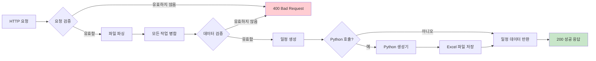

---

## 컴포넌트 아키텍처

### 프론트엔드 컴포넌트

#### 1. **GanttGenerator** (컨테이너 컴포넌트)

- **위치**: `components/gantt-generator.tsx`
- **책임**: 메인 오케스트레이터 컴포넌트
- **상태 관리**:
  - `uploadedFiles`: 파싱된 파일 데이터 배열
  - `config`: 프로젝트 설정 (시작일, 시나리오)
  - `isGenerating`: 로딩 상태
  - `result`: 다운로드 URL이 포함된 생성 결과
  - `error`: 오류 메시지
  - `scheduleData`: 미리보기를 위한 파싱된 일정

#### 2. **FileUploader**

- **위치**: `components/file-uploader.tsx`
- **책임**: 파일 업로드 및 검증
- **기능**:
  - 드래그 앤 드롭 지원
  - 다중 파일 선택
  - 파일 타입 검증 (TSV/JSON)
  - 크기 제한 적용 (10MB)
  - 실시간 파싱 피드백

#### 3. **ConfigurationPanel**

- **위치**: `components/configuration-panel.tsx`
- **책임**: 프로젝트 설정
- **설정 가능 항목**:
  - 프로젝트 시작일
  - 시나리오 선택 (낙관적, 기준선, 비관적)

#### 4. **GanttPreview**

- **위치**: `components/gantt-preview.tsx`
- **책임**: 시각적 Gantt 차트 미리보기
- **기능**:
  - 대화형 타임라인 뷰 (5가지 탭: Gantt Chart, Table View, Voyage Summary, Documents, Summary)
  - 작업 계층 구조 시각화
  - WBS 레벨별 색상 코딩
  - Deadline 오버레이 시각화
  - 반응형 디자인

#### 5. **DocumentChecklist**

- **위치**: `components/documents/document-checklist.tsx`
- **책임**: Voyage 문서 체크리스트 관리
- **기능**:
  - 카테고리별 문서 그룹화
  - Workflow 상태 관리 (not_started → approved)
  - 마감일 계산 및 Due state 표시
  - 진행률 표시

#### 6. **VoyageMiniGrid**

- **위치**: `components/documents/voyage-mini-grid.tsx`
- **책임**: Voyage 선택 UI
- **기능**:
  - Voyage 카드 그리드 표시
  - 선택된 Voyage 강조
  - Overdue 문서 개수 표시

#### 7. **DeadlineLadderOverlay**

- **위치**: `components/overlays/deadline-ladder-overlay.tsx`
- **책임**: Gantt 차트에 문서 마감일 시각화
- **기능**:
  - 타임라인 헤더/바 영역에 세로선 표시
  - Risk 레벨별 색상 구분 (ON_TRACK/AT_RISK/OVERDUE)
  - 줌 레벨 변경 시 위치 자동 조정

#### 8. **DocsProgressOverlay**

- **위치**: `components/overlays/docs-progress-overlay.tsx`
- **책임**: Gantt Trip row 위에 문서 진행률 표시
- **기능**:
  - Approved/Total 비율 시각화 (Progress bar + Badge)
  - 클릭 인터랙션: Docs 탭으로 이동 + 해당 Voyage 자동 선택
  - 키보드 접근성 지원 (Tab, Enter/Space)
  - 포커스 링 스타일 (focus-visible)

#### 9. **GenerationStatus**

- **위치**: `components/generation-status.tsx`
- **책임**: 생성 제어 및 상태
- **기능**:
  - 생성 버튼
  - 진행 표시기
  - 성공/오류 메시징
  - 다운로드 링크

---

## 데이터 흐름

### 파일 업로드 흐름

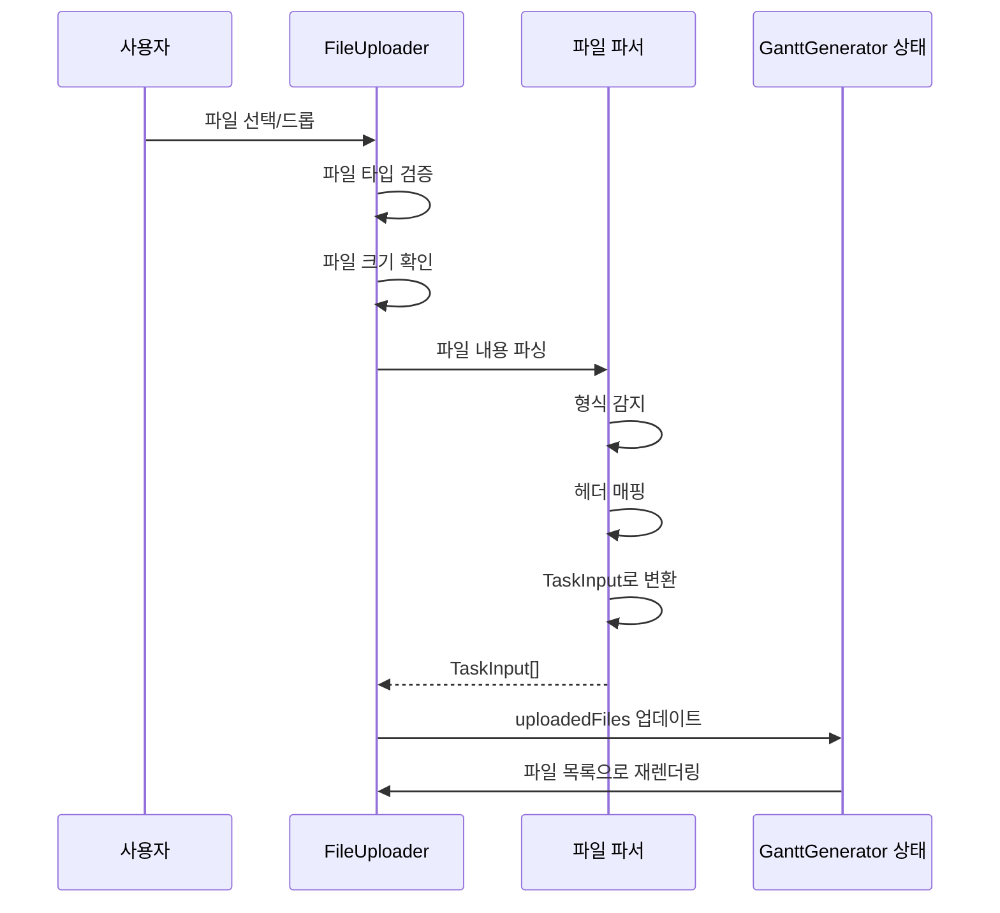

### 생성 흐름

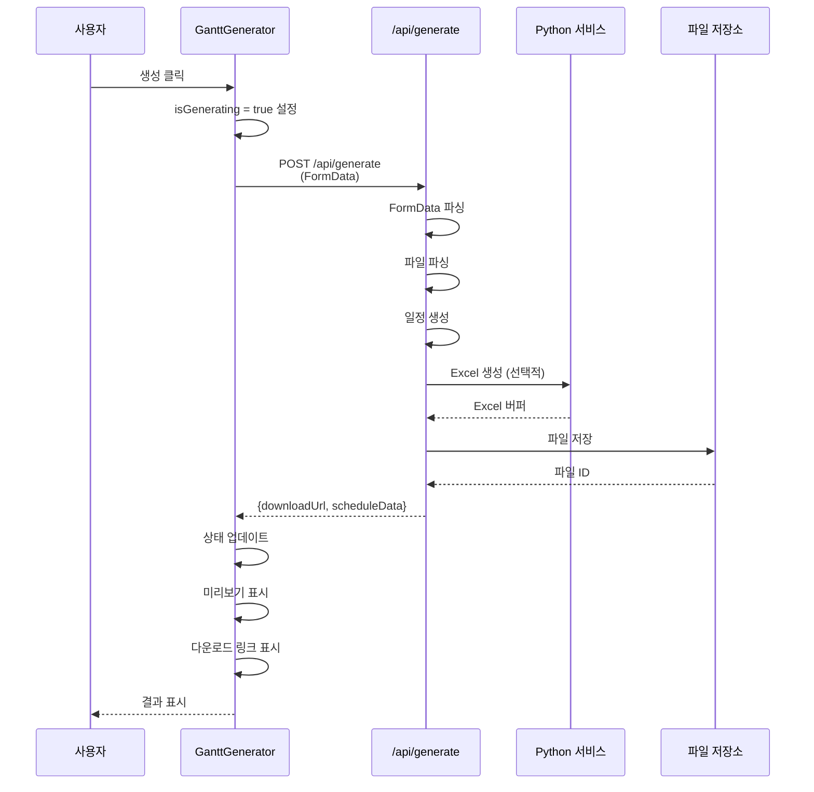

---

## API 아키텍처

### 엔드포인트: POST `/api/generate`

**목적**: 업로드된 작업 파일로부터 Excel 워크북 생성

**요청 흐름**:

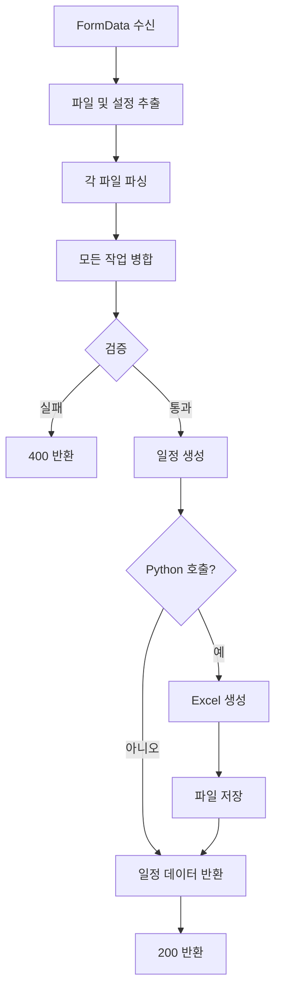

**응답 구조**:

```typescript
{
  success: boolean
  downloadUrl: string
  filename: string
  scenarioCount: number
  taskCount: number
  scheduleData: ScheduleData
}
```

### 엔드포인트: GET `/api/download?id={id}`

**목적**: 생성된 Excel 파일 다운로드

**흐름**:

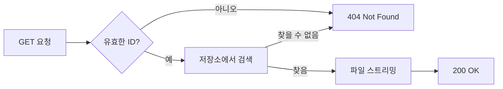

---

## 파일 처리 파이프라인

### 파서 아키텍처

```mermaid
graph TD
    Input[파일 내용<br/>문자열] --> Format{형식 감지}

    Format -->|TSV/CSV| TSV[TSV 파서]
    Format -->|JSON| JSON[JSON 파서]

    TSV --> Header[헤더 감지<br/>구분자 감지]
    Header --> Map[헤더 매핑<br/>이름 정규화]

    JSON --> ValidateJSON[구조 검증]

    Map --> Transform[행 처리]
    ValidateJSON --> Transform

    Transform --> Build[작업 객체 구축]
    Build --> ValidateTask[필수 필드 검증]
    ValidateTask --> Output[TaskInput[]]

    style Input fill:#e1f5ff
    style Output fill:#c8e6c9
```

### 헤더 매핑 시스템

시스템은 다양한 컬럼 이름 형식을 처리하기 위해 유연한 헤더 매핑을 사용합니다:

```mermaid
graph LR
    RawHeader[원시 헤더<br/>예: 'Activity ID (1)'] --> Normalize[정규화<br/>소문자, 공백 제거]
    Normalize --> Lookup[COLUMN_MAPPINGS에서<br/>조회]
    Lookup --> Mapped[매핑된 필드<br/>예: 'activityId1']
    Mapped --> TaskField[TaskInput 필드]

    style RawHeader fill:#fff3e0
    style TaskField fill:#c8e6c9
```

---

## 상태 관리

### 클라이언트 측 상태 (React)

```mermaid
graph TD
    Root[GanttGenerator<br/>루트 상태] --> Files[uploadedFiles<br/>UploadedFile[]]
    Root --> Config[config<br/>ProjectConfig]
    Root --> Generating[isGenerating<br/>boolean]
    Root --> Result[result<br/>GenerationResult | null]
    Root --> Error[error<br/>string | null]
    Root --> Schedule[scheduleData<br/>ScheduleData | null]

    Files --> FileUploader[FileUploader 컴포넌트]
    Config --> ConfigPanel[ConfigurationPanel 컴포넌트]
    Generating --> GenStatus[GenerationStatus 컴포넌트]
    Result --> GenStatus
    Error --> GenStatus
    Schedule --> Preview[GanttPreview 컴포넌트]
```

### 서버 측 상태

- **무상태**: API 라우트는 무상태입니다 (서버 측 상태 없음)
- **파일 저장소**: 생성된 Excel 파일은 임시로 저장됩니다 (메모리, 파일시스템 또는 클라우드 저장소)
- **세션 관리**: 파일 다운로드 ID는 일시적입니다 (타임스탬프 기반)

---

## 기술 스택

### 프론트엔드

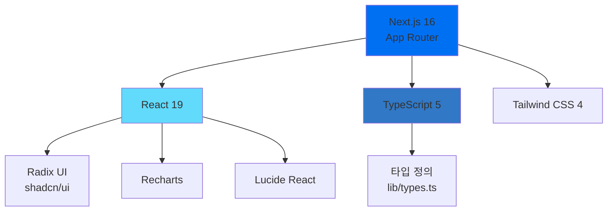

### 백엔드

- **프레임워크**: Next.js 16 (App Router)
- **런타임**: Node.js 18+
- **API**: Next.js API 라우트
- **파일 처리**: 커스텀 파서 (lib/file-parser.ts)

---

## 보안 아키텍처

### 입력 검증 흐름

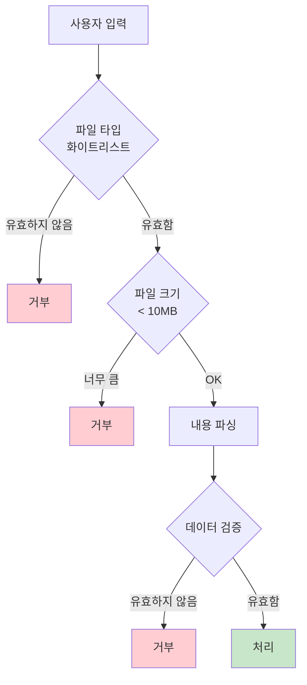

### 보안 계층

1. **클라이언트 측 검증**: 즉각적인 피드백
2. **서버 측 검증**: 최종 보안 검사
3. **파일 타입 화이트리스트**: TSV/JSON만 허용
4. **크기 제한**: 최대 10MB
5. **내용 정제**: 입력 필드 검증

---

## 성능 고려사항

### 최적화 전략

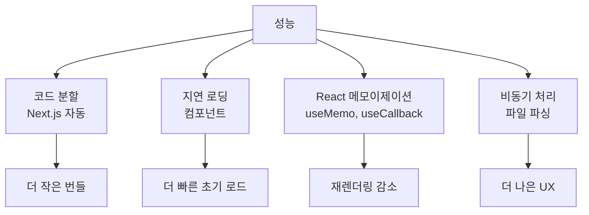

### 캐싱 전략

- **정적 자산**: CDN 캐싱
- **API 응답**: 캐싱 없음 (동적 콘텐츠)
- **생성된 파일**: TTL이 있는 임시 저장소

---

## 확장성

### 현재 아키텍처

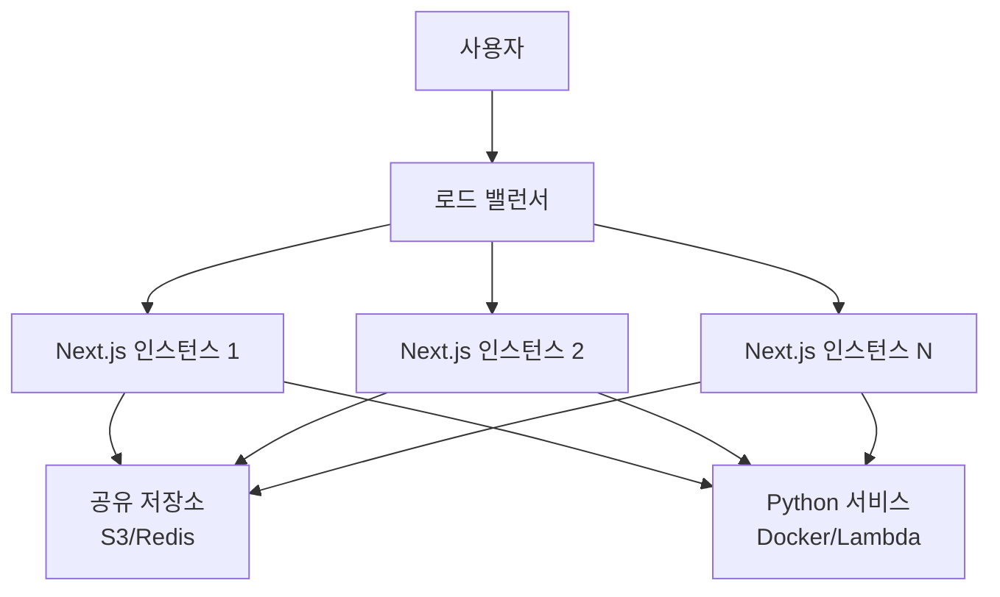

### 확장 전략

1. **수평 확장**: 여러 Next.js 인스턴스
2. **무상태 API**: 확장 용이
3. **외부 서비스**: Python 서비스는 독립적으로 확장 가능
4. **파일 저장소**: 확장성을 위한 클라우드 저장소 (S3)

---

## 향후 개선 사항

### 계획된 기능

#### Phase 1 (활성)
- ✅ Python 통합
- ✅ 파일 저장소
- ✅ 다운로드 엔드포인트

#### Phase 2 (계획됨)
- 📋 사용자 인증
- 📋 저장된 프로젝트
- 📋 생성 이력

#### Phase 3 (향후)
- 🔮 작업 의존성
- 🔮 리소스 할당
- 🔮 임계 경로

#### Phase 4 (향후)
- 🔮 커스텀 템플릿
- 🔮 고급 차트
- 🔮 API 문서화
```

---

## 관련 문서

- [시스템 레이아웃](./SYSTEM_LAYOUT.md) / [시스템 레이아웃 (영어)](./docs/en/SYSTEM_LAYOUT_EN.md) - 컴포넌트 계층 구조 및 UI 레이아웃 상세 정보
- [배포 가이드](./docs/en/DEPLOYMENT.md) / [배포 가이드 (한국어)](./DEPLOYMENT_KO.md) - 배포 지침

---

**문서 버전**: 1.0.0
**최종 업데이트**: 2025-01-01
**유지보수자**: 개발 팀
