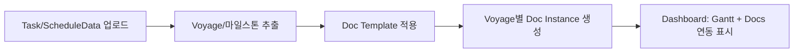
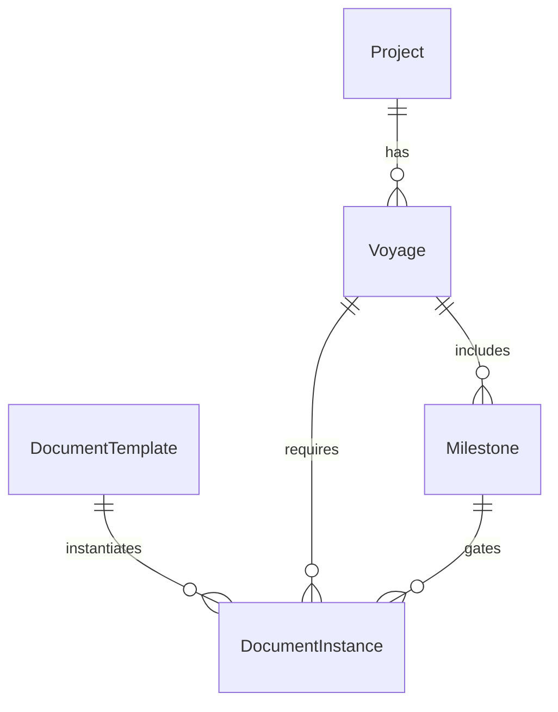

## 0. Problem Statement + Objectives + Risks + Assumptions

### Problem statement

현재 레포에는 **(1) Next.js/Vercel 기반 Gantt Generator 대시보드**와 **(2) 별도 제작된 HTML 대시보드/체크리스트 화면**이 공존합니다. 결과적으로 “일정(선적/항차/마일스톤)”과 “서류(PTW/통관/NOC 등)”가 **같은 컨텍스트로 묶여 있지 않아서**, 일정 변경 시 서류 마감/준비상태가 자동으로 따라오지 않고, 화면 스타일/정보 구조도 이중화됩니다.

또한 “대시보드”는 한 화면에서 **자주 모니터링해야 하는 정보를 한눈에 보여주고, 즉시 행동으로 이어지게 하는** 형태가 가장 효과적입니다. (single-page, at-a-glance, act quickly) ([Nielsen Norman Group][1])

### Objectives (제품 목표)

1. **하나의 대시보드 스타일**로 통합

* 동일 테마(다크/라이트), 동일 컴포넌트 시스템(shadcn/Radix), 동일 IA(탭/페이지)에서 일정+서류를 제공.

2. **선적일정 ↔ 서류 준비 항목의 “매칭/연동”**

* Voyage(항차) 기준으로 마일스톤(도착/Load-out/출항/AGI Transit 등)과 문서 패키지(PTW pack, Loading docs, NOC docs)를 연결.
* 일정이 변경되면 **문서 due-date(D-3/D-4/Business day 규칙)**도 자동 재계산.

3. 운영 관점 “컨트롤 타워”화

* KPI(전체 기간/병행기간/활용률) + 리스크(조수/날씨/문서지연) + 다음 마감(가장 임박한 D-3/D-4)까지 한 화면에서 파악.

### Key risks

* **데이터 매핑 불일치**: 업로드된 작업(Task)에서 Voyage/마일스톤을 안정적으로 추출 못하면 연동이 깨짐.
* **규정/기관 요구사항 변동**: 문서 템플릿은 바뀔 수 있어, 하드코딩하면 유지보수 비용 증가.
* **성능/번들 증가**: Gantt + 체크리스트 + 추가 시각화가 클라이언트 번들을 키울 수 있음. (워터폴 제거/번들 최소화 우선)

### Assumptions (명시)

* 체크리스트는 현재 제공된 “Gate Pass & Customs Document Checklist”의 항목/구조를 1차 기준으로 사용.
* Voyage는 최소 1~4(Option A) 단위로 관리하며, 각 Voyage는 MZP Arrival/Departure/AGI Arrival 등의 마일스톤을 가진다.
* 초기 버전은 **단일 프로젝트/단일 팀** 운영을 전제로 “Local-first(브라우저 저장)”을 허용하고, 이후 서버 저장으로 확장 가능(검증 체크포인트로 둠).

---

## 1. Personas (2–3) + Validation Qs

### Persona A: Operations Planner (선적/운항 일정 총괄)

* 목표: “항차별 주요 마일스톤과 위험구간”을 빠르게 파악하고 일정 변경 영향도를 즉시 확인.
* 검증 질문:

  * “Voyage 2 일정이 하루 밀리면 문서 마감도 자동으로 바뀌어야 하나?”
  * “Load-out 날짜가 변하면 Tide window/리스크 표시도 같이 변해야 하나?”

### Persona B: Document Coordinator (서류/허가 패키지 담당)

* 목표: Voyage별 제출 마감(D-3/D-4) 기준으로 준비 상태를 추적하고, 누락/지연을 조기에 발견.
* 검증 질문:

  * “필수(Mandatory) vs 권고(Recommended)를 readiness 계산에서 분리해야 하나?”
  * “문서 중 ‘프로젝트 1회성’과 ‘Voyage 반복’ 항목을 구분해야 하나?”

### Persona C: PM/Stakeholder (의사결정자)

* 목표: 현재 상태(완료율/리스크/다음 마감)를 30초 안에 이해하고, 필요한 결정을 내림.
* 검증 질문:

  * “보고용 요약(Export) 필요 여부?”
  * “병행운영(Parallel) 구간의 리스크를 별도로 보고 싶은가?”

---

## 2. Journey Map(s) + Emotional Beats

### Journey 1: “Voyage 선택 → 문서 준비 → 마감 대응”

1. 대시보드 진입 (긴장도 낮음)
2. Voyage mini card 클릭 → 해당 항차 컨텍스트 고정 (명확해짐)
3. 우측 패널에서 “D-3/D-4 마감 + 미완료 문서” 즉시 확인 (통제감 상승)
4. 누락 문서 클릭 → 담당자/상태/첨부/코멘트 업데이트 (작업 전환)
5. 마감 임박/초과 시 “리스크 배지+알림”으로 노출 (긴장도 상승 → 즉시 행동)

### Journey 2: “일정 변경 → 영향도 확인”

1. Gantt에서 Task 일정 변경(또는 업로드 파일 갱신)
2. 시스템이 Voyage 마일스톤 재산출 → 문서 due-date 자동 재계산
3. “영향받는 문서 목록”이 바로 표시 → 누락 방지 (안도감)

---

## 3. Flows + Recovery Paths + Metrics

### Core flow A: “Schedule → Voyage Context → Docs”

* **연동 핵심**: “Voyage 컨텍스트(선택 상태)”가 일정/문서/조수/날씨 모두를 동기화하는 단일 키.

### Recovery paths

* **마일스톤 미식별**: “MZP Arrival”을 Task에서 못 찾으면, UI에서 수동 지정(매핑 설정) 제공.
* **문서 템플릿 변경**: 템플릿 버전 관리(예: `docTemplates.v2026_01_19`), 기존 인스턴스에 마이그레이션 경고.
* **권한/승인 지연**: 문서 상태를 단순 체크박스가 아니라 `Draft → Submitted → Approved`로 확장.

### Success metrics (측정 가능)

* D-3/D-4 **마감 준수율**(On-time submission %)
* 마감 임박(48h) 시점의 **미완료 문서 수**
* Voyage별 **readiness score 추이**
* 일정 변경 후 “영향도 확인까지 걸린 시간”(ops/문서팀 체감)

---

## 4. IA + Label strategy

### Proposed IA (통합 대시보드)

기존 `GanttPreview`의 탭 구조를 유지/확장하는 방식이 “최소 변경으로 통합”에 유리합니다. 현재 4탭(Gantt Chart / Table View / Voyage Summary / Summary)에 **Documents 탭을 추가**하는 것을 기본안으로 제안합니다.

* **Overview(요약)**: KPI + 다음 마감 + 전체 리스크
* **Schedule(Gantt)**: 기존 Gantt + “문서 마감 라인/배지” 오버레이
* **Voyage Summary**: 기존 항차 마일스톤 + 조수/날씨 + 문서 readiness
* **Documents**: 체크리스트(카테고리별) + 첨부/상태/담당
* (선택) **Tide/Weather**: 상세 테이블/필터 (이미 데이터 통합 구조 존재)

### Label strategy

* “Voyage 2 ⚡(Parallel)”처럼 **운영 의미가 있는 표기**를 유지(사용자 mental model 유지).
* 문서 카테고리는 현행 용어 유지:

  * `PTW Land / HM / HSE / MZ Ops Submission Pack`
  * `Loading Cargo Related Documents`
  * `AD Maritime NOC Documents`

---

## 5. UI Direction + Component Specs + Accessibility Notes

### 5.1 Proposed default solution (통합 방식 3안 중 선택)

**통합 옵션 3가지**를 비교하면:

1. **IFrame/정적 HTML 그대로 임베드**

   * 장점: 가장 빠름
   * 단점: 스타일/상태/데이터 연동이 사실상 불가(“연동” 목표와 충돌)

2. **HTML을 `dangerouslySetInnerHTML`로 감싸기(부분 통합)**

   * 장점: 빠른 편, 라우팅 통합 가능
   * 단점: 상태 공유/컴포넌트 재사용/접근성 개선에 제약

3. **HTML을 React 컴포넌트로 재구성(권장, Progressive Migration)**

   * 장점: 일정-서류 연동/상태관리/테마 통일/재사용성/장기 유지보수 모두 유리
   * 단점: 초기 작업량 증가

**권장 기본안: 3) Progressive Migration**

* 이미 앱이 shadcn/Radix/Tailwind 기반으로 구성되어 있고(다크모드 포함), Gantt/Voyage Summary 구조가 갖춰져 있어 HTML을 기능 단위로 흡수하기 가장 적합합니다.

### 5.2 “Schedule ↔ Docs” 연동의 설계 핵심 (데이터 모델)

* **Voyage/Milestone**: 기존 `Voyage Summary`가 이미 “LCT Arrives to MZP / Load-out / Sail-away / Return” 같은 마일스톤 체계를 가지고 있으므로 여기서 확장.
* **DocumentTemplate**: 체크리스트 항목을 템플릿화(13+4+6 등)해서 버전 관리.
* **DocumentInstance**: Voyage별로 템플릿이 인스턴스화되며 상태/담당/첨부/마감일을 가짐.

#### Due-date rule (현행 데이터 기반)

게이트패스 HTML에는 Voyage별로 D-4 또는 D-3 형태의 문서 마감이 존재합니다. (예: V1 01-26 도착, 01-22 마감 / V2 02-06 도착, 02-03 마감)
따라서 엔진은:

* 기본 규칙: `dueDate = milestoneDate - N days`
* Voyage별 override 가능: `N = 3 or 4`
* “Land permit 2-3 business days” 같은 문구는 **Business day 계산 옵션**으로 확장 가능.

### 5.3 화면 구조 제안 (단일 대시보드)

**레이아웃(추천)**: “Gantt + Context Side Panel” 2-pane

* 좌측(70%): Gantt (기존 유지)
* 우측(30%): 선택된 Voyage 컨텍스트 패널

  * “다음 마감 D-3/D-4”
  * 문서 readiness(필수/권고 분리)
  * Tide/Weather 리스크 요약
  * Contacts quick view

이 구성은 “대시보드=한눈에 보고 즉시 행동” 원칙에 부합합니다. ([Nielsen Norman Group][1])

### 5.4 Signature interactions (차별화 포인트 2개 이상)

1. **Deadline Heatline (문서 마감선 오버레이)**

   * Gantt 타임라인에 “Document Deadline” 수직선 표시
   * 선의 색/강도 = readiness(예: 90% 이상이면 On-track, 미달이면 At-risk)
   * 클릭 시 우측 패널이 “마감 관련 문서만 필터링”

2. **Milestone → Doc Gate 자동 연결**

   * 사용자가 “MZP Arrival” 마일스톤을 선택하면, 관련 Doc Pack(PTW/Loading/NOC)이 자동으로 묶여 표시
   * Smartsheet/Atlassian에서 말하는 milestone chart의 핵심(마일스톤에 due date·status·관련 deliverables 연결)을 그대로 UI에 반영. ([Smartsheet][2])

3. (선택) **Supply-chain “Control Tower KPI” 블록**

   * ClickUp의 supply chain dashboard 정의처럼 “흩어진 정보(일정/조수/날씨/문서)를 한 화면에서 KPI로 통합”하여 조기 이슈 감지에 초점. ([ClickUp][3])

### 5.5 Component specs (구현 단위)

기존 컴포넌트 구조를 최대한 유지하면서 확장하는 형태:

* `components/gantt-preview.tsx`

  * 탭 추가: `Documents`
  * 공통 상태: `selectedVoyageId` (Context key)

* 신규 컴포넌트 제안

  * `components/voyage-context/voyage-mini-grid.tsx` (Gate Pass HTML의 mini cards)
  * `components/documents/document-checklist.tsx`
  * `components/documents/document-readiness.tsx` (progress bar + counts)
  * `components/overlays/deadline-heatline.tsx` (Gantt overlay)

* 신규 데이터/로직

  * `data/doc-templates.v2026-01-19.json` (템플릿)
  * `lib/derive-voyages.ts` (ScheduleData → Voyage/Milestones)
  * `lib/doc-engine.ts` (due-date 계산/필터/score)

### 5.6 Accessibility notes (WCAG 2.2 AA 기준 요약)

* **색만으로 상태 전달 금지**: 배지 텍스트(“On Track / At Risk / Overdue”) + 아이콘 병행
* 체크박스/토글은 Radix/shadcn 컴포넌트로 키보드 접근 확보
* 대시보드 시각화는 “preattentive processing”을 활용하되(길이/2D 위치, 명확한 시각적 구분), 과한 장식으로 정보 소음을 늘리지 않음. ([Nielsen Norman Group][4])

---

## 6. Prototype Pipeline + Simulation Report

### Prototype pipeline (단계별, 재현 가능)

1. **HTML → 데이터 추출**

   * Gate Pass HTML의 Voyage/마감/체크리스트를 JSON 템플릿으로 분리
2. **Voyage Context State 추가**

   * `selectedVoyageId`를 Gantt/Docs/Voyage Summary가 공유
3. **Documents 탭 구현**

   * 카테고리별 체크리스트 + readiness 계산
4. **Gantt Overlay**

   * 문서 마감선 + “미완료 문서 수” 배지
5. **저장 방식 선택(초기: localStorage)**

   * Voyage별 문서 상태 저장(브라우저) → 추후 서버 저장으로 확장

### Simulation report (이번 응답에서 실제로 검증한 내용)

* Gate Pass HTML에서 Voyage별 **MZP Arrival**과 **Document Deadline**을 추출/검증한 결과, 다음과 같이 **D-4 또는 D-3** 형태로 존재함을 확인했습니다:

  * V1: 01-26 arrival / 01-22 deadline (4일)
  * V2: 02-06 arrival / 02-03 deadline (3일)
  * V3: 02-15 arrival / 02-12 deadline (3일)
  * V4: 02-24 arrival / 02-20 deadline (4일)
* 체크리스트 항목 수는 (PTW 13 + Loading 4 + NOC 6) = **총 23개 템플릿**으로 분리 가능함을 확인했습니다.

### Feasibility status

* **Pass**: 데이터 분리(템플릿화) + Voyage 컨텍스트 + 탭 확장 방식은 현재 Next.js 구조에 자연스럽게 결합 가능.
* **Revise(조건부)**: 다중 사용자/승인 워크플로우(Submitted/Approved)까지 요구되면 서버 저장/권한 체계를 별도 설계해야 함.

또한 구현 시 우선순위는 “워터폴 제거 → 번들 최소화”를 선행하는 것이 안전합니다(기능 통합으로 복잡도/의존성 증가 가능).

---

## 7. Validation Plan + Decision Gates

### Validation plan

* **Unit tests**

  * `deriveVoyagesFromSchedule()`가 Task 변경에도 안정적으로 Voyage/Milestone을 만든다
  * `computeDueDate()`가 D-3/D-4/Business-day 규칙을 정확히 계산
* **E2E 시나리오**

  1. Voyage 2 선택 → Docs 탭에서 해당 항차 문서만 보임
  2. 체크박스 3개 완료 → readiness%와 Gantt heatline이 즉시 갱신
  3. 일정(Arrival date) 변경 → 문서 due-date와 “Overdue/At risk”가 자동 갱신
* **Performance sanity**

  * Gantt 렌더링이 느려지면, Docs 패널은 동적 import/가상 스크롤 등으로 대응(번들/렌더 비용 제어).

### Decision gates (결정 포인트)

* Gate 1: “Voyage 컨텍스트”로 일정/문서가 실제로 함께 움직이는가?
* Gate 2: readiness가 현장 팀이 납득 가능한 방식(필수/권고 분리)인가?
* Gate 3: 저장/권한 요구(다중 사용자)가 있는가? → 있으면 DB/로그 설계로 확장

---

## 8. Differentiation + Risks + Mitigation

### Differentiation (이 프로젝트에 맞춘 “특화 기능”)

* **Tide/Weather + Docs 결합 리스크 뷰**: “작업 가능 Tide window”가 문서 패키지(예: Tide Table/Confirmation)와 같이 움직이게 설계.
* **Parallel Operation(⚡) 구간 가시화**: Option A HTML의 병행운영 구간/활용률 KPI를 Overview에 통합.

### Risks & mitigations

* 일정 데이터 포맷 다양화 → **매핑 규칙 UI(키워드/Activity ID 기반) 제공**
* 문서 템플릿 빈번 변경 → **템플릿 버전/적용일 관리**
* 체크박스만으로 부족 → **상태 모델 확장(승인/첨부/담당/코멘트) 가능한 구조로 설계**

---

## 9. Handoff + Traceability Bundle

### “HTML → 통합 대시보드” 매핑 표 (핵심)

* `option_a_dashboard_EN...`의 주요 요소

  * KPI Cards → `Overview/KPIBar`
  * Nav Tabs(Section) → Next Tabs(탭)로 흡수
  * Gantt/ Voyage/ Tide 섹션 → 기존 `GanttPreview` 탭 구조와 정렬

* `gate_pass_customs_checklist_EN...`의 주요 요소

  * Voyage mini cards + Document Deadline → `Voyage Mini Grid` + `Deadline Panel`
  * 3개 체크리스트(PTW/Loading/NOC) → `DocumentChecklist` 템플릿 기반 렌더
  * Voyage-wise readiness progress → `DocumentReadiness` 컴포넌트

### Repo-level 변경 제안(작게 시작)

* `data/doc-templates.v2026-01-19.json` 추가
* `components/documents/*` 추가
* `components/gantt-preview.tsx` 탭 확장
* (선택) `app/(dashboard)/page.tsx`로 “운영 대시보드”를 별도 라우트로 분리(현재 Gantt Generator는 그대로 유지)

---

### 추가 인터넷 기반 아이디어를 요약하면

* “마일스톤 차트”는 **주요 단계/마감/책임/의존성을 상위 레벨로 보여주는 도구**로 정의되고, 마일스톤에 **due date + 상태 + 관련 deliverables**를 붙이는 것이 모범 사례로 언급됩니다. 이를 Voyage의 핵심 마일스톤(MZP Arrival/Departure/AGI Transit 등)에 문서 패키지를 “Gate”로 결합하는 설계로 적용할 수 있습니다. ([Atlassian][5])
* “공급망 대시보드”는 흩어진 데이터를 중앙에서 KPI로 통합해 이슈를 조기 감지하는 컨셉이므로, 본 프로젝트에서는 일정/문서/조수/날씨/병행운영 KPI를 “Control Tower”로 묶는 것이 자연스럽습니다. ([ClickUp][3])
* 만약 Gantt 렌더링 구현을 단순화/교체하고 싶다면 Frappe Gantt 같은 오픈소스 라이브러리(구성 가능)가 대안이 될 수 있으나, 현재 커스텀 Gantt가 이미 동작한다면 “오버레이/연동” 중심 확장이 더 리스크가 낮습니다. ([GitHub][6])

---

원하시면, 위 구조를 기준으로 **“탭 추가 + Voyage 컨텍스트 + doc-templates JSON 스키마(초안)”**까지 더 구체적으로(필드 정의/예시 JSON/상태 머신) 제시하겠습니다.

[1]: https://www.nngroup.com/articles/dashboards-preattentive/ "Dashboards: Making Charts and Graphs Easier to Understand - NN/G"
[2]: https://www.smartsheet.com/content/milestone-charts?srsltid=AfmBOortc7YwuJT5QfsCScMmzmvs0CllTqueN-x582oqgxuXNCsqjvfH "Milestone Charts 101 With Samples and Templates"
[3]: https://clickup.com/blog/supply-chain-dashboard/ "Supply Chain Dashboard: What to Track & How to Build One"
[4]: https://www.nngroup.com/videos/data-visualizations-dashboards/ "Data Visualizations for Dashboards (Video) - NN/G"
[5]: https://www.atlassian.com/work-management/project-management/project-planning/milestone-chart " Milestone chart [+ Strategies & Best Practices] | Team Central "
[6]: https://github.com/frappe/gantt "GitHub - frappe/gantt: Open Source Javascript Gantt"
