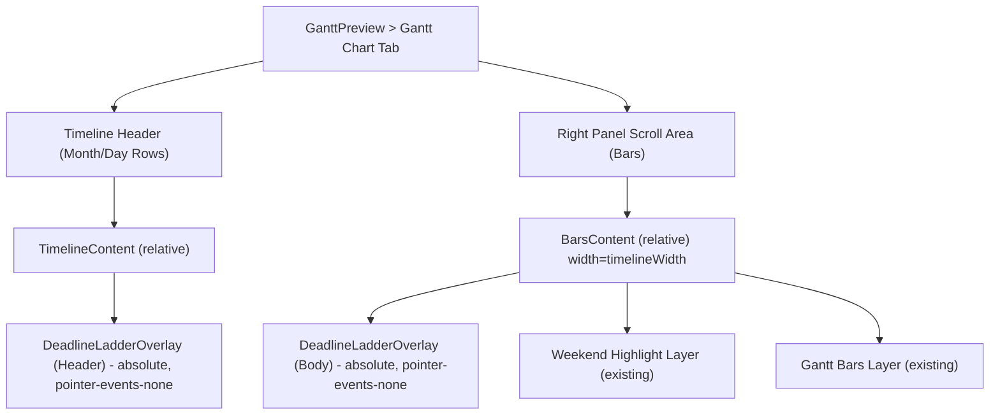

([Past chat][1])([Past chat][2])([Past chat][3])([Past chat][4])([Past chat][5])

## Exec (DeadlineLadder 오버레이 패치: GanttPreview 옵션 컴포넌트)

* `components/gantt-preview.tsx`의 **Gantt Chart 탭(타임라인 헤더 + 바 영역)** 에 “문서 마감 세로선”을 **옵션 오버레이 레이어**로 추가합니다. (스크롤 동기화/줌/주말 하이라이트 구조 유지)
* 오버레이는 **Right Panel의 동일 좌표계(=timelineWidth, cellWidth)** 를 사용하여, 마감일을 `x = diffDays * cellWidth` 로 정렬합니다. (수평 스크롤 자동 추종, 포인터 이벤트 차단)
* 외부 의존 최소화: 기존 `date-fns` 사용. 마커 데이터는 `deadlineMarkers?: DeadlineMarker[]`로 주입(없으면 아무것도 렌더링하지 않음).

---

## Visual (레이어 구조)



---

# PATCH 1) 새 컴포넌트 추가

## `components/overlays/deadline-ladder-overlay.tsx`

```tsx
"use client";

import * as React from "react";
import { differenceInCalendarDays, startOfDay } from "date-fns";

export type DeadlineRisk = "ON_TRACK" | "AT_RISK" | "OVERDUE" | "UNKNOWN";

export type DeadlineMarker = {
  id: string;
  date: Date;              // dueAt
  label: string;           // 문서명/패키지명
  risk?: DeadlineRisk;     // 색/스타일용
  category?: string;       // PTW/NOC 등
};

function clamp(n: number, min: number, max: number) {
  return Math.max(min, Math.min(max, n));
}

function xOfDate(opts: { timelineStart: Date; date: Date; cellWidth: number; totalDays: number }) {
  const start = startOfDay(opts.timelineStart);
  const d = startOfDay(opts.date);
  const diff = differenceInCalendarDays(d, start);
  const idx = clamp(diff, 0, Math.max(0, opts.totalDays - 1));
  return idx * opts.cellWidth;
}

function lineClass(risk: DeadlineRisk) {
  // 기존 Risk Badge 톤을 따르되, 오버레이가 과하게 튀지 않게 투명도 적용
  // 색상은 Tailwind token 기반(다크모드 포함)
  switch (risk) {
    case "OVERDUE":
      return "bg-destructive/70";
    case "AT_RISK":
      return "bg-amber-500/60";
    case "ON_TRACK":
      return "bg-emerald-500/40";
    default:
      return "bg-muted-foreground/30";
  }
}

export function DeadlineLadderOverlay(props: {
  timelineStart: Date;
  totalDays: number;
  cellWidth: number;

  // 오버레이가 깔릴 영역 높이(헤더=64px, 바영역=scrollHeight 등)
  heightPx: number;

  markers: DeadlineMarker[];

  // 헤더에서 라벨 “핀”을 보여줄지 여부(기본 true)
  showPins?: boolean;

  className?: string;
}) {
  const { timelineStart, totalDays, cellWidth, heightPx, markers, showPins = true, className } = props;

  if (!markers || markers.length === 0 || totalDays <= 0 || cellWidth <= 0) return null;

  return (
    <div
      className={[
        "pointer-events-none absolute inset-0 z-20",
        className ?? "",
      ].join(" ")}
      style={{ height: `${heightPx}px` }}
    >
      {markers.map((m) => {
        const x = xOfDate({ timelineStart, date: m.date, cellWidth, totalDays });
        const risk = m.risk ?? "UNKNOWN";

        return (
          <div key={m.id} className="absolute top-0" style={{ left: `${x}px`, height: "100%" }}>
            {/* 세로선 */}
            <div className={["w-px h-full", lineClass(risk)].join(" ")} />

            {/* 헤더 핀(선택) */}
            {showPins && (
              <div
                className="absolute -top-0.5 left-0 translate-x-[-50%] rounded-sm px-1 py-0.5 text-[9px] leading-none"
                style={{ background: "rgba(0,0,0,0.00)" }}
                title={`${m.label} | ${m.date.toISOString().slice(0, 10)} | ${risk}`}
              >
                {/* 핀은 텍스트 대신 아주 작은 마커로만(혼잡 방지) */}
                <div className={["h-2 w-2 rounded-full", lineClass(risk)].join(" ")} />
              </div>
            )}
          </div>
        );
      })}
    </div>
  );
}
```

---

# PATCH 2) (선택) 마커 어댑터 유틸 추가

문서 계산 결과(`calcDocDueDates`)를 쓰는 경우, 아래 유틸로 `DeadlineMarker[]`를 생성해 `GanttPreview`에 주입합니다.

## `lib/documents/to-deadline-markers.ts`

```ts
import type { DeadlineMarker } from "@/components/overlays/deadline-ladder-overlay";

type ComputedLike = {
  items: Array<{
    rule: { id: string; title: string; category?: string };
    dueAt: Date | null;
    risk: "ON_TRACK" | "AT_RISK" | "OVERDUE" | "UNKNOWN";
  }>;
  voyage?: { id: string };
};

export function toDeadlineMarkers(computed: ComputedLike | null): DeadlineMarker[] {
  if (!computed) return [];
  const voyageId = computed.voyage?.id ?? "V?";

  return computed.items
    .filter((x) => Boolean(x.dueAt))
    .map((x) => ({
      id: `${voyageId}::${x.rule.id}`,
      date: x.dueAt as Date,
      label: x.rule.title,
      risk: x.risk,
      category: x.rule.category ?? "DOC",
    }));
}
```

---

# PATCH 3) `components/gantt-preview.tsx`에 “옵션 오버레이” 삽입

아래 패치는 **GanttPreview의 Gantt Chart 탭** 내부에 들어갑니다. GanttPreview는 **타임라인 헤더/Right Panel 스크롤 동기화/줌(cellWidth)/timelineDays/총일수(totalDays)** 를 이미 갖고 있는 구조입니다.

## 3-1) Props 확장(옵션 주입)

`GanttPreviewProps`에 아래 2개 옵션을 추가합니다.

```tsx
// (추가) 상단 import
import { DeadlineLadderOverlay, type DeadlineMarker } from "@/components/overlays/deadline-ladder-overlay";

// (기존 Props에 추가)
interface GanttPreviewProps {
  scheduleData: ScheduleData | null;
  config: ProjectConfig;
  isGenerating: boolean;

  // (추가) 오버레이 입력
  deadlineMarkers?: DeadlineMarker[];
  defaultShowDeadlines?: boolean;
}
```

## 3-2) 헤더(버튼 영역)에 토글 추가

GanttPreview Header(Zoom 버튼/Badge 있는 라인)에 다음 상태/버튼을 추가합니다.

```tsx
const [showDeadlines, setShowDeadlines] = React.useState<boolean>(defaultShowDeadlines ?? true);
```

버튼(또는 Switch) 추가:

```tsx
<Button
  variant={showDeadlines ? "default" : "outline"}
  size="sm"
  className="h-7 text-xs"
  onClick={() => setShowDeadlines((v) => !v)}
>
  Deadlines
</Button>
```

## 3-3) “타임라인 헤더” 오버레이 삽입

타임라인 헤더(월/일 row)에서 **가로 기준점**이 되는 “긴 콘텐츠 컨테이너(width=timelineWidth)”를 `relative`로 감싸고, 그 안에 헤더용 오버레이를 넣습니다.

예시(삽입 패턴):

```tsx
// 가정: timelineStartDate, totalDays, cellWidth(줌), timelineWidth가 이미 계산되어 있음
// 가정: Timeline Header 높이 = 64px(h-16) :contentReference[oaicite:3]{index=3}

<div className="relative" style={{ width: `${timelineWidth}px` }}>
  {/* (기존) Month Row / Day Row 렌더 */}

  {showDeadlines && (deadlineMarkers?.length ?? 0) > 0 && (
    <DeadlineLadderOverlay
      timelineStart={timelineStartDate}
      totalDays={totalDays}
      cellWidth={cellWidth}
      heightPx={64}
      markers={deadlineMarkers!}
      showPins={true}
    />
  )}
</div>
```

## 3-4) “Gantt Bars 영역” 오버레이 삽입(핵심)

Right Panel의 바 영역은 세로 스크롤이 있으므로, 오버레이 높이를 **실제 스크롤 콘텐츠 높이**로 맞추는 것이 안정적입니다.

### (a) Bars Content ref 추가

```tsx
const barsContentRef = React.useRef<HTMLDivElement | null>(null);
const [barsHeight, setBarsHeight] = React.useState<number>(0);

React.useLayoutEffect(() => {
  const el = barsContentRef.current;
  if (!el) return;

  const update = () => setBarsHeight(el.scrollHeight || el.clientHeight || 0);
  update();

  const ro = new ResizeObserver(() => update());
  ro.observe(el);

  return () => ro.disconnect();
}, [/* scheduleData, zoomLevel 등 */]);
```

### (b) Bars Content를 relative 컨테이너로 만들고 오버레이 삽입

기존 바/주말 레이어가 들어있는 “긴 콘텐츠 컨테이너(width=timelineWidth)” 위치에 아래 형태로 감쌉니다.

```tsx
<div
  ref={barsContentRef}
  className="relative"
  style={{ width: `${timelineWidth}px` }}
>
  {/* (추가) Body 오버레이 */}
  {showDeadlines && (deadlineMarkers?.length ?? 0) > 0 && barsHeight > 0 && (
    <DeadlineLadderOverlay
      timelineStart={timelineStartDate}
      totalDays={totalDays}
      cellWidth={cellWidth}
      heightPx={barsHeight}
      markers={deadlineMarkers!}
      showPins={false}   // 바 영역은 핀 제거(혼잡 방지)
    />
  )}

  {/* (기존) 주말 하이라이트 레이어 */}
  {/* (기존) Gantt Bars 레이어 */}
</div>
```

> 이 방식이면 **수평 스크롤은 자동으로 일치**합니다(오버레이가 같은 “긴 콘텐츠” 내부에 존재). 또한 `pointer-events-none`로 클릭/툴팁 간섭을 차단합니다.

---

# PATCH 4) 실제 주입 위치(예: 통합 Provider 기준)

문서 계산을 이미 붙인 구조라면, `computed → deadlineMarkers` 변환 후 `GanttPreview`에 넘기면 끝입니다.

예시:

```tsx
import { toDeadlineMarkers } from "@/lib/documents/to-deadline-markers";

const markers = React.useMemo(() => toDeadlineMarkers(computed), [computed]);

<GanttPreview
  scheduleData={scheduleData}
  config={config}
  isGenerating={isGenerating}
  deadlineMarkers={markers}
  defaultShowDeadlines={true}
/>
```

---

## QA (즉시 테스트 시나리오)

1. **줌 4단계 변경** 시 세로선이 날짜 그리드에 계속 정렬되는가(=cellWidth 동기)
2. **수평 스크롤** 시 헤더/바 영역 세로선 위치가 동일하게 이동하는가(=같은 width 컨테이너 내부)
3. **세로 스크롤** 시 세로선이 바 영역 전체(스크롤 콘텐츠 높이)로 유지되는가
4. **툴팁/클릭**(바 hover) 동작이 오버레이로 인해 방해받지 않는가(`pointer-events-none`)

---

## 🔧 cmd 3 (Now/Next/Alt)

* Now: `DeadlineLadderOverlay` 추가 + `gantt-preview.tsx`에 헤더/바 영역 2중 오버레이 삽입
* Next: “마감 라벨 필터(PTW/NOC/OTHER)” + “Overdue만 표시” 토글
* Alt: Gantt 바 클릭 시 우측 패널에 “해당 Activity/Voyage 문서만” 필터링(dual highlight)

---

## ZERO log

| 단계 | 이유                                                                                            | 위험 | 요청데이터                                     | 다음조치                         |
| -- | --------------------------------------------------------------------------------------------- | -- | ----------------------------------------- | ---------------------------- |
| 계속 | 실제 `gantt-preview.tsx` 내부 변수명(`timelineStartDate`, `timelineWidth`, `cellWidth`)이 문서와 다를 수 있음 | 낮음 | (필요 시) gantt-preview.tsx 해당 구간 코드 50~100줄 | 변수명에 맞춰 삽입 위치를 정확한 diff로 재작성 |

원하시면, 다음 메시지에서 `components/gantt-preview.tsx`의 실제 코드 일부(타임라인 헤더/바 렌더 구간)만 붙여주시면, 위 패치를 **정확한 diff 형식(삭제/추가 라인 포함)** 으로 “그대로 적용 가능한” 패치로 다시 작성하겠습니다.

[1]: https://chatgpt.com/c/696e5fe6-6364-832c-a3be-20751920a2a0 "대시보드 통합 아이디어"
[2]: https://chatgpt.com/c/696e6070-ac70-8330-a939-846e580eda98 "New chat"
[3]: https://chatgpt.com/c/695bbe6a-6728-832b-a65f-f5d9e1af400d "Prompt List HVDC Logistics"
[4]: https://chatgpt.com/c/696e5d18-6704-832d-be15-cc890e40ccbe "Vercel Next.js AGI Gantt"
[5]: https://chatgpt.com/c/696bc1a1-2cd8-832a-951c-7cab39495bdf "Conversation summary"
