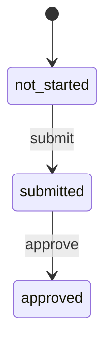

아래는 **“Docs 탭만 먼저 추가(= UI 골격 + Voyage selector + 카테고리/리스트)”**를 **바로 개발 가능한 수준**으로 구체화한 1차 MVP 제안입니다.
또한 **문서 상태 머신(not_started → submitted → approved)** 을 UI 동작에 실제로 연결하는 방식(전이 함수/가드/예시 데이터)까지 포함합니다.

---

## 0) 목표, 전제, 범위

### 이번 1차 범위 (Docs 탭 MVP)

* 기존 Gantt 대시보드(Next.js/Vercel) 안에 **Docs 탭** 추가
* Docs 탭 내부에:

  * **Voyage selector**
  * **카테고리 네비게이션(좌측)**
  * **문서 리스트(우측)**
* 각 문서 row에 대해:

  * 상태 표시: `not_started | submitted | approved`
  * 상태 전이 버튼:

    * `not_started → submitted` (Submit)
    * `submitted → approved` (Approve)
  * (1차에서는 **되돌리기 기능은 제외**)

### 데이터 출처(현행 프로토타입 기반)

* 제공하신 HTML 체크리스트(PTW pack / Loading docs / AD Maritime NOC docs) 구조를 **Docs 탭의 카테고리/템플릿으로 이식**합니다.
* Voyage별 “Document Deadline” 개념을 유지하고, **향후 Gantt 일정(Trip 그룹/마일스톤)과의 연결을 위한 필드도 같이 설계**합니다.

---

## 1) 정보구조(IA) — Docs 탭 UI 골격

**상단(컨텍스트 바)**

* `Voyage Select` (예: Voyage 1: TR Units 1–2)
* 선택된 Voyage의 핵심 마일스톤 요약(선택): `MZP Arrival`, `Load-out`, `MZP Departure`, `Doc Deadline`

**좌측(카테고리 리스트)**

* PTW Submission Pack
* Loading cargo related docs
* AD Maritime NOC docs
* 각 카테고리별 진행도: `approved/total` + 진행바(옵션)

**우측(문서 리스트)**

* 컬럼(권장):

  * `Document` (제목 + 짧은 설명)
  * `Due` (마감일 + D-카운트다운)
  * `Status` (badge)
  * `Action` (Submit/Approve 버튼)
* 필터(옵션):

  * 상태 필터(not_started/submitted/approved)
  * 태그 필터(mandatory/important/recommended/standard)

---

## 2) doc-templates JSON 스키마(초안)

### 2.1 핵심 개념

* **DocTemplate**: “문서 항목의 정의(템플릿)” — 모든 Voyage에서 공통
* **DocInstance**: “특정 Voyage에 대한 템플릿의 상태(실행 데이터)”

> 이번 1차에서는 **Template을 정적으로 두고**, 상태(Instance)를 **프론트 state로만 관리**(나중에 DB로 확장)하는 형태가 가장 빠릅니다.

---

### 2.2 JSON Schema (Draft, Templates)

```json
{
  "$schema": "https://json-schema.org/draft/2020-12/schema",
  "$id": "https://example.com/schemas/doc-templates.schema.json",
  "title": "Voyage Document Templates",
  "type": "object",
  "required": ["version", "categories", "templates"],
  "properties": {
    "version": { "type": "string", "description": "Schema/data version" },
    "categories": {
      "type": "array",
      "items": { "$ref": "#/$defs/category" }
    },
    "templates": {
      "type": "array",
      "items": { "$ref": "#/$defs/template" }
    }
  },
  "$defs": {
    "category": {
      "type": "object",
      "required": ["id", "label", "order"],
      "properties": {
        "id": { "type": "string", "pattern": "^[a-z0-9_\\-]+$" },
        "label": { "type": "string" },
        "description": { "type": "string" },
        "order": { "type": "integer" }
      }
    },
    "template": {
      "type": "object",
      "required": ["id", "categoryId", "title", "tag", "due"],
      "properties": {
        "id": { "type": "string", "pattern": "^[a-z0-9_\\-]+$" },
        "categoryId": { "type": "string" },
        "title": { "type": "string" },
        "description": { "type": "string" },

        "tag": {
          "type": "string",
          "enum": ["mandatory", "important", "standard", "recommended"]
        },

        "ownerRole": {
          "type": "string",
          "description": "Responsible role/team (e.g., HSE, MWS, Logistics, Agent)"
        },

        "due": {
          "type": "object",
          "required": ["anchor", "offsetDays"],
          "properties": {
            "anchor": {
              "type": "string",
              "enum": ["doc_deadline", "mzp_arrival", "loadout_start", "mzp_departure", "agi_arrival"]
            },
            "offsetDays": {
              "type": "integer",
              "description": "Relative offset from anchor date; negative means before the anchor date."
            }
          }
        },

        "dependencies": {
          "type": "array",
          "items": { "type": "string" },
          "description": "Template IDs that should be completed first (optional)"
        },

        "evidence": {
          "type": "array",
          "items": {
            "type": "object",
            "required": ["type", "label"],
            "properties": {
              "type": { "type": "string", "enum": ["file", "link", "text"] },
              "label": { "type": "string" },
              "required": { "type": "boolean", "default": false }
            }
          }
        }
      }
    }
  }
}
```

---

### 2.3 예시 JSON (Templates) — 지금 바로 적용 가능한 초기값

```json
{
  "version": "1.0.0",
  "categories": [
    { "id": "ptw_pack", "label": "PTW Land / HM / HSE / MZ Ops Submission Pack", "description": "Port/HM/HSE submission pack", "order": 1 },
    { "id": "loading_docs", "label": "Loading Cargo Related Documents", "description": "Requested by OFCO (recommended checklist)", "order": 2 },
    { "id": "noc_docs", "label": "AD Maritime NOC Documents", "description": "Required prior to AGI transit", "order": 3 }
  ],
  "templates": [
    { "id": "ptw_risk_assessment", "categoryId": "ptw_pack", "title": "Risk Assessment", "description": "AD Port format (shared)", "tag": "mandatory", "due": { "anchor": "doc_deadline", "offsetDays": 0 }, "ownerRole": "HSE" },
    { "id": "ptw_consent_form", "categoryId": "ptw_pack", "title": "PTW Applicant/Receiver Consent Form", "description": "AD Port format (shared)", "tag": "mandatory", "due": { "anchor": "doc_deadline", "offsetDays": 0 }, "ownerRole": "HSE" },
    { "id": "ptw_land_ohl", "categoryId": "ptw_pack", "title": "PTW Application for Land Oversized & Heavy Load", "description": "SPMT/heavy load (allow lead time)", "tag": "mandatory", "due": { "anchor": "doc_deadline", "offsetDays": 0 }, "ownerRole": "Logistics" },
    { "id": "ptw_stowage_plan", "categoryId": "ptw_pack", "title": "Stowage Plan", "description": "Cargo stowage plan (layout/weights)", "tag": "mandatory", "due": { "anchor": "doc_deadline", "offsetDays": 0 }, "ownerRole": "Marine" },
    { "id": "ptw_method_statement", "categoryId": "ptw_pack", "title": "Method Statement (incl. Weather Criteria)", "description": "AD Port format incl. weather criteria", "tag": "mandatory", "due": { "anchor": "doc_deadline", "offsetDays": 0 }, "ownerRole": "HSE" },
    { "id": "ptw_countdown_plan", "categoryId": "ptw_pack", "title": "Countdown Plan", "description": "Operation countdown schedule", "tag": "important", "due": { "anchor": "doc_deadline", "offsetDays": 0 } },
    { "id": "ptw_undertaking_letter", "categoryId": "ptw_pack", "title": "Undertaking Letter", "description": "Undertaking/commitment letter", "tag": "important", "due": { "anchor": "doc_deadline", "offsetDays": 0 } },
    { "id": "ptw_stability_calc", "categoryId": "ptw_pack", "title": "Stability Calculation", "description": "For HM review", "tag": "mandatory", "due": { "anchor": "doc_deadline", "offsetDays": 0 } },
    { "id": "ptw_equipment_certs", "categoryId": "ptw_pack", "title": "3rd Party Equipment Certificates", "description": "SPMT certificates + operator competency", "tag": "important", "due": { "anchor": "doc_deadline", "offsetDays": 0 } },
    { "id": "ptw_mws", "categoryId": "ptw_pack", "title": "Marine Warranty Survey (MWS)", "description": "Required before sailing for HM approval", "tag": "mandatory", "due": { "anchor": "mzp_departure", "offsetDays": -1 } },
    { "id": "ptw_mooring_plan", "categoryId": "ptw_pack", "title": "Mooring Plan", "description": "Mooring arrangement/plan", "tag": "standard", "due": { "anchor": "loadout_start", "offsetDays": -1 } },
    { "id": "ptw_lashing_plan", "categoryId": "ptw_pack", "title": "Lashing Plan", "description": "Cargo lashing plan", "tag": "mandatory", "due": { "anchor": "loadout_start", "offsetDays": -1 } },
    { "id": "ptw_tide_window", "categoryId": "ptw_pack", "title": "Tide Table / Tide Window Confirmation (Mina Zayed)", "description": "Confirm workable window for RoRo/linkspan ops", "tag": "mandatory", "due": { "anchor": "loadout_start", "offsetDays": -1 } },

    { "id": "load_manifest", "categoryId": "loading_docs", "title": "Cargo List / Manifest (per voyage)", "description": "Unit No., dims/weight/CoG, lifting points", "tag": "recommended", "due": { "anchor": "loadout_start", "offsetDays": -1 } },
    { "id": "load_packing_list", "categoryId": "loading_docs", "title": "Packing List / CI (if applicable)", "description": "Alignment for cargo identity", "tag": "recommended", "due": { "anchor": "loadout_start", "offsetDays": -1 } },
    { "id": "load_photos", "categoryId": "loading_docs", "title": "Cargo Photos (current condition)", "description": "Pre-loading condition photos", "tag": "recommended", "due": { "anchor": "loadout_start", "offsetDays": -1 } },
    { "id": "load_sequence", "categoryId": "loading_docs", "title": "Load sequence / trailer allocation", "description": "Load order, trailer IDs, interfaces", "tag": "recommended", "due": { "anchor": "loadout_start", "offsetDays": -1 } },

    { "id": "noc_trading_license", "categoryId": "noc_docs", "title": "Local Trading License", "description": "Business registration", "tag": "mandatory", "due": { "anchor": "mzp_departure", "offsetDays": -1 } },
    { "id": "noc_ra_erp", "categoryId": "noc_docs", "title": "Detailed Risk Assessment & Emergency Response Plan", "description": "RA + ERP", "tag": "mandatory", "due": { "anchor": "mzp_departure", "offsetDays": -1 } },
    { "id": "noc_authorities_no_objection", "categoryId": "noc_docs", "title": "No Objection from Relevant Authorities", "description": "No-objection letter", "tag": "mandatory", "due": { "anchor": "mzp_departure", "offsetDays": -1 } },
    { "id": "noc_voyage_plan", "categoryId": "noc_docs", "title": "Voyage Plan", "description": "MZP → AGI", "tag": "mandatory", "due": { "anchor": "mzp_departure", "offsetDays": -1 } },
    { "id": "noc_route_map", "categoryId": "noc_docs", "title": "Route Map", "description": "Route map", "tag": "important", "due": { "anchor": "mzp_departure", "offsetDays": -1 } },
    { "id": "noc_contract_award", "categoryId": "noc_docs", "title": "Contract Award Letter Copy", "description": "Copy of contract award letter", "tag": "important", "due": { "anchor": "mzp_departure", "offsetDays": -1 } }
  ]
}
```

---

## 3) 문서 상태 머신 연결

### 3.1 상태 머신(요구사항 그대로)



### 3.2 전이 규칙(가드 포함)

| 현재 상태       | 액션             | 다음 상태     | 허용 여부                           |
| ----------- | -------------- | --------- | ------------------------------- |
| not_started | submit         | submitted | ✅                               |
| not_started | approve        | -         | ❌ (가드: submitted 상태에서만 approve) |
| submitted   | approve        | approved  | ✅                               |
| submitted   | submit         | -         | ❌ (중복 submit 방지)                |
| approved    | submit/approve | -         | ❌ (종료 상태 취급)                    |

---

## 4) Docs 탭 UI 구현(Next.js/shadcn 기준)

> `Select`/`Table`/`Badge`는 shadcn 컴포넌트로 바로 구성 가능합니다. Select는 “옵션 리스트를 버튼 트리거로 보여주는 컴포넌트”로 설명되어 있고, Table은 TanStack과 결합 가능한 기본 테이블 베이스로 안내됩니다. ([Shadcn UI][1])

### 4.1 Voyage 데이터(1차는 정적 상수로 시작)

* **정적 Voyage 목록**을 먼저 만들고
* 이후에 Gantt 입력 데이터의 **Trip 그룹(activityId2)** 으로부터 자동 생성되도록 확장 권장
  (레포 README에 Activity ID(2)가 trip grouping 용도로 언급됨) ([GitHub][2])

---

## 5) “바로 붙여넣기 가능한” 코드 골격

아래 코드는 **Docs 탭 화면을 바로 띄우고**, 문서 상태 전이를 실제로 작동시키는 최소 단위입니다.

### 5.1 `lib/docs/types.ts` (신규)

```ts
// lib/docs/types.ts
export type DocStatus = "not_started" | "submitted" | "approved";
export type DocTag = "mandatory" | "important" | "standard" | "recommended";

export type DueAnchor =
  | "doc_deadline"
  | "mzp_arrival"
  | "loadout_start"
  | "mzp_departure"
  | "agi_arrival";

export type DocCategory = {
  id: string;
  label: string;
  description?: string;
  order: number;
};

export type DocTemplate = {
  id: string;
  categoryId: string;
  title: string;
  description?: string;
  tag: DocTag;
  ownerRole?: string;

  due: {
    anchor: DueAnchor;
    offsetDays: number; // negative = before anchor date
  };

  dependencies?: string[]; // optional
};

export type Voyage = {
  id: string;
  label: string;      // e.g., "Voyage 1"
  cargo?: string;     // e.g., "TR Units 1-2"

  // ISO date strings
  mzpArrival?: string;
  loadoutStart?: string;
  mzpDeparture?: string;
  agiArrival?: string;

  // Primary document submission deadline (if you have it)
  docDeadline?: string;
};
```

---

### 5.2 `lib/docs/workflow.ts` (신규)

```ts
// lib/docs/workflow.ts
import type { DocStatus } from "./types";

export type DocAction = "submit" | "approve";

export function canTransition(status: DocStatus, action: DocAction): boolean {
  if (status === "not_started") return action === "submit";
  if (status === "submitted") return action === "approve";
  return false; // approved = terminal in this MVP
}

export function transitionStatus(status: DocStatus, action: DocAction): DocStatus {
  if (!canTransition(status, action)) return status;
  if (status === "not_started" && action === "submit") return "submitted";
  if (status === "submitted" && action === "approve") return "approved";
  return status;
}

export function statusLabel(status: DocStatus): string {
  switch (status) {
    case "not_started":
      return "Not started";
    case "submitted":
      return "Submitted";
    case "approved":
      return "Approved";
  }
}
```

---

### 5.3 `data/docs-seed.ts` (신규, 1차 정적 데이터)

```ts
// data/docs-seed.ts
import type { DocCategory, DocTemplate, Voyage } from "@/lib/docs/types";

export const DOC_CATEGORIES: DocCategory[] = [
  {
    id: "ptw_pack",
    label: "PTW Submission Pack",
    description: "PTW Land / HM / HSE / MZ Ops submission pack",
    order: 1,
  },
  {
    id: "loading_docs",
    label: "Loading cargo related docs",
    description: "Requested by OFCO (recommended checklist)",
    order: 2,
  },
  {
    id: "noc_docs",
    label: "AD Maritime NOC docs",
    description: "Required prior to AGI transit",
    order: 3,
  },
];

export const DOC_TEMPLATES: DocTemplate[] = [
  // --- PTW pack (13) ---
  { id: "ptw_risk_assessment", categoryId: "ptw_pack", title: "Risk Assessment", description: "AD Port format (shared)", tag: "mandatory", due: { anchor: "doc_deadline", offsetDays: 0 } },
  { id: "ptw_consent_form", categoryId: "ptw_pack", title: "PTW Applicant/Receiver Consent Form", description: "AD Port format (shared)", tag: "mandatory", due: { anchor: "doc_deadline", offsetDays: 0 } },
  { id: "ptw_land_ohl", categoryId: "ptw_pack", title: "PTW Application for Land Oversized & Heavy Load", description: "SPMT/heavy load (allow lead time)", tag: "mandatory", due: { anchor: "doc_deadline", offsetDays: 0 } },
  { id: "ptw_stowage_plan", categoryId: "ptw_pack", title: "Stowage Plan", description: "Cargo stowage plan (layout/weights)", tag: "mandatory", due: { anchor: "doc_deadline", offsetDays: 0 } },
  { id: "ptw_method_statement", categoryId: "ptw_pack", title: "Method Statement (incl. Weather Criteria)", description: "incl. weather criteria", tag: "mandatory", due: { anchor: "doc_deadline", offsetDays: 0 } },
  { id: "ptw_countdown_plan", categoryId: "ptw_pack", title: "Countdown Plan", description: "Operation countdown schedule", tag: "important", due: { anchor: "doc_deadline", offsetDays: 0 } },
  { id: "ptw_undertaking_letter", categoryId: "ptw_pack", title: "Undertaking Letter", description: "Commitment letter", tag: "important", due: { anchor: "doc_deadline", offsetDays: 0 } },
  { id: "ptw_stability_calc", categoryId: "ptw_pack", title: "Stability Calculation", description: "For HM review", tag: "mandatory", due: { anchor: "doc_deadline", offsetDays: 0 } },
  { id: "ptw_equipment_certs", categoryId: "ptw_pack", title: "3rd Party Equipment Certificates", description: "SPMT certificates + competency", tag: "important", due: { anchor: "doc_deadline", offsetDays: 0 } },
  { id: "ptw_mws", categoryId: "ptw_pack", title: "Marine Warranty Survey (MWS)", description: "Required before sailing", tag: "mandatory", due: { anchor: "mzp_departure", offsetDays: -1 } },
  { id: "ptw_mooring_plan", categoryId: "ptw_pack", title: "Mooring Plan", description: "Mooring arrangement", tag: "standard", due: { anchor: "loadout_start", offsetDays: -1 } },
  { id: "ptw_lashing_plan", categoryId: "ptw_pack", title: "Lashing Plan", description: "Cargo lashing plan", tag: "mandatory", due: { anchor: "loadout_start", offsetDays: -1 } },
  { id: "ptw_tide_window", categoryId: "ptw_pack", title: "Tide window confirmation (Mina Zayed)", description: "Confirm workable window", tag: "mandatory", due: { anchor: "loadout_start", offsetDays: -1 } },

  // --- Loading docs (4) ---
  { id: "load_manifest", categoryId: "loading_docs", title: "Cargo List / Manifest", description: "dims/weight/CoG + interfaces", tag: "recommended", due: { anchor: "loadout_start", offsetDays: -1 } },
  { id: "load_packing_list", categoryId: "loading_docs", title: "Packing List / CI (if applicable)", description: "Alignment for cargo identity", tag: "recommended", due: { anchor: "loadout_start", offsetDays: -1 } },
  { id: "load_photos", categoryId: "loading_docs", title: "Cargo Photos (current condition)", description: "Pre-loading condition photos", tag: "recommended", due: { anchor: "loadout_start", offsetDays: -1 } },
  { id: "load_sequence", categoryId: "loading_docs", title: "Load sequence / trailer allocation", description: "Load order, trailer IDs", tag: "recommended", due: { anchor: "loadout_start", offsetDays: -1 } },

  // --- NOC docs (6) ---
  { id: "noc_trading_license", categoryId: "noc_docs", title: "Local Trading License", description: "Business registration", tag: "mandatory", due: { anchor: "mzp_departure", offsetDays: -1 } },
  { id: "noc_ra_erp", categoryId: "noc_docs", title: "Risk Assessment & Emergency Response Plan", description: "Detailed RA + ERP", tag: "mandatory", due: { anchor: "mzp_departure", offsetDays: -1 } },
  { id: "noc_authorities_no_objection", categoryId: "noc_docs", title: "No Objection from Authorities", description: "No-objection letter", tag: "mandatory", due: { anchor: "mzp_departure", offsetDays: -1 } },
  { id: "noc_voyage_plan", categoryId: "noc_docs", title: "Voyage Plan (MZP → AGI)", description: "Voyage plan", tag: "mandatory", due: { anchor: "mzp_departure", offsetDays: -1 } },
  { id: "noc_route_map", categoryId: "noc_docs", title: "Route Map", description: "Route map", tag: "important", due: { anchor: "mzp_departure", offsetDays: -1 } },
  { id: "noc_contract_award", categoryId: "noc_docs", title: "Contract Award Letter Copy", description: "Award letter", tag: "important", due: { anchor: "mzp_departure", offsetDays: -1 } },
];

// 1차는 gate-pass HTML 기반 날짜를 정적 seed로 둡니다.
// 이후엔 Gantt(Trip/Scenario)에서 마일스톤을 파싱해 자동 생성하도록 교체하세요.
export const VOYAGES_SEED: Voyage[] = [
  {
    id: "voyage_1",
    label: "Voyage 1",
    cargo: "TR Units 1–2",
    mzpArrival: "2026-01-26",
    loadoutStart: "2026-01-29",
    mzpDeparture: "2026-02-01",
    agiArrival: "2026-02-02",
    docDeadline: "2026-01-22"
  },
  {
    id: "voyage_2",
    label: "Voyage 2",
    cargo: "TR Units 3–4",
    mzpArrival: "2026-02-06",
    loadoutStart: "2026-02-09",
    mzpDeparture: "2026-02-12",
    agiArrival: "2026-02-13",
    docDeadline: "2026-02-03"
  },
  {
    id: "voyage_3",
    label: "Voyage 3",
    cargo: "TR Units 5–6",
    mzpArrival: "2026-02-15",
    loadoutStart: "2026-02-18",
    mzpDeparture: "2026-02-19",
    agiArrival: "2026-02-20",
    docDeadline: "2026-02-12"
  },
  {
    id: "voyage_4",
    label: "Voyage 4",
    cargo: "TR Unit 7",
    mzpArrival: "2026-02-24",
    loadoutStart: "2026-02-26",
    mzpDeparture: "2026-02-27",
    agiArrival: "2026-02-28",
    docDeadline: "2026-02-20"
  }
];
```

---

### 5.4 `components/docs-panel.tsx` (신규) — UI 골격 + 상태 머신 연결

```tsx
"use client";

import * as React from "react";
import { addDays, differenceInCalendarDays, format, parseISO } from "date-fns";

import type { DocStatus, DocTemplate, Voyage, DocCategory } from "@/lib/docs/types";
import { transitionStatus, canTransition, statusLabel } from "@/lib/docs/workflow";
import { DOC_CATEGORIES, DOC_TEMPLATES, VOYAGES_SEED } from "@/data/docs-seed";

// shadcn/ui (프로젝트에 이미 있으면 그대로 사용)
// Select docs: :contentReference[oaicite:2]{index=2}, Table docs: :contentReference[oaicite:3]{index=3}
import { Badge } from "@/components/ui/badge";
import { Button } from "@/components/ui/button";
import { Card } from "@/components/ui/card";
import {
  Select,
  SelectContent,
  SelectItem,
  SelectTrigger,
  SelectValue,
} from "@/components/ui/select";
import {
  Table,
  TableBody,
  TableCell,
  TableHead,
  TableHeader,
  TableRow,
} from "@/components/ui/table";

type DocsState = Record<string, Record<string, DocStatus>>; // voyageId -> templateId -> status

function buildInitialState(voyages: Voyage[], templates: DocTemplate[]): DocsState {
  const init: DocsState = {};
  for (const v of voyages) {
    init[v.id] = {};
    for (const t of templates) init[v.id][t.id] = "not_started";
  }
  return init;
}

function resolveAnchorDate(voyage: Voyage, anchor: DocTemplate["due"]["anchor"]): string | undefined {
  switch (anchor) {
    case "doc_deadline":
      return voyage.docDeadline;
    case "mzp_arrival":
      return voyage.mzpArrival;
    case "loadout_start":
      return voyage.loadoutStart;
    case "mzp_departure":
      return voyage.mzpDeparture;
    case "agi_arrival":
      return voyage.agiArrival;
  }
}

function computeDueDate(voyage: Voyage, template: DocTemplate): Date | null {
  const base = resolveAnchorDate(voyage, template.due.anchor) ?? voyage.docDeadline;
  if (!base) return null;
  try {
    return addDays(parseISO(base), template.due.offsetDays);
  } catch {
    return null;
  }
}

function TagBadge({ tag }: { tag: DocTemplate["tag"] }) {
  const label =
    tag === "mandatory" ? "Mandatory" :
    tag === "important" ? "Important" :
    tag === "recommended" ? "Recommended" :
    "Standard";

  // 색상만으로 의미 전달하지 않도록 텍스트를 반드시 포함
  return <Badge variant="outline">{label}</Badge>;
}

function StatusBadge({ status }: { status: DocStatus }) {
  if (status === "approved") return <Badge>Approved</Badge>;
  if (status === "submitted") return <Badge variant="secondary">Submitted</Badge>;
  return <Badge variant="outline">Not started</Badge>;
}

function ProgressCounts(templates: DocTemplate[], getStatus: (id: string) => DocStatus) {
  const total = templates.length;
  const approved = templates.filter(t => getStatus(t.id) === "approved").length;
  const submitted = templates.filter(t => getStatus(t.id) === "submitted").length;
  const notStarted = total - approved - submitted;
  return { total, approved, submitted, notStarted };
}

export function DocsPanel() {
  const voyages = VOYAGES_SEED;
  const categories = DOC_CATEGORIES.slice().sort((a, b) => a.order - b.order);
  const templates = DOC_TEMPLATES;

  const [selectedVoyageId, setSelectedVoyageId] = React.useState<string>(voyages[0]?.id ?? "");
  const [selectedCategoryId, setSelectedCategoryId] = React.useState<string>(categories[0]?.id ?? "");
  const [state, setState] = React.useState<DocsState>(() => buildInitialState(voyages, templates));

  const voyage = React.useMemo(
    () => voyages.find(v => v.id === selectedVoyageId) ?? voyages[0],
    [voyages, selectedVoyageId]
  );

  const templatesInCategory = React.useMemo(
    () => templates.filter(t => t.categoryId === selectedCategoryId),
    [templates, selectedCategoryId]
  );

  const getStatus = React.useCallback((templateId: string): DocStatus => {
    return state[selectedVoyageId]?.[templateId] ?? "not_started";
  }, [state, selectedVoyageId]);

  const dispatch = React.useCallback((templateId: string, action: "submit" | "approve") => {
    setState(prev => {
      const current = prev[selectedVoyageId]?.[templateId] ?? "not_started";
      if (!canTransition(current, action)) return prev;

      return {
        ...prev,
        [selectedVoyageId]: {
          ...prev[selectedVoyageId],
          [templateId]: transitionStatus(current, action),
        }
      };
    });
  }, [selectedVoyageId]);

  const overall = React.useMemo(() => {
    const get = (id: string) => state[selectedVoyageId]?.[id] ?? "not_started";
    return ProgressCounts(templates, get);
  }, [state, selectedVoyageId, templates]);

  return (
    <div className="space-y-4">
      {/* Context Bar */}
      <Card className="p-4">
        <div className="flex flex-col gap-3 md:flex-row md:items-center md:justify-between">
          <div className="space-y-1">
            <div className="text-sm text-muted-foreground">Docs</div>
            <div className="text-base font-semibold">
              {voyage?.label}{voyage?.cargo ? ` — ${voyage.cargo}` : ""}
            </div>
            <div className="text-sm text-muted-foreground">
              Overall: {overall.approved}/{overall.total} approved · {overall.submitted} submitted · {overall.notStarted} not started
            </div>
          </div>

          <div className="w-full md:w-[280px]">
            <Select value={selectedVoyageId} onValueChange={setSelectedVoyageId}>
              <SelectTrigger aria-label="Select voyage">
                <SelectValue placeholder="Select voyage" />
              </SelectTrigger>
              <SelectContent>
                {voyages.map(v => (
                  <SelectItem key={v.id} value={v.id}>
                    {v.label}{v.cargo ? ` — ${v.cargo}` : ""}
                  </SelectItem>
                ))}
              </SelectContent>
            </Select>
          </div>
        </div>

        {/* Optional milestone line */}
        <div className="mt-3 grid grid-cols-2 gap-2 text-sm text-muted-foreground md:grid-cols-5">
          <div>Doc deadline: <span className="text-foreground">{voyage?.docDeadline ?? "-"}</span></div>
          <div>MZP arrival: <span className="text-foreground">{voyage?.mzpArrival ?? "-"}</span></div>
          <div>Load-out: <span className="text-foreground">{voyage?.loadoutStart ?? "-"}</span></div>
          <div>MZP dep: <span className="text-foreground">{voyage?.mzpDeparture ?? "-"}</span></div>
          <div>AGI arr: <span className="text-foreground">{voyage?.agiArrival ?? "-"}</span></div>
        </div>
      </Card>

      {/* Main 2-column layout */}
      <div className="grid grid-cols-1 gap-4 md:grid-cols-12">
        {/* Left: Categories */}
        <Card className="p-2 md:col-span-4">
          <div className="px-2 py-2 text-sm font-semibold">Categories</div>
          <div className="flex flex-col gap-1">
            {categories.map((c: DocCategory) => {
              const catTemplates = templates.filter(t => t.categoryId === c.id);
              const approved = catTemplates.filter(t => getStatus(t.id) === "approved").length;

              const active = c.id === selectedCategoryId;
              return (
                <button
                  key={c.id}
                  onClick={() => setSelectedCategoryId(c.id)}
                  className={[
                    "w-full rounded-md px-3 py-2 text-left transition",
                    active ? "bg-accent" : "hover:bg-muted"
                  ].join(" ")}
                  aria-current={active ? "page" : undefined}
                >
                  <div className="flex items-center justify-between gap-2">
                    <div className="min-w-0">
                      <div className="truncate text-sm font-medium">{c.label}</div>
                      {c.description ? (
                        <div className="truncate text-xs text-muted-foreground">{c.description}</div>
                      ) : null}
                    </div>
                    <div className="shrink-0 text-xs text-muted-foreground">
                      {approved}/{catTemplates.length}
                    </div>
                  </div>
                </button>
              );
            })}
          </div>
        </Card>

        {/* Right: Docs list */}
        <Card className="p-4 md:col-span-8">
          <div className="mb-3 flex items-end justify-between gap-2">
            <div>
              <div className="text-sm text-muted-foreground">Documents</div>
              <div className="text-base font-semibold">
                {categories.find(c => c.id === selectedCategoryId)?.label ?? "—"}
              </div>
            </div>
          </div>

          <Table>
            <TableHeader>
              <TableRow>
                <TableHead>Document</TableHead>
                <TableHead className="w-[160px]">Due</TableHead>
                <TableHead className="w-[140px]">Status</TableHead>
                <TableHead className="w-[160px]">Action</TableHead>
              </TableRow>
            </TableHeader>

            <TableBody>
              {templatesInCategory.map((t) => {
                const status = getStatus(t.id);
                const due = voyage ? computeDueDate(voyage, t) : null;

                const today = new Date();
                const dueDiff = due ? differenceInCalendarDays(due, today) : null;

                const dueText = due ? format(due, "yyyy-MM-dd") : "—";
                const dueBadge =
                  dueDiff === null ? "" :
                  dueDiff > 0 ? `D-${dueDiff}` :
                  dueDiff === 0 ? "Due today" :
                  `Overdue ${Math.abs(dueDiff)}d`;

                const canSubmit = canTransition(status, "submit");
                const canApprove = canTransition(status, "approve");

                return (
                  <TableRow key={t.id}>
                    <TableCell>
                      <div className="space-y-1">
                        <div className="flex flex-wrap items-center gap-2">
                          <div className="font-medium">{t.title}</div>
                          <TagBadge tag={t.tag} />
                        </div>
                        {t.description ? (
                          <div className="text-xs text-muted-foreground">{t.description}</div>
                        ) : null}
                      </div>
                    </TableCell>

                    <TableCell>
                      <div className="space-y-1">
                        <div className="text-sm">{dueText}</div>
                        {dueBadge ? (
                          <div className="text-xs text-muted-foreground">{dueBadge}</div>
                        ) : null}
                      </div>
                    </TableCell>

                    <TableCell>
                      <div className="space-y-1">
                        <StatusBadge status={status} />
                        <div className="text-xs text-muted-foreground">{statusLabel(status)}</div>
                      </div>
                    </TableCell>

                    <TableCell>
                      <div className="flex gap-2">
                        <Button
                          size="sm"
                          variant="secondary"
                          disabled={!canSubmit}
                          onClick={() => dispatch(t.id, "submit")}
                        >
                          Submit
                        </Button>
                        <Button
                          size="sm"
                          disabled={!canApprove}
                          onClick={() => dispatch(t.id, "approve")}
                        >
                          Approve
                        </Button>
                      </div>
                    </TableCell>
                  </TableRow>
                );
              })}

              {templatesInCategory.length === 0 ? (
                <TableRow>
                  <TableCell colSpan={4} className="text-sm text-muted-foreground">
                    No templates in this category.
                  </TableCell>
                </TableRow>
              ) : null}
            </TableBody>
          </Table>
        </Card>
      </div>
    </div>
  );
}
```

---

### 5.5 `components/gantt-preview.tsx`에서 “Docs 탭” 추가(예시)

프로젝트에 이미 Tabs 구조가 있다면 아래처럼 **Trigger + Content만 추가**하면 됩니다.

```tsx
// components/gantt-preview.tsx (예시)
// ...
import { DocsPanel } from "@/components/docs-panel";

// TabsList 내부
// <TabsTrigger value="docs">Docs</TabsTrigger>

// TabsContent 추가
// <TabsContent value="docs">
//   <DocsPanel />
// </TabsContent>
```

> shadcn Tabs 패턴을 이미 사용 중이면 기존 구조에 맞춰 `value`만 일치시켜 넣으면 됩니다.

---

## 6) “선적 일정 ↔ 문서” 연동을 위한 확장 설계(이번 MVP 이후 2단계)

### 6.1 Voyage 자동 생성(Trip 그룹 기반)

* 현재 레포 입력 포맷에서 **Activity ID(2)가 trip grouping에 쓰인다고 명시**되어 있으니 ([GitHub][2])
  향후 `activityId2`별로 voyage를 자동 구성하고, voyage label을 매핑하면 됩니다.

### 6.2 마일스톤 자동 파싱

* `mzp_arrival`, `loadout_start`, `mzp_departure`, `agi_arrival` 같은 키를

  * (A) 일정 데이터의 특정 activityName 패턴
  * (B) 혹은 “Voyage Summary”에서 쓰는 마일스톤 정의(프로젝트 내부 상수)
    중 하나로 매칭하여 date를 채웁니다.

### 6.3 “Due date는 일정이 바뀌면 자동으로 바뀐다”

* `DocTemplate.due.anchor + offsetDays` 구조로 설계했기 때문에,

  * Gantt 일정 변경(마일스톤 날짜 변경) → Due date 자동 재계산
  * 이게 **통합 대시보드의 핵심 이점**입니다.

---

## 7) 외부 리서치 기반 추가 아이디어(대시보드 고도화)

요구하신 “외부 인터넷 기반 아이디어”로, 다음 3가지를 권장합니다.

### 7.1 “규정/기관별 사전 제출 리드타임 엔진”

* 항만/국가/기관에 따라 **사전 통보/제출이 ‘최소 96시간 전’처럼 길게 요구되는 케이스가 존재**합니다. 예를 들어, 미 항만 NOA 제출은 조건에 따라 96시간 규칙이 명시됩니다. ([eCFR][3])
* 따라서 **단일 docDeadline** 대신:

  * `Policy = { port, authority, leadTimeHours }`
  * Voyage에 policy를 적용하여 docDeadline을 계산
    같은 구조로 확장하면 운영 리스크가 크게 줄어듭니다.

### 7.2 “문서 번들(패키지) 제출” UX

* PTW Pack처럼 **13개를 묶어서 제출**해야 하는 경우,

  * pack 진행률(approved/total)
  * “Pack Submit” 버튼(단, mandatory 항목만 충족 시 활성화)
    같은 번들 UX가 실사용에서 효율적입니다.

### 7.3 “표준 선적 문서(Commercial Invoice / Packing List / Customs Declaration / B/L 등) 템플릿 라이브러리”

* 글로벌 선적에서 자주 등장하는 문서군(Commercial invoice, packing list, customs declaration, bill of lading 등)을 템플릿으로 갖춰두면, OFCO 요청 같은 상황에 빠르게 대응 가능합니다. ([Maersk][4])
* Docs 탭에 “Template Library” 서브탭을 두는 것도 좋은 확장 방향입니다.

---

## 8) 검증 체크리스트(이번 MVP 완료 기준)

### 기능 검증

* [ ] Voyage 변경 시, 카테고리/리스트가 유지되고 상태는 Voyage별로 독립적으로 관리된다
* [ ] `Submit` / `Approve` 전이가 가드 규칙대로만 동작한다 (approve는 submitted에서만 가능)
* [ ] due date 계산이 anchor/offset 기준으로 정상 렌더링된다 (anchor 없는 경우 docDeadline fallback)

### UX/접근성(WCAG AA 관점)

* [ ] 상태가 색상만으로 전달되지 않고 텍스트로도 전달된다(배지 텍스트)
* [ ] Select/버튼이 키보드로 조작 가능하다(shadcn/Radix 기반이면 기본 충족) ([Shadcn UI][1])

---

## 다음 액션(제가 제안하는 “가장 빠른 구현 순서”)

1. 위 파일 4개 추가/수정으로 **Docs 탭 화면부터 띄우기**
2. 그 다음, **VOYAGES_SEED를 Gantt 입력 데이터에서 자동 생성**(activityId2 기반) ([GitHub][2])
3. 마지막으로, “Voyage Summary” 마일스톤과 Docs due anchor를 연결해서 **완전 연동**으로 진화

원하시면, 다음 단계로 **(A) VOYAGES_SEED를 scheduleData에서 자동 구성하는 유틸 함수**와 **(B) Docs 탭을 Gantt 바(Trip row) 위에 “Docs progress overlay”로 표시하는 UI**까지 이어서 설계/코드 골격을 제시하겠습니다.

[1]: https://ui.shadcn.com/docs/components/select?utm_source=chatgpt.com "Select - Shadcn UI"
[2]: https://github.com/macho715/agi-tr-gantt "GitHub - macho715/agi-tr-gantt"
[3]: https://www.ecfr.gov/current/title-33/chapter-I/subchapter-P/part-160/subpart-C/section-160.212?utm_source=chatgpt.com "33 CFR 160.212 -- When to submit an NOA."
[4]: https://www.maersk.com/logistics-explained/shipping-documentation/2023/08/27/important-shipping-documents?utm_source=chatgpt.com "Shipping documents you need when transporting your cargo"
