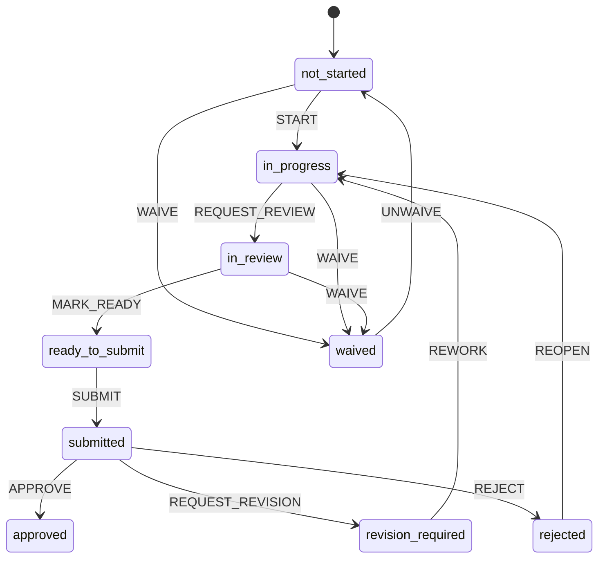

아래는 **(1) 기존 Vercel/Next.js 대시보드(agi-tr-gantt)** + **(2) 기존 순수 HTML 대시보드(option_a_dashboard)** + **(3) Gate Pass/Customs 체크리스트 HTML**을 **하나의 “Voyage 중심 운영 대시보드”**로 통합하기 위한 **구체 설계안**입니다.
요청하신 범위 중 특히 **“탭 추가 + Voyage 컨텍스트 + doc-templates JSON 스키마(초안)”**는 **필드 정의/예시 JSON/상태 머신까지** 포함했습니다.

---

## 0. 문제 정의, 목표, 리스크, 가정

### 문제 정의

* 현재 **운영 일정(선적/운항/현장 작업)**은 Gantt/요약(Next.js)과 별도 HTML(Option A)로 분산되고,
* **서류/허가/회의(PTW/NOC/Loading docs)**는 별도 HTML(체크리스트)로 분산되어,
* **“Voyage 단위로 일정과 서류가 매칭되어 한 화면에서 추적/경보/증빙(attachments)까지”**가 어렵습니다.

### 목표(핵심)

1. **Voyage를 단일 컨텍스트(=Single Source of Truth)로** 잡고
   일정(스케줄) ↔ 서류(체크리스트/허가) ↔ Tide/Weather를 **동일 Voyage ID로 연동**
2. **문서 마감(D-4 등)**이 스케줄 마일스톤(예: MZP Arrival) 변경에 따라 자동 재계산
3. **문서 상태(초안/검토/제출/승인) + 타임리스크(At-risk/Overdue)**를 분리하여 운영자가 “지금 뭐가 위험한지” 즉시 파악
4. 기존 HTML은 **초기엔 빠르게 임베드**하고, **중장기엔 데이터/컴포넌트로 마이그레이션**해 유지보수성을 확보

### 리스크

* (R1) Voyage 식별 규칙이 일관되지 않으면 매칭 실패(= 데이터 모델이 먼저 필요)
* (R2) 문서 마감 계산에 **timezone/주말(토/일 vs 금/토) 규칙**이 들어가면 운영 환경별 편차
* (R3) HTML iframe 임베딩은 빠르지만 **상호작용(클릭→Voyage 변경, 상태 저장)**이 제한적
* (R4) 상태 저장을 Vercel에서 영속화하려면 DB 필요(초기엔 localStorage 가능)

### 가정(초안)

* Voyage는 **1~4회차**처럼 숫자/코드가 있고, 스케줄은 `activityId2(Trip grouping)`로 Voyage 그룹핑 가능
  (현재 구조가 그렇게 설계되어 있음).
* Gate Pass/Customs 체크리스트의 기준 마감은 **MZP Arrival 기준 D-4**(문서 패키지), 일부는 추가 리드타임 필요
  (예: Land Permit approval 2~3 business days).

---

## 1. 사용자/페르소나

1. **Operations Planner(운항/작업 일정 담당)**

* 관심: 일정 충돌/병렬 작업, 조수/기상 리스크, “이 Voyage가 가능한가”

2. **Compliance/HSE Coordinator(서류/허가 담당)**

* 관심: 어떤 서류가 누락/지연인지, 누가 액션해야 하는지, 제출/승인 이력

3. **Logistics Coordinator(대관/대리점/선사 커뮤니케이션)**

* 관심: Pre-arrival Meeting, NOC 요구사항, 연락처/제출처, 최신본 증빙

---

## 2. 여정 맵(정서/행동)

* **Morning check(5분)**: “오늘 위험한 Voyage/문서 뭐지?” → Red/Amber를 먼저 본다
* **Action(30~60분)**: 문제 문서 클릭 → 관련 일정 바/마일스톤 확인 → 담당자 지정/증빙 업로드 → 제출
* **Change event(상시)**: ETA 변경/Load-out 변경 → 문서 마감 자동 재계산 → 위험 상태 재평가

---

## 3. 핵심 플로우 + 복구 경로

### 플로우 A: Voyage 선택 → 일정/문서 연동

1. Voyage 카드 클릭(또는 Gantt에서 Voyage 그룹 클릭)
2. `selectedVoyageId` 업데이트
3. **Schedule Panel**은 해당 Voyage로 스크롤/하이라이트
4. **Docs Panel**은 해당 Voyage 문서 목록/마감/상태 표시

복구:

* 마일스톤이 없으면(예: MZP Arrival 미정) → “마일스톤 설정 필요” 배너 + 수동 입력 UI 노출

### 플로우 B: 문서 상태 전환(상태 머신)

* 문서 클릭 → “상태 변경 / 첨부 업로드 / 코멘트 / 담당자”
* 제출/승인 이벤트는 **상태 전환 규칙**을 통과해야 진행(예: 필수 첨부 없으면 SUBMIT 불가)

복구:

* 승인 반려(REJECT) 시 → `revision_required`로 전환, 사유 필수 입력

---

## 4. IA(정보 구조) + 라벨 전략

현재 `GanttPreview`는 탭 4개(Gantt Chart / Table View / Voyage / Summary) 구조입니다.
이를 “Voyage 중심 운영”으로 확장합니다.

### 제안 IA(최소 변경)

* **Gantt Chart** (기존)
* **Table View** (기존)
* **Voyage** (기존) → “Voyage Overview” 역할 강화
* **Docs** (신규) → Gate Pass/Customs/PTW/NOC 체크리스트 통합
* **Summary** (기존)

> 탭 구현은 shadcn/ui Tabs(Radix 기반) 패턴을 그대로 확장하면 됩니다. ([Shadcn UI][1])

---

## 5. UI 방향 + 컴포넌트 스펙 + 접근성

### 5.1 “탭 추가” 구체안

#### 탭 구성(추천)

* `gantt` / `table` / `voyage` / `docs` / `summary`

#### Docs 탭 내 레이아웃(1차 MVP)

* 상단: **Voyage Mini Cards(1~4)** + “문서 마감(D-4)” + “Risk badge(Overdue/At-risk)”
* 본문(2열):

  * 좌: **카테고리(PTW Pack / Loading Cargo / AD Maritime NOC)** + 진행률
  * 우: **문서 리스트(상태/마감/담당/첨부)** + 상세 드로어(attachments/history)

> 상태 배지 설계는 “Overdue/Failed”가 시각적으로 우선되도록 아이콘/형태 대비를 주는 것이 좋습니다. ([Medium][2])
> 또한 NNGroup의 status tracker 가이드처럼 “사용자가 지금 어디에 있고 무엇이 남았는지”를 일관되게 보여줘야 합니다. ([Nielsen Norman Group][3])

#### 접근성(필수)

* 탭은 WAI-ARIA Tabs 패턴(키보드: Tab으로 진입, Arrow로 탭 이동 등)을 준수해야 합니다. ([W3C][4])
* 색상만으로 상태 구분 금지(배지 텍스트 + 아이콘 + 설명툴팁)

---

### 5.2 Voyage 컨텍스트(핵심) 설계

#### 목표

* **Voyage 선택 상태를 전역으로 유지**하여
  Gantt / Voyage Summary / Docs가 같은 컨텍스트를 공유

#### Voyage Context(권장 인터페이스)

```ts
type VoyageId = string; // "V1" | "V2" | ...

type MilestoneKey =
  | "mzp_arrival"
  | "mzp_departure"
  | "loadout_start"
  | "loadout_end"
  | "agi_arrival"
  | "agi_departure"
  | "doc_deadline";

type Voyage = {
  id: VoyageId;
  label: string;              // "Voyage 1"
  cargoLabel?: string;        // "TR Units 1-2"
  tripGroupKey?: string;      // activityId2 매칭 키
  milestones: Partial<Record<MilestoneKey, string>>; // ISO date
  notes?: string;
};

type VoyageContextValue = {
  voyages: Voyage[];
  selectedVoyageId: VoyageId | null;
  setSelectedVoyageId: (id: VoyageId) => void;

  // schedule ↔ docs 연동을 위해
  getVoyageTasks: (id: VoyageId) => { taskIds: string[]; dateRange?: { start: string; end: string } };

  // docs instance
  docsByVoyage: Record<VoyageId, VoyageDocState>;
  updateDoc: (voyageId: VoyageId, templateId: string, patch: Partial<DocInstance>) => void;
};
```

#### Voyage 추출 전략(스케줄에서 자동 파생)

* `scheduleData.tasks`를 `activityId2`로 그룹핑
* 그룹명/규칙으로 Voyage ID 생성 (예: `"Voyage 1"` → `V1`)
* 각 Voyage의 milestone은 다음 우선순위로 파생:

  1. 명시적 마일스톤 task 이름 매칭(“MZP Arrival”, “Departure”)
  2. 없으면 heuristic:

     * `mzp_arrival` = 해당 Voyage에서 “loadout” 이전 prep/start 최소값
     * `doc_deadline` = `mzp_arrival - 4 days`(기본값)
  3. 그래도 없으면 UI에서 수동 지정(override)

> 현재 시스템은 Trip 그룹을 색상 코딩/요약하는 구조가 이미 존재하므로 Voyage 파생은 자연스럽게 이어집니다.

---

## 6. doc-templates JSON 스키마(초안)

### 6.1 설계 원칙

* 템플릿은 “문서 종류”를 정의(정적)
* 인스턴스는 “Voyage별 문서 상태/첨부/이력”을 정의(동적)
* 문서 마감은 템플릿의 `anchor + offset`으로 계산
* 상태는 **워크플로우 상태(workflowState)**와 **타이밍 상태(dueState)**를 분리

### 6.2 필드 정의(템플릿)

| 필드                    |       타입 |  필수 | 설명                                              |
| --------------------- | -------: | :-: | ----------------------------------------------- |
| `id`                  |   string |  Y  | 템플릿 고유 ID (`ptw.risk_assessment`)               |
| `title`               |   string |  Y  | 표시명                                             |
| `categoryId`          |   string |  Y  | `ptw_pack`, `cargo_docs`, `ad_maritime_noc` 등   |
| `priority`            |     enum |  Y  | `critical`/`important`/`standard`/`recommended` |
| `description`         |   string |  N  | 짧은 설명                                           |
| `appliesTo.scope`     |     enum |  Y  | `voyage`(기본) / `unit` / `project`               |
| `anchor.milestoneKey` |     enum |  Y  | 기준 마일스톤 키(예: `mzp_arrival`)                     |
| `anchor.offsetDays`   |   number |  Y  | 기준일 대비 ±일수(예: -4)                               |
| `anchor.offsetType`   |     enum |  Y  | `calendar_days` / `business_days`               |
| `leadTime.value`      |   number |  N  | 권고 리드타임(예: 3)                                   |
| `leadTime.type`       |     enum |  N  | `calendar_days` / `business_days`               |
| `dependencies`        | string[] |  N  | 선행 문서 템플릿 ID                                    |
| `evidence[]`          |    array |  N  | 첨부/증빙 요구사항(파일/URL/텍스트)                          |
| `links.scheduleTags`  | string[] |  N  | 스케줄 하이라이트 매칭 키워드                                |
| `links.tideRequired`  |  boolean |  N  | Tide 데이터 참조 필요 여부                               |

### 6.3 예시 JSON: `doc-templates.json` (Gate Pass/Customs 기반)

> 아래는 **현재 체크리스트 HTML**에 있는 문서 항목을 그대로 템플릿화한 “작동 가능한 초안”입니다.
> (운영 중 템플릿 ID/카테고리/리드타임은 조정 가능)

```json
{
  "version": "0.1.0",
  "updatedAt": "2026-01-19",
  "defaultCalendar": {
    "timezone": "Asia/Dubai",
    "weekendDays": ["SAT", "SUN"]
  },
  "milestoneKeys": [
    "mzp_arrival",
    "mzp_departure",
    "loadout_start",
    "loadout_end",
    "agi_arrival",
    "doc_deadline"
  ],
  "categories": [
    { "id": "ptw_pack", "label": "PTW Land / HM / HSE / MZ Ops Submission Pack", "sort": 10 },
    { "id": "cargo_docs", "label": "Loading Cargo Related Documents", "sort": 20 },
    { "id": "ad_maritime_noc", "label": "AD Maritime NOC Documents", "sort": 30 }
  ],
  "templates": [
    {
      "id": "ptw.risk_assessment",
      "title": "Risk Assessment",
      "categoryId": "ptw_pack",
      "priority": "critical",
      "description": "AD Port format (shared)",
      "appliesTo": { "scope": "voyage" },
      "anchor": { "milestoneKey": "mzp_arrival", "offsetDays": -4, "offsetType": "calendar_days" },
      "leadTime": { "value": 2, "type": "business_days" },
      "dependencies": [],
      "evidence": [{ "id": "ra_pdf", "type": "file", "label": "Signed RA (PDF)", "required": true, "minCount": 1 }],
      "links": { "scheduleTags": ["MZP", "Load-out"], "tideRequired": false }
    },
    {
      "id": "ptw.consent_form",
      "title": "PTW Applicant/Receiver Consent Form",
      "categoryId": "ptw_pack",
      "priority": "critical",
      "description": "AD Port format (shared)",
      "appliesTo": { "scope": "voyage" },
      "anchor": { "milestoneKey": "mzp_arrival", "offsetDays": -4, "offsetType": "calendar_days" },
      "dependencies": ["ptw.risk_assessment"],
      "evidence": [{ "id": "consent_pdf", "type": "file", "label": "Signed Consent (PDF)", "required": true, "minCount": 1 }],
      "links": { "scheduleTags": ["MZP"], "tideRequired": false }
    },
    {
      "id": "ptw.land_oversize_application",
      "title": "PTW Application for Land Oversized & Heavy Load",
      "categoryId": "ptw_pack",
      "priority": "critical",
      "description": "SPMT/heavy load; approval lead time 2–3 business days",
      "appliesTo": { "scope": "voyage" },
      "anchor": { "milestoneKey": "mzp_arrival", "offsetDays": -5, "offsetType": "calendar_days" },
      "leadTime": { "value": 3, "type": "business_days" },
      "dependencies": ["ptw.risk_assessment", "ptw.method_statement"],
      "evidence": [{ "id": "land_ptw_form", "type": "file", "label": "Land PTW Form", "required": true, "minCount": 1 }],
      "links": { "scheduleTags": ["SPMT", "Load-out"], "tideRequired": false }
    },
    {
      "id": "ptw.stowage_plan",
      "title": "Stowage Plan",
      "categoryId": "ptw_pack",
      "priority": "critical",
      "description": "Cargo layout/weights",
      "appliesTo": { "scope": "voyage" },
      "anchor": { "milestoneKey": "loadout_start", "offsetDays": -3, "offsetType": "calendar_days" },
      "dependencies": [],
      "evidence": [{ "id": "stowage", "type": "file", "label": "Stowage Plan File", "required": true, "minCount": 1 }],
      "links": { "scheduleTags": ["Load-out"], "tideRequired": false }
    },
    {
      "id": "ptw.method_statement",
      "title": "Method Statement (incl. Weather Criteria)",
      "categoryId": "ptw_pack",
      "priority": "critical",
      "description": "AD Port format incl weather criteria",
      "appliesTo": { "scope": "voyage" },
      "anchor": { "milestoneKey": "mzp_arrival", "offsetDays": -4, "offsetType": "calendar_days" },
      "dependencies": ["ptw.risk_assessment"],
      "evidence": [{ "id": "ms", "type": "file", "label": "Method Statement", "required": true, "minCount": 1 }],
      "links": { "scheduleTags": ["MZP", "Load-out", "Transport"], "tideRequired": false }
    },
    {
      "id": "ptw.countdown_plan",
      "title": "Countdown Plan",
      "categoryId": "ptw_pack",
      "priority": "important",
      "description": "Operation countdown schedule",
      "appliesTo": { "scope": "voyage" },
      "anchor": { "milestoneKey": "loadout_start", "offsetDays": -2, "offsetType": "calendar_days" },
      "dependencies": ["ptw.method_statement"],
      "evidence": [{ "id": "countdown", "type": "file", "label": "Countdown Plan", "required": false, "minCount": 0 }],
      "links": { "scheduleTags": ["Load-out"], "tideRequired": false }
    },
    {
      "id": "ptw.undertaking_letter",
      "title": "Undertaking Letter",
      "categoryId": "ptw_pack",
      "priority": "important",
      "appliesTo": { "scope": "voyage" },
      "anchor": { "milestoneKey": "mzp_arrival", "offsetDays": -4, "offsetType": "calendar_days" },
      "dependencies": [],
      "evidence": [{ "id": "undertaking", "type": "file", "label": "Signed Undertaking", "required": false, "minCount": 0 }],
      "links": { "scheduleTags": ["MZP"], "tideRequired": false }
    },
    {
      "id": "ptw.stability_calculation",
      "title": "Stability Calculation",
      "categoryId": "ptw_pack",
      "priority": "critical",
      "description": "For HM review",
      "appliesTo": { "scope": "voyage" },
      "anchor": { "milestoneKey": "mzp_departure", "offsetDays": -5, "offsetType": "calendar_days" },
      "dependencies": ["ptw.stowage_plan"],
      "evidence": [{ "id": "stability", "type": "file", "label": "Stability Calc", "required": true, "minCount": 1 }],
      "links": { "scheduleTags": ["Departure"], "tideRequired": false }
    },
    {
      "id": "ptw.equipment_certificates",
      "title": "3rd Party Equipment Certificates",
      "categoryId": "ptw_pack",
      "priority": "important",
      "description": "SPMT certificates + operator competency",
      "appliesTo": { "scope": "voyage" },
      "anchor": { "milestoneKey": "loadout_start", "offsetDays": -3, "offsetType": "calendar_days" },
      "dependencies": [],
      "evidence": [{ "id": "certs", "type": "file", "label": "Certificates Bundle", "required": false, "minCount": 0 }],
      "links": { "scheduleTags": ["SPMT", "Load-out"], "tideRequired": false }
    },
    {
      "id": "ptw.mws",
      "title": "Marine Warranty Survey (MWS)",
      "categoryId": "ptw_pack",
      "priority": "critical",
      "description": "Required before sailing for HM approval",
      "appliesTo": { "scope": "voyage" },
      "anchor": { "milestoneKey": "mzp_departure", "offsetDays": -2, "offsetType": "calendar_days" },
      "dependencies": ["ptw.stability_calculation"],
      "evidence": [{ "id": "mws", "type": "file", "label": "MWS Approval/Report", "required": true, "minCount": 1 }],
      "links": { "scheduleTags": ["Departure"], "tideRequired": false }
    },
    {
      "id": "ptw.mooring_plan",
      "title": "Mooring Plan",
      "categoryId": "ptw_pack",
      "priority": "standard",
      "appliesTo": { "scope": "voyage" },
      "anchor": { "milestoneKey": "mzp_arrival", "offsetDays": -3, "offsetType": "calendar_days" },
      "dependencies": [],
      "evidence": [{ "id": "mooring", "type": "file", "label": "Mooring Plan", "required": false, "minCount": 0 }],
      "links": { "scheduleTags": ["MZP"], "tideRequired": false }
    },
    {
      "id": "ptw.lashing_plan",
      "title": "Lashing Plan",
      "categoryId": "ptw_pack",
      "priority": "critical",
      "appliesTo": { "scope": "voyage" },
      "anchor": { "milestoneKey": "mzp_departure", "offsetDays": -3, "offsetType": "calendar_days" },
      "dependencies": ["ptw.stowage_plan"],
      "evidence": [{ "id": "lashing", "type": "file", "label": "Lashing Plan", "required": true, "minCount": 1 }],
      "links": { "scheduleTags": ["Departure"], "tideRequired": false }
    },
    {
      "id": "ptw.tide_confirmation",
      "title": "Tide Table / Tide Window Confirmation (Mina Zayed)",
      "categoryId": "ptw_pack",
      "priority": "critical",
      "description": "Confirm workable window for RoRo/linkspan ops",
      "appliesTo": { "scope": "voyage" },
      "anchor": { "milestoneKey": "loadout_start", "offsetDays": -2, "offsetType": "calendar_days" },
      "dependencies": [],
      "evidence": [{ "id": "tide_ref", "type": "file", "label": "Tide Reference / Confirmation", "required": true, "minCount": 1 }],
      "links": { "scheduleTags": ["Load-out"], "tideRequired": true }
    },

    { "id": "cargo.manifest", "title": "Cargo List / Manifest (per voyage)", "categoryId": "cargo_docs", "priority": "recommended",
      "description": "Unit No., dims/weight/CoG etc.",
      "appliesTo": { "scope": "voyage" },
      "anchor": { "milestoneKey": "mzp_arrival", "offsetDays": -4, "offsetType": "calendar_days" },
      "dependencies": [],
      "evidence": [{ "id": "manifest", "type": "file", "label": "Cargo Manifest", "required": false, "minCount": 0 }],
      "links": { "scheduleTags": ["MZP"], "tideRequired": false }
    },
    { "id": "cargo.packing_list", "title": "Packing List / CI (if applicable)", "categoryId": "cargo_docs", "priority": "recommended",
      "appliesTo": { "scope": "voyage" },
      "anchor": { "milestoneKey": "mzp_arrival", "offsetDays": -4, "offsetType": "calendar_days" },
      "dependencies": [],
      "evidence": [{ "id": "packing", "type": "file", "label": "Packing List / CI", "required": false, "minCount": 0 }],
      "links": { "scheduleTags": ["MZP"], "tideRequired": false }
    },
    { "id": "cargo.photos", "title": "Cargo Photos (current condition)", "categoryId": "cargo_docs", "priority": "recommended",
      "appliesTo": { "scope": "voyage" },
      "anchor": { "milestoneKey": "loadout_start", "offsetDays": -1, "offsetType": "calendar_days" },
      "dependencies": [],
      "evidence": [{ "id": "photos", "type": "file", "label": "Photos", "required": false, "minCount": 0 }],
      "links": { "scheduleTags": ["Load-out"], "tideRequired": false }
    },
    { "id": "cargo.load_sequence", "title": "Load sequence / trailer allocation", "categoryId": "cargo_docs", "priority": "important",
      "appliesTo": { "scope": "voyage" },
      "anchor": { "milestoneKey": "loadout_start", "offsetDays": -2, "offsetType": "calendar_days" },
      "dependencies": ["ptw.stowage_plan"],
      "evidence": [{ "id": "sequence", "type": "file", "label": "Load sequence", "required": false, "minCount": 0 }],
      "links": { "scheduleTags": ["Load-out"], "tideRequired": false }
    },

    { "id": "noc.trading_license", "title": "Local Trading License", "categoryId": "ad_maritime_noc", "priority": "critical",
      "appliesTo": { "scope": "project" },
      "anchor": { "milestoneKey": "agi_arrival", "offsetDays": -7, "offsetType": "calendar_days" },
      "dependencies": [],
      "evidence": [{ "id": "license", "type": "file", "label": "Trading License", "required": true, "minCount": 1 }],
      "links": { "scheduleTags": ["Transport"], "tideRequired": false }
    },
    { "id": "noc.ra_erp", "title": "Detailed Risk Assessment & Emergency Response Plan", "categoryId": "ad_maritime_noc", "priority": "critical",
      "appliesTo": { "scope": "voyage" },
      "anchor": { "milestoneKey": "agi_arrival", "offsetDays": -5, "offsetType": "calendar_days" },
      "dependencies": ["ptw.risk_assessment"],
      "evidence": [{ "id": "erp", "type": "file", "label": "ERP Document", "required": true, "minCount": 1 }],
      "links": { "scheduleTags": ["Transport"], "tideRequired": false }
    },
    { "id": "noc.no_objection", "title": "No Objection from Relevant Authorities", "categoryId": "ad_maritime_noc", "priority": "critical",
      "appliesTo": { "scope": "project" },
      "anchor": { "milestoneKey": "agi_arrival", "offsetDays": -7, "offsetType": "calendar_days" },
      "dependencies": [],
      "evidence": [{ "id": "nol", "type": "file", "label": "No Objection Letter", "required": true, "minCount": 1 }],
      "links": { "scheduleTags": ["Transport"], "tideRequired": false }
    },
    { "id": "noc.voyage_plan", "title": "Voyage Plan (MZP → AGI)", "categoryId": "ad_maritime_noc", "priority": "critical",
      "appliesTo": { "scope": "voyage" },
      "anchor": { "milestoneKey": "agi_arrival", "offsetDays": -3, "offsetType": "calendar_days" },
      "dependencies": [],
      "evidence": [{ "id": "voyage_plan", "type": "file", "label": "Voyage Plan", "required": true, "minCount": 1 }],
      "links": { "scheduleTags": ["Transport"], "tideRequired": false }
    },
    { "id": "noc.route_map", "title": "Route Map", "categoryId": "ad_maritime_noc", "priority": "important",
      "appliesTo": { "scope": "voyage" },
      "anchor": { "milestoneKey": "agi_arrival", "offsetDays": -3, "offsetType": "calendar_days" },
      "dependencies": ["noc.voyage_plan"],
      "evidence": [{ "id": "route", "type": "file", "label": "Route Map", "required": false, "minCount": 0 }],
      "links": { "scheduleTags": ["Transport"], "tideRequired": false }
    },
    { "id": "noc.contract_award", "title": "Contract Award Letter Copy", "categoryId": "ad_maritime_noc", "priority": "important",
      "appliesTo": { "scope": "project" },
      "anchor": { "milestoneKey": "agi_arrival", "offsetDays": -10, "offsetType": "calendar_days" },
      "dependencies": [],
      "evidence": [{ "id": "award", "type": "file", "label": "Contract Award Letter", "required": false, "minCount": 0 }],
      "links": { "scheduleTags": ["Transport"], "tideRequired": false }
    }
  ]
}
```

(템플릿 파일을 JSON Schema로 검증하는 방식 자체는 JSON Schema 공식 예시/enum 규칙을 그대로 따르면 됩니다.) ([JSON Schema][5])

---

### 6.4 예시 JSON: Voyage별 문서 인스턴스 상태(`voyage-docs.json`)

```json
{
  "voyageId": "V1",
  "templateVersion": "0.1.0",
  "milestones": {
    "mzp_arrival": "2026-01-26",
    "mzp_departure": "2026-02-01",
    "loadout_start": "2026-01-29",
    "agi_arrival": "2026-02-02"
  },
  "documents": [
    {
      "templateId": "ptw.risk_assessment",
      "workflowState": "approved",
      "dueAt": "2026-01-22",
      "assignee": { "name": "HSE Lead", "org": "Mammoet" },
      "attachments": [
        { "id": "att_001", "name": "RA_V1_signed.pdf", "type": "file", "url": "https://storage/ra.pdf", "uploadedAt": "2026-01-18T10:15:00Z" }
      ],
      "history": [
        { "at": "2026-01-17T08:00:00Z", "event": "START" },
        { "at": "2026-01-18T10:15:00Z", "event": "UPLOAD" },
        { "at": "2026-01-18T12:00:00Z", "event": "SUBMIT" },
        { "at": "2026-01-19T09:30:00Z", "event": "APPROVE" }
      ],
      "notes": "Approved by AD Port HSE"
    }
  ]
}
```

---

## 7. 문서 상태 머신(상태/이벤트 정의)

### 7.1 워크플로우 상태(Workflow State)

* `not_started`
* `in_progress`
* `in_review`
* `ready_to_submit`
* `submitted`
* `approved`
* `revision_required`
* `rejected`
* `waived`(해당 없음/면제)

### 7.2 타이밍 상태(Due State) — **계산 필드(권장)**

* `on_track` / `at_risk` / `overdue` / `completed_late`

> 타이밍은 “상태”라기보다 “현재 날짜 vs dueAt vs 완료일”로 **항상 재계산**되는 것이 운영상 안전합니다.

### 7.3 Mermaid 상태 다이어그램(초안)



### 7.4 구현 힌트(XState 선택지)

상태 머신을 코드로 확정하려면 XState 같은 라이브러리가 적합합니다(워크플로우 모델링/시각화/테스트에 유리). ([Stately][6])

---

## 8. Prototype Pipeline + Simulation Report

### 8.1 빠른 통합(즉시 가능): “Legacy HTML 임베드 탭”

* HTML 파일을 `public/legacy/*.html`로 옮기면 Next.js가 정적 파일로 서빙할 수 있습니다. ([Next.js][7])
* `Docs` 탭에 iframe로 `gate_pass...html`를 넣으면 “UI 통합 느낌”은 빠르게 낼 수 있습니다.
* 보안/성능은 `sandbox`, lazy loading 등 기본 수칙을 적용합니다. ([caisy.io][8])

**Feasibility: Pass(단, 연동성은 낮음)**

### 8.2 제대로 된 통합(권장): “데이터/컴포넌트 마이그레이션”

* HTML의 “문서 항목”을 `doc-templates.json`으로 추출(위 예시)
* 스케줄 데이터에서 Voyage/milestone 파생
* Docs 탭은 React 컴포넌트로 구축(상태 저장 포함)

**Feasibility: Pass(작업량 증가, 유지보수성↑)**

### 8.3 시뮬레이션(간단 검증 로그)

* 예: `mzp_arrival=2026-01-26`이면 `doc_deadline = -4 calendar days = 2026-01-22`로 계산
  → Gate Pass 체크리스트에 기재된 Document Deadline과 정합.
* 예: Land Permit “제출 마감”은 `-5 calendar days`로 두고(01-21), `leadTime=3 business days`를 별도 리드타임으로 모델링하면 “주말 포함 시 여유 필요” 메시지를 UI에서 자동 표기 가능.

---

## 9. Validation Plan + Decision Gates

### 기능 검증(필수)

* [ ] Voyage 선택이 모든 탭에서 동기화되는가
* [ ] milestone 변경 시 dueAt 재계산이 즉시 반영되는가
* [ ] 필수 evidence 없을 때 SUBMIT 차단되는가
* [ ] Overdue/At-risk 계산이 일관되는가(타임존 포함)

### UX 검증(필수)

* [ ] Overdue/Failed가 시각적으로 최우선으로 보이는가(색상만 의존하지 않음) ([Medium][2])
* [ ] 탭 키보드 내비게이션이 APG 패턴대로 동작하는가 ([W3C][4])

---

## 10. 차별화 포인트(“signature interactions”) + 리스크 완화

### 시그니처 1: **Doc ↔ Schedule 양방향 하이라이트**

* 문서 항목 hover → 관련 스케줄 바/마일스톤 강조
* 스케줄 바 클릭 → 관련 문서 목록 필터 + “이 작업에 필요한 문서” 강조

### 시그니처 2: **Voyage Deadline Heatline**

* Gantt 상단 타임라인에 `doc_deadline` 마커/경보 표시
* 일정이 앞당겨지면 마커도 자동 이동 → “문서가 일정에 종속”됨을 시각화

---

## Handoff + Traceability Bundle

### 산출물(이번 답변에서 제공한 것)

* 탭 추가 IA 제안
* Voyage Context 데이터 모델
* doc-templates JSON 스키마(필드 정의 + 예시 JSON)
* 문서 상태 머신(mermaid)
* 구현/검증 체크리스트

### 첨부(프로젝트 파일 근거)

* 컴포넌트 탭 구조/레이아웃 기반 설계:
* Vercel/Next.js 성능 우선순위(워터폴 제거/번들 최적화 등) 참고:

---

## 다음 단계 제안(바로 실행 가능한 작업 순서)

1. **Docs 탭만 먼저 추가**(UI 골격 + Voyage selector + 카테고리/리스트)
2. `doc-templates.json`을 `/data`에 추가하고 zod로 런타임 검증(이미 프로젝트에 zod 사용 중)
3. Voyage 파생 로직(스케줄→voyages+milestones) 구현
4. 문서 인스턴스 상태 저장: MVP는 localStorage, 운영/공유 필요 시 DB(Vercel Postgres 등)로 확장
5. 마지막으로 iframe 기반 “Legacy HTML 보기”는 제거하거나 “Reference” 메뉴로 격하

원하시면, 위 스키마를 기준으로 **(A) 실제 Next.js 컴포넌트 트리 설계(파일 단위)**, **(B) `doc-templates.schema.json`(Draft 2020-12) 전체 JSON Schema**, **(C) 상태 머신을 XState 코드로 구체화**까지 한 번에 내려드릴 수 있습니다.

[1]: https://ui.shadcn.com/docs/components/tabs?utm_source=chatgpt.com "Tabs - Shadcn UI"
[2]: https://uxmovement.medium.com/the-right-way-to-design-table-status-badges-31f65a927dab?utm_source=chatgpt.com "The Right Way to Design Table Status Badges - UX Movement"
[3]: https://www.nngroup.com/articles/status-tracker-progress-update/?utm_source=chatgpt.com "Status Trackers and Progress Updates: 16 Design Guidelines"
[4]: https://www.w3.org/WAI/ARIA/apg/patterns/tabs/?utm_source=chatgpt.com "Tabs Pattern | APG | WAI"
[5]: https://json-schema.org/learn/json-schema-examples?utm_source=chatgpt.com "JSON Schema examples"
[6]: https://stately.ai/docs/examples?utm_source=chatgpt.com "XState examples"
[7]: https://nextjs.org/docs/pages/api-reference/file-conventions/public-folder?utm_source=chatgpt.com "File-system conventions: public"
[8]: https://caisy.io/blog/nextjs-iframe-implementation?utm_source=chatgpt.com "How to Use Iframes in Next.js (Secure, Fast & SEO-Friendly)"
