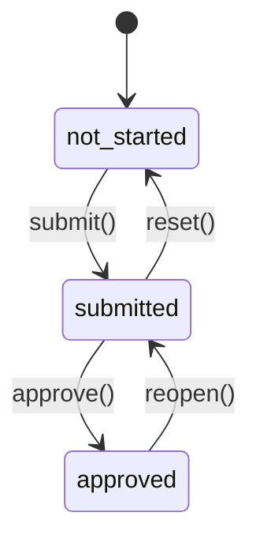

아래는 **“Docs 탭(문서 체크리스트) → Voyage 컨텍스트(선적/Trip 단위) → 문서 상태 머신(not_started → submitted → approved) → due date를 4개 마일스톤과 동일 로직으로 연동 → 영속화(localStorage/DB) → Gantt 상에 Docs progress overlay + 문서 데드라인 세로 마커”**까지, **바로 구현 가능한 수준의 설계/코드 골격**입니다.
(외부 아이디어는 “문서 패키지/선적 문서 표준” 관점까지 포함해 확장했습니다. ([Maersk][1]))

---

## Stage 0. Problem Statement + Objectives + Risks + Assumptions

### Problem

* 현재 **Vercel 기반 Gantt/대시보드**와 **HTML 체크리스트(PTW/Customs/NOC)**가 분리되어 있어:

  * “**어느 Voyage(Trip)에서 어떤 문서가 언제까지 필요하고, 지금 몇 % 준비됐는지**”가 한 화면에 결합되지 않음
  * 일정 변경 시 **문서 데드라인이 수동 유지**되어 리스크가 커짐

### Objectives

1. **Docs 탭**을 먼저 추가: *Voyage Selector + 카테고리/리스트 + 상태 변경(상태 머신)*
2. **Doc due date를 Voyage Summary의 4 마일스톤과 동일 로직으로 자동 연동**
3. **Docs 진행률을 Gantt Trip row 위에 overlay**로 표시 (시각적 결합)
4. **문서 데드라인 세로 마커**를 타임라인에 표시 (임박/지연 리스크 시각화)
5. **상태 영속화**: localStorage → (옵션) DB(Vercel KV / SQLite 계열)

### Key Risks

* (R1) 마일스톤 추출 로직이 코드에 분산돼 있으면 **“동일 로직 공유”가 붕괴**
* (R2) 날짜 파싱/타임존 이슈로 **due date가 하루 밀리는** 버그 가능
* (R3) Vercel에서 **로컬 파일 SQLite는 원칙적으로 비권장/불가**(서버리스 스토리지 특성) ([Vercel][2])

### Assumptions

* scheduleData는 `ScheduleTask[]`를 갖고, Trip/Voyage는 `activityId2`로 그룹핑 가능 (SYSTEM_LAYOUT 문서 기준)
* Voyage Summary 탭은 이미 “4 마일스톤” 표를 렌더하고 있음 → 해당 로직을 **공용 유틸로 추출**해 Docs에서도 사용

---

## Stage 1. Personas (핵심 3명)

1. **Logistics Coordinator**: Gantt에서 “Trip별 docs readiness”를 즉시 보고 싶다.
2. **Document Controller**: 카테고리별 문서 상태 업데이트(제출/승인) + 데드라인 관리가 필요.
3. **Project Manager**: 지연 위험(RAG)과 병목(어떤 문서가 막고 있는지)을 한 눈에 확인해야 한다.

---

## Stage 2. Journey Map (요약)

* Trip 선택 → (Docs 탭) 필수 문서 리스트 확인 → 제출/승인 처리
* 일정 변경(마일스톤 이동) → due date 자동 재계산 → 타임라인/Trip overlay에 위험 표시

---

## Stage 3. Flows + Recovery Paths + Metrics

### Core Flow: 문서 처리

1. Docs 탭에서 Voyage 선택
2. 카테고리(PTW / Loading / NOC) 선택
3. 문서 row에서 상태 전환:

   * not_started → submitted → approved
4. 자동 계산된 due date와 “D-x” 표시 확인
5. Gantt에서 Trip overlay로 진행률 및 데드라인 마커 확인

### Recovery

* 잘못 승인/제출 시: `approved → submitted` 또는 `submitted → not_started` (권한 정책은 추후)

### Metrics

* Voyage별 **Approved ratio**
* **Overdue 문서 수 / Due soon 문서 수**
* 문서 상태 변경 이벤트(감사 로그는 옵션)

---

## Stage 4. IA + Label Strategy

현재 GanttPreview 탭(예: Gantt / Table / Voyage Summary / Summary)에 **Docs 탭 추가**:

* Gantt Chart
* Table View
* Voyage Summary
* **Docs** (NEW)
* Summary

Docs 탭 내부 IA:

* 상단: Voyage Selector + Progress KPI(Approved/Total, Overdue, Due soon)
* 좌측: Category list
* 우측: Doc list (due date + status + action)

---

## Stage 5. UI Direction + Component Specs + Accessibility

### UI 핵심

* **Voyage Selector**: Select 컴포넌트(키보드 탐색/스크린리더 가능)
* **문서 row**: 제목/설명/태그/데드라인/상태 배지/액션 버튼
* **Progress**: (전체) Progress bar + 숫자 KPI
* **RAG**: due date 기반 위험 색상(텍스트 + 아이콘) — 색만으로 구분 금지(WCAG)

### 접근성 메모

* 상태 버튼에 `aria-label="Mark as submitted"` 등 명확한 label
* “Due in 2 days” 같은 텍스트 병기(색상 의존 금지)

---

## Stage 6. Prototype Pipeline + Simulation Report

### 구현 순서 (권장)

1. **공용 마일스톤 유틸** 추출 (`getVoyageMilestones()`)
2. doc-templates 스키마/예시 정의
3. Docs 탭 UI 골격 + Voyage selector + 카테고리/리스트
4. 상태 머신 연결 + localStorage 영속화
5. due date 계산을 마일스톤 기반으로 연결
6. Gantt overlay + due date marker 렌더

Simulation note

* 현재 환경에서 repo 전체를 빌드/런하는 “실행형 시뮬레이션”은 수행하지 않았고, 대신 **컴파일 가능한 형태의 TS/React 골격**을 제공했습니다.
* due date 계산/마일스톤 매핑은 단위 테스트 형태로 쉽게 검증 가능하도록 순수 함수로 분리했습니다.

Feasibility: **Pass** (단, DB 저장소는 배포환경 제약 고려 필요)

---

# 핵심 설계/코드 골격

아래는 “바로 파일 생성/붙여넣기” 가능한 수준으로 작성했습니다.

---

## 1) Voyage 컨텍스트 + VOYAGES_SEED 자동 구성 유틸 (요청 A)

### `lib/voyage/build-voyages-seed.ts`

```ts
import type { ScheduleData, ScheduleTask } from "@/lib/types";

export type VoyageId = string; // 기본: activityId2
export type VoyageSeed = {
  id: VoyageId;
  label: string;          // UI 표시명 (fallback 포함)
  startDate: Date;
  endDate: Date;
  order: number;          // 정렬용
};

function toDate(d: string | Date): Date {
  // IMPORTANT: "YYYY-MM-DD" 문자열은 new Date()로 파싱하면 UTC로 처리돼 날짜가 밀릴 수 있음
  // 프로젝트가 date-fns를 쓰고 있다면 parseISO 권장
  return d instanceof Date ? d : new Date(d + "T00:00:00");
}

function minDate(dates: Date[]) {
  return new Date(Math.min(...dates.map((d) => d.getTime())));
}
function maxDate(dates: Date[]) {
  return new Date(Math.max(...dates.map((d) => d.getTime())));
}

function inferVoyageLabel(tasks: ScheduleTask[], fallback: string) {
  // 가벼운 휴리스틱: task.name에 "AGI TR Units" 같은 문자열이 있으면 우선 사용
  const hit = tasks.find((t) => /AGI\s*TR\s*Units/i.test(t.name))?.name;
  return hit ? hit : fallback;
}

export function buildVoyagesSeedFromScheduleData(scheduleData: ScheduleData): VoyageSeed[] {
  const tasks = scheduleData.tasks ?? [];
  const byId2 = new Map<string, ScheduleTask[]>();

  for (const t of tasks) {
    const key = t.activityId2?.trim();
    if (!key) continue;
    const arr = byId2.get(key) ?? [];
    arr.push(t);
    byId2.set(key, arr);
  }

  const seeds: VoyageSeed[] = Array.from(byId2.entries()).map(([id, ts]) => {
    const starts = ts.map((t) => toDate(t.startDate));
    const ends = ts.map((t) => toDate(t.endDate));
    const startDate = minDate(starts);
    const endDate = maxDate(ends);
    return {
      id,
      label: inferVoyageLabel(ts, `Trip ${id}`),
      startDate,
      endDate,
      order: startDate.getTime(),
    };
  });

  seeds.sort((a, b) => a.order - b.order);
  return seeds;
}
```

**포인트**

* `activityId2` 기반으로 **Trip/Voyage를 자동 추출**
* label은 우선 휴리스틱/매핑(추후 개선), 기본은 `Trip {activityId2}`

---

## 2) Voyage Summary(4 마일스톤)와 동일 로직 공유 (Docs due date 기반)

### ✅ 핵심 원칙

* Voyage Summary가 쓰는 “마일스톤 추출” 로직을 **반드시 공용화**
* Docs due date는 doc-template의 `dueRule.anchorMilestoneKey` + `offsetDays`로 계산

### `lib/voyage/milestones.ts`

```ts
import type { ScheduleTask } from "@/lib/types";
import type { VoyageId } from "@/lib/voyage/build-voyages-seed";

export type MilestoneKey =
  | "mzp_arrival"
  | "loadout"
  | "sail_away_to_agi"
  | "return_to_mzp";

export type MilestoneWindow = {
  key: MilestoneKey;
  label: string;
  start?: Date;
  end?: Date;
  sourceTaskIds?: string[];
};

function toDate(d: string | Date): Date {
  return d instanceof Date ? d : new Date(d + "T00:00:00");
}

// 프로젝트 데이터에 맞춰 여기 매칭 규칙은 반드시 한번 실제 task.name을 보고 튜닝하세요.
const MILESTONE_DEFS: Array<{
  key: MilestoneKey;
  label: string;
  match: (t: ScheduleTask) => boolean;
  pick: "start" | "end" | "range";
}> = [
  {
    key: "mzp_arrival",
    label: "LCT Arrives to MZP",
    match: (t) => /arrives?\s+to\s+mzp|mzp\s+arrival/i.test(t.name),
    pick: "start",
  },
  {
    key: "loadout",
    label: "Load-out",
    match: (t) => /load-?out|loading/i.test(t.name),
    pick: "range",
  },
  {
    key: "sail_away_to_agi",
    label: "Sail-away to AGI",
    match: (t) => /sail-?away|depart|to\s+agi/i.test(t.name),
    pick: "start",
  },
  {
    key: "return_to_mzp",
    label: "Return to MZP",
    match: (t) => /return\s+to\s+mzp/i.test(t.name),
    pick: "end",
  },
];

export function getVoyageMilestones(tasks: ScheduleTask[], voyageId: VoyageId): Record<MilestoneKey, MilestoneWindow> {
  const voyageTasks = tasks.filter((t) => t.activityId2 === voyageId);

  const result = {} as Record<MilestoneKey, MilestoneWindow>;

  for (const def of MILESTONE_DEFS) {
    const matched = voyageTasks.filter(def.match);

    if (matched.length === 0) {
      result[def.key] = { key: def.key, label: def.label };
      continue;
    }

    const starts = matched.map((t) => toDate(t.startDate));
    const ends = matched.map((t) => toDate(t.endDate));

    if (def.pick === "start") {
      const start = new Date(Math.min(...starts.map((d) => d.getTime())));
      result[def.key] = { key: def.key, label: def.label, start, end: start, sourceTaskIds: matched.map(m => m.id) };
    } else if (def.pick === "end") {
      const end = new Date(Math.max(...ends.map((d) => d.getTime())));
      result[def.key] = { key: def.key, label: def.label, start: end, end, sourceTaskIds: matched.map(m => m.id) };
    } else {
      const start = new Date(Math.min(...starts.map((d) => d.getTime())));
      const end = new Date(Math.max(...ends.map((d) => d.getTime())));
      result[def.key] = { key: def.key, label: def.label, start, end, sourceTaskIds: matched.map(m => m.id) };
    }
  }

  return result;
}
```

> **중요:** `match()`는 프로젝트 task naming 규칙에 맞춰 실제 데이터 기준으로 조정 필요(1회 튜닝하면 안정적으로 갑니다).

---

## 3) doc-templates JSON 스키마(초안) + 필드 정의 + 예시 JSON + 상태 머신

### 3.1 Doc Templates 스키마(필드 정의)

* `categories[]`

  * `id`: string (예: `ptw_pack`)
  * `label`: string
  * `order`: number
* `templates[]`

  * `id`: string (전역 고유)
  * `categoryId`: string (categories.id 참조)
  * `title`: string
  * `description?`: string
  * `tags?`: `"mandatory" | "important" | "reference"` 등
  * `scope`: `"voyage" | "project" | "month"` (초기에는 voyage 권장)
  * `dueRule`

    * `anchorMilestoneKey`: `"mzp_arrival" | "loadout" | "sail_away_to_agi" | "return_to_mzp"`
    * `offsetDays`: number (예: -4)
    * `timeLocal?`: `"17:00"` (표시용)
  * `owners?`: string[]
  * `links?`: `{ label: string; url: string }[]`
  * `notes?`: string

### 3.2 예시 JSON (data/doc-templates.v0.json)

```json
{
  "schemaVersion": "0.1",
  "categories": [
    { "id": "ptw_pack", "label": "PTW / Land Permit / HSE / MZ Ops Submission Pack", "order": 1 },
    { "id": "loading_docs", "label": "Loading Cargo Documentation", "order": 2 },
    { "id": "ad_maritime_noc", "label": "AD Maritime NOC Submission Pack", "order": 3 }
  ],
  "templates": [
    {
      "id": "ptw_risk_assessment",
      "categoryId": "ptw_pack",
      "title": "Risk Assessment",
      "description": "AD Port format",
      "tags": ["mandatory"],
      "scope": "voyage",
      "dueRule": { "anchorMilestoneKey": "mzp_arrival", "offsetDays": -4, "timeLocal": "17:00" },
      "owners": ["Mammoet", "HSE"]
    },
    {
      "id": "ptw_method_statement",
      "categoryId": "ptw_pack",
      "title": "Method Statement",
      "tags": ["mandatory"],
      "scope": "voyage",
      "dueRule": { "anchorMilestoneKey": "mzp_arrival", "offsetDays": -4 }
    },
    {
      "id": "ptw_tide_reference",
      "categoryId": "ptw_pack",
      "title": "Tide Table / Best Departure Time Confirmation (Reference)",
      "tags": ["reference"],
      "scope": "voyage",
      "dueRule": { "anchorMilestoneKey": "sail_away_to_agi", "offsetDays": -1 }
    },

    {
      "id": "load_cargo_list",
      "categoryId": "loading_docs",
      "title": "Cargo List (SKU / Dimensions / Weight)",
      "tags": ["mandatory"],
      "scope": "voyage",
      "dueRule": { "anchorMilestoneKey": "loadout", "offsetDays": -2 }
    },

    {
      "id": "noc_marine_transit_plan",
      "categoryId": "ad_maritime_noc",
      "title": "Marine Transit Plan",
      "tags": ["mandatory"],
      "scope": "voyage",
      "dueRule": { "anchorMilestoneKey": "sail_away_to_agi", "offsetDays": -2 }
    }
  ]
}
```

> 외부 아이디어: 국제 선적에서는 Commercial Invoice / Packing List / Customs Declaration / Bill of Lading 등 “표준 선적 문서 세트”가 자주 필수입니다. 필요하면 `customs_docs` 카테고리로 확장 가능. ([Maersk][1])

---

## 4) 문서 상태 머신 정의 + 연결

### 4.1 상태 머신(mermaid)



### 4.2 타입/전이(Transition) 함수

#### `lib/docs/state-machine.ts`

```ts
export type DocStatus = "not_started" | "submitted" | "approved";

export type DocAction = "submit" | "approve" | "reset" | "reopen";

const TRANSITIONS: Record<DocStatus, Partial<Record<DocAction, DocStatus>>> = {
  not_started: { submit: "submitted" },
  submitted:   { approve: "approved", reset: "not_started" },
  approved:    { reopen: "submitted" },
};

export function canTransition(from: DocStatus, action: DocAction): boolean {
  return Boolean(TRANSITIONS[from][action]);
}

export function transition(from: DocStatus, action: DocAction): DocStatus {
  const next = TRANSITIONS[from][action];
  if (!next) return from;
  return next;
}
```

---

## 5) Doc due date 계산(마일스톤 연동) + 공유 로직

#### `lib/docs/due-date.ts`

```ts
import type { MilestoneKey, MilestoneWindow } from "@/lib/voyage/milestones";

export type DueRule = {
  anchorMilestoneKey: MilestoneKey;
  offsetDays: number;        // (-)이면 이전
  timeLocal?: string;        // 표시용
};

export function addDays(date: Date, days: number) {
  const d = new Date(date);
  d.setDate(d.getDate() + days);
  return d;
}

export function computeDueDate(
  milestones: Record<MilestoneKey, MilestoneWindow>,
  dueRule: DueRule
): Date | undefined {
  const anchor = milestones[dueRule.anchorMilestoneKey]?.start;
  if (!anchor) return undefined;
  return addDays(anchor, dueRule.offsetDays);
}
```

> 여기서 핵심은 **Voyage Summary 탭도 동일 milestones 유틸을 쓰도록 리팩토링**하는 것입니다.
> 즉, “마일스톤 추출”은 1곳에서만 정의하고, Docs/요약/마커/오버레이가 모두 동일 함수 호출.

---

## 6) Docs 상태 영속화: localStorage + (옵션) DB(Vercel KV / SQLite)

### 6.1 저장 키 설계(권장)

* `projectKey`: 프로젝트/스케줄 단위 키(예: 업로드 파일명, projectId)
* `docInstanceKey`: `${projectKey}::${voyageId}::${docTemplateId}`

### 6.2 localStorage 구현(우선)

#### `hooks/use-docs-store.ts`

```ts
"use client";

import { useCallback, useEffect, useMemo, useState } from "react";
import type { DocStatus } from "@/lib/docs/state-machine";

export type DocInstanceState = {
  status: DocStatus;
  updatedAt: string; // ISO
};

export type DocsState = {
  version: 1;
  projectKey: string;
  items: Record<string, DocInstanceState>; // docInstanceKey -> state
};

function safeParse<T>(value: string | null): T | null {
  if (!value) return null;
  try { return JSON.parse(value) as T; } catch { return null; }
}

export function useDocsStore(projectKey: string) {
  const storageKey = useMemo(() => `docsState:v1:${projectKey}`, [projectKey]);

  const [state, setState] = useState<DocsState>({
    version: 1,
    projectKey,
    items: {},
  });

  useEffect(() => {
    const saved = safeParse<DocsState>(localStorage.getItem(storageKey));
    if (saved?.version === 1 && saved.projectKey === projectKey) {
      setState(saved);
    }
  }, [projectKey, storageKey]);

  const persist = useCallback((next: DocsState) => {
    setState(next);
    localStorage.setItem(storageKey, JSON.stringify(next));
  }, [storageKey]);

  const setDocStatus = useCallback((docInstanceKey: string, status: DocStatus) => {
    const now = new Date().toISOString();
    persist({
      ...state,
      items: {
        ...state.items,
        [docInstanceKey]: { status, updatedAt: now },
      },
    });
  }, [persist, state]);

  return { state, setDocStatus };
}
```

### 6.3 DB 옵션 (Vercel KV)

* **@vercel/kv는 기본적으로 `KV_REST_API_URL`, `KV_REST_API_TOKEN`를 읽고**, `kv.get/set`를 제공합니다. ([Socket][3])
* 다만, Vercel KV는 “제품 자체는 sunset”되었고, 현재는 Marketplace 스토리지를 통해 대체 KV를 연결하는 방식이 안내됩니다. ([Vercel][4])

#### `app/api/docs-state/route.ts` (Route Handler)

Next.js Route Handlers는 `app/api/.../route.ts`에 정의합니다. ([Next.js][5])

```ts
import { NextRequest } from "next/server";
import { kv } from "@vercel/kv";

export const runtime = "nodejs"; // edge에서도 가능할 수 있으나, 우선 nodejs 권장

type DocsState = {
  version: 1;
  projectKey: string;
  items: Record<string, { status: "not_started" | "submitted" | "approved"; updatedAt: string }>;
};

function keyOf(projectKey: string) {
  return `docsState:v1:${projectKey}`;
}

export async function GET(req: NextRequest) {
  const projectKey = req.nextUrl.searchParams.get("projectKey");
  if (!projectKey) return Response.json({ error: "missing projectKey" }, { status: 400 });

  const data = await kv.get<DocsState>(keyOf(projectKey));
  return Response.json({ data: data ?? null });
}

export async function PUT(req: NextRequest) {
  const body = (await req.json()) as DocsState;
  if (!body?.projectKey) return Response.json({ error: "missing projectKey" }, { status: 400 });

  await kv.set(keyOf(body.projectKey), body);
  return Response.json({ ok: true });
}
```

### 6.4 SQLite 옵션(현실적 제약)

* **Vercel의 serverless 환경에서는 로컬 파일 기반 SQLite는 권장/지원되지 않습니다**(ephemeral storage). ([Vercel][2])
* “SQLite 계열”을 유지하려면:

  * **Turso 같은 원격 SQLite(libSQL) 계열**을 사용(HTTP 기반)하는 접근이 실무적으로 맞습니다. ([docs.turso.tech][6])

---

## 7) Docs 탭 UI 골격 (요청: “Docs 탭만 먼저 추가”)

아래는 **GanttPreview 내부 Tabs에 Docs 탭을 추가**하고, **Voyage selector + 카테고리/리스트**를 렌더하는 최소 골격입니다.

### 7.1 `components/docs/docs-tab.tsx`

```tsx
"use client";

import { useMemo, useState } from "react";
import type { ScheduleData } from "@/lib/types";
import { buildVoyagesSeedFromScheduleData } from "@/lib/voyage/build-voyages-seed";
import { getVoyageMilestones } from "@/lib/voyage/milestones";
import { computeDueDate } from "@/lib/docs/due-date";
import { transition, type DocAction, type DocStatus } from "@/lib/docs/state-machine";
import { useDocsStore } from "@/hooks/use-docs-store";

// shadcn/ui 가정 (프로젝트에 맞는 import 경로로 조정)
import { Card, CardContent, CardHeader, CardTitle } from "@/components/ui/card";
import { Select, SelectContent, SelectItem, SelectTrigger, SelectValue } from "@/components/ui/select";
import { Button } from "@/components/ui/button";
import { Badge } from "@/components/ui/badge";
import { Progress } from "@/components/ui/progress";
import { Separator } from "@/components/ui/separator";

// 초기에는 TS 상수로 (추후 JSON 로더로 전환 가능)
import { DOC_CATEGORIES, DOC_TEMPLATES } from "@/lib/docs/templates";

type Props = {
  scheduleData: ScheduleData;
  projectKey: string; // 업로드 파일명/프로젝트명 등
};

function fmtDate(d?: Date) {
  if (!d) return "—";
  return d.toISOString().slice(0, 10);
}

function makeDocInstanceKey(projectKey: string, voyageId: string, docId: string) {
  return `${projectKey}::${voyageId}::${docId}`;
}

export function DocsTab({ scheduleData, projectKey }: Props) {
  const voyages = useMemo(() => buildVoyagesSeedFromScheduleData(scheduleData), [scheduleData]);
  const [voyageId, setVoyageId] = useState<string>(voyages[0]?.id ?? "");
  const [categoryId, setCategoryId] = useState<string>(DOC_CATEGORIES[0]?.id ?? "");

  const { state, setDocStatus } = useDocsStore(projectKey);

  const milestones = useMemo(() => {
    if (!voyageId) return null;
    return getVoyageMilestones(scheduleData.tasks ?? [], voyageId);
  }, [scheduleData.tasks, voyageId]);

  const visibleDocs = useMemo(() => {
    return DOC_TEMPLATES.filter((t) => t.categoryId === categoryId);
  }, [categoryId]);

  const progress = useMemo(() => {
    if (!voyageId) return { total: 0, approved: 0, pct: 0 };
    const docs = DOC_TEMPLATES; // 전체 기준(원하면 category 기준으로 변경)
    const total = docs.length;
    const approved = docs.filter((d) => {
      const key = makeDocInstanceKey(projectKey, voyageId, d.id);
      return state.items[key]?.status === "approved";
    }).length;
    const pct = total === 0 ? 0 : Math.round((approved / total) * 100);
    return { total, approved, pct };
  }, [projectKey, state.items, voyageId]);

  const onAction = (docId: string, action: DocAction) => {
    const key = makeDocInstanceKey(projectKey, voyageId, docId);
    const current: DocStatus = state.items[key]?.status ?? "not_started";
    const next = transition(current, action);
    setDocStatus(key, next);
  };

  return (
    <Card className="w-full">
      <CardHeader className="pb-3">
        <div className="flex items-start justify-between gap-4">
          <div>
            <CardTitle>Docs</CardTitle>
            <div className="text-sm text-muted-foreground">
              Voyage(Trip)별 문서 준비 상태를 일정(마일스톤)과 연동해 관리합니다.
            </div>
          </div>

          <div className="w-[260px]">
            <Select value={voyageId} onValueChange={setVoyageId}>
              <SelectTrigger aria-label="Select voyage">
                <SelectValue placeholder="Select voyage" />
              </SelectTrigger>
              <SelectContent>
                {voyages.map((v) => (
                  <SelectItem key={v.id} value={v.id}>
                    {v.label}
                  </SelectItem>
                ))}
              </SelectContent>
            </Select>

            <div className="mt-2">
              <div className="flex items-center justify-between text-xs text-muted-foreground">
                <span>Approved</span>
                <span>{progress.approved}/{progress.total} ({progress.pct}%)</span>
              </div>
              <Progress value={progress.pct} className="mt-1" />
            </div>
          </div>
        </div>
      </CardHeader>

      <CardContent className="pt-0">
        <div className="grid grid-cols-12 gap-4">
          {/* Left: Categories */}
          <div className="col-span-12 md:col-span-4">
            <div className="text-xs font-medium text-muted-foreground mb-2">Categories</div>
            <div className="space-y-2">
              {DOC_CATEGORIES.map((c) => (
                <Button
                  key={c.id}
                  variant={c.id === categoryId ? "default" : "outline"}
                  className="w-full justify-start"
                  onClick={() => setCategoryId(c.id)}
                >
                  {c.label}
                </Button>
              ))}
            </div>

            <Separator className="my-4" />

            {/* Milestone snapshot */}
            <div className="text-xs font-medium text-muted-foreground mb-2">Milestones (shared logic)</div>
            <div className="space-y-1 text-sm">
              {!milestones ? (
                <div className="text-muted-foreground">Voyage를 선택하세요.</div>
              ) : (
                <>
                  <div className="flex justify-between"><span>LCT Arrives to MZP</span><span>{fmtDate(milestones.mzp_arrival.start)}</span></div>
                  <div className="flex justify-between"><span>Load-out</span><span>{fmtDate(milestones.loadout.start)}</span></div>
                  <div className="flex justify-between"><span>Sail-away to AGI</span><span>{fmtDate(milestones.sail_away_to_agi.start)}</span></div>
                  <div className="flex justify-between"><span>Return to MZP</span><span>{fmtDate(milestones.return_to_mzp.start)}</span></div>
                </>
              )}
            </div>
          </div>

          {/* Right: Docs list */}
          <div className="col-span-12 md:col-span-8">
            <div className="flex items-center justify-between">
              <div className="text-xs font-medium text-muted-foreground">Docs list</div>
              <div className="text-xs text-muted-foreground">
                상태: not_started → submitted → approved
              </div>
            </div>

            <div className="mt-2 space-y-2">
              {visibleDocs.map((doc) => {
                const key = makeDocInstanceKey(projectKey, voyageId, doc.id);
                const status: DocStatus = state.items[key]?.status ?? "not_started";
                const due = milestones ? computeDueDate(milestones, doc.dueRule) : undefined;

                return (
                  <div key={doc.id} className="rounded-lg border p-3">
                    <div className="flex items-start justify-between gap-3">
                      <div>
                        <div className="font-medium">{doc.title}</div>
                        {doc.description && (
                          <div className="text-sm text-muted-foreground">{doc.description}</div>
                        )}
                        <div className="mt-2 flex flex-wrap items-center gap-2 text-xs">
                          <Badge variant="secondary">Due: {fmtDate(due)}</Badge>
                          <Badge variant="outline">Status: {status}</Badge>
                          {doc.tags?.map((t) => (
                            <Badge key={t} variant="secondary">{t}</Badge>
                          ))}
                        </div>
                      </div>

                      <div className="flex flex-col gap-2">
                        <Button
                          size="sm"
                          variant="outline"
                          disabled={status !== "not_started"}
                          onClick={() => onAction(doc.id, "submit")}
                        >
                          Submit
                        </Button>
                        <Button
                          size="sm"
                          variant="outline"
                          disabled={status !== "submitted"}
                          onClick={() => onAction(doc.id, "approve")}
                        >
                          Approve
                        </Button>
                        <Button
                          size="sm"
                          variant="ghost"
                          disabled={status === "not_started"}
                          onClick={() => onAction(doc.id, status === "approved" ? "reopen" : "reset")}
                        >
                          {status === "approved" ? "Reopen" : "Reset"}
                        </Button>
                      </div>
                    </div>
                  </div>
                );
              })}
            </div>

          </div>
        </div>
      </CardContent>
    </Card>
  );
}
```

### 7.2 `lib/docs/templates.ts` (TS 상수 버전)

```ts
import type { DueRule } from "@/lib/docs/due-date";

export type DocTemplate = {
  id: string;
  categoryId: string;
  title: string;
  description?: string;
  tags?: Array<"mandatory" | "important" | "reference">;
  scope: "voyage" | "project" | "month";
  dueRule: DueRule;
};

export const DOC_CATEGORIES = [
  { id: "ptw_pack", label: "PTW / Land Permit / HSE / MZ Ops Pack" },
  { id: "loading_docs", label: "Loading Cargo Documentation" },
  { id: "ad_maritime_noc", label: "AD Maritime NOC Pack" },
] as const;

export const DOC_TEMPLATES: DocTemplate[] = [
  // PTW Pack (샘플)
  { id: "ptw_risk_assessment", categoryId: "ptw_pack", title: "Risk Assessment", tags: ["mandatory"], scope: "voyage", dueRule: { anchorMilestoneKey: "mzp_arrival", offsetDays: -4 } },
  { id: "ptw_method_statement", categoryId: "ptw_pack", title: "Method Statement", tags: ["mandatory"], scope: "voyage", dueRule: { anchorMilestoneKey: "mzp_arrival", offsetDays: -4 } },
  { id: "ptw_lashing_plan", categoryId: "ptw_pack", title: "Lashing Plan", tags: ["important"], scope: "voyage", dueRule: { anchorMilestoneKey: "sail_away_to_agi", offsetDays: -2 } },
  { id: "ptw_tide_reference", categoryId: "ptw_pack", title: "Tide Table / Best Departure Confirmation (Ref)", tags: ["reference"], scope: "voyage", dueRule: { anchorMilestoneKey: "sail_away_to_agi", offsetDays: -1 } },

  // Loading Docs
  { id: "load_cargo_list", categoryId: "loading_docs", title: "Cargo List", tags: ["mandatory"], scope: "voyage", dueRule: { anchorMilestoneKey: "loadout", offsetDays: -2 } },
  { id: "load_packing_list", categoryId: "loading_docs", title: "Packing List", tags: ["mandatory"], scope: "voyage", dueRule: { anchorMilestoneKey: "loadout", offsetDays: -2 } },

  // NOC
  { id: "noc_marine_transit_plan", categoryId: "ad_maritime_noc", title: "Marine Transit Plan", tags: ["mandatory"], scope: "voyage", dueRule: { anchorMilestoneKey: "sail_away_to_agi", offsetDays: -2 } },
  { id: "noc_vessel_particulars", categoryId: "ad_maritime_noc", title: "Vessel Particulars", tags: ["important"], scope: "voyage", dueRule: { anchorMilestoneKey: "sail_away_to_agi", offsetDays: -2 } },
];
```

---

## 8) Gantt “Docs progress overlay” + “문서 데드라인 세로 마커”(요청 B)

아래는 “구현 전략 + 코드 골격”입니다. (현재 Gantt가 커스텀 렌더링 구조이므로, **바(Trip row) 렌더 시점**에 props를 주입하는 형태가 가장 안전합니다.)

### 8.1 계산: Voyage별 docs progress + 핵심 deadline

* progress: approved/total
* deadline marker: 대표 데드라인 1~2개만 (예: “PTW Pack due”, “NOC due”) → 너무 많은 마커는 가독성 저하

#### `lib/docs/analytics.ts`

```ts
import type { DocTemplate } from "@/lib/docs/templates";
import type { DocsState } from "@/hooks/use-docs-store";
import type { MilestoneKey, MilestoneWindow } from "@/lib/voyage/milestones";
import { computeDueDate } from "@/lib/docs/due-date";

export function voyageDocsProgress(args: {
  projectKey: string;
  voyageId: string;
  templates: DocTemplate[];
  docsState: DocsState;
}) {
  const { projectKey, voyageId, templates, docsState } = args;
  const total = templates.length;
  const approved = templates.filter((t) => {
    const key = `${projectKey}::${voyageId}::${t.id}`;
    return docsState.items[key]?.status === "approved";
  }).length;
  const submitted = templates.filter((t) => {
    const key = `${projectKey}::${voyageId}::${t.id}`;
    return docsState.items[key]?.status === "submitted";
  }).length;

  const pct = total ? Math.round((approved / total) * 100) : 0;
  return { total, approved, submitted, pct };
}

export function voyageDeadlineMarkers(args: {
  milestones: Record<MilestoneKey, MilestoneWindow>;
  templates: DocTemplate[];
}) {
  // 카테고리별 가장 빠른 due date 1개씩만 뽑는 전략(가독성)
  const byCat = new Map<string, Date[]>();
  for (const t of args.templates) {
    const due = computeDueDate(args.milestones, t.dueRule);
    if (!due) continue;
    const arr = byCat.get(t.categoryId) ?? [];
    arr.push(due);
    byCat.set(t.categoryId, arr);
  }

  return Array.from(byCat.entries()).map(([categoryId, dues]) => {
    const earliest = new Date(Math.min(...dues.map((d) => d.getTime())));
    return { categoryId, due: earliest };
  });
}
```

### 8.2 UI: Trip row bar 위에 progress overlay

**권장 방식(가독성/충돌 최소화):**

* Trip row(그룹 헤더)에서 “그룹 duration 바”를 그린 다음
* 그 위에 얇은 progress fill을 overlay

#### `components/gantt/docs-progress-overlay.tsx`

```tsx
"use client";

export function DocsProgressOverlay(props: {
  leftPx: number;
  widthPx: number;
  progressPct: number; // 0~100
  label?: string;      // tooltip 용
}) {
  const { leftPx, widthPx, progressPct } = props;

  return (
    <div
      className="absolute top-2 h-2 rounded bg-muted/50"
      style={{ left: leftPx, width: widthPx }}
      aria-label={props.label ?? "Docs progress"}
    >
      <div
        className="h-full rounded bg-foreground/60"
        style={{ width: `${Math.max(0, Math.min(100, progressPct))}%` }}
      />
    </div>
  );
}
```

> 실제로는 `bg-foreground/60` 대신 프로젝트 색상 토큰을 쓰세요(Trip 색상과 매칭).

### 8.3 UI: 문서 데드라인 세로 마커

#### `components/gantt/deadline-markers.tsx`

```tsx
"use client";

export type DeadlineMarker = {
  id: string;
  date: Date;
  label: string;
  severity: "ok" | "soon" | "overdue";
  leftPx: number; // 타임라인 기준 좌표(px)
};

export function DeadlineMarkers({ markers }: { markers: DeadlineMarker[] }) {
  return (
    <>
      {markers.map((m) => (
        <div
          key={m.id}
          className={[
            "absolute top-0 bottom-0 w-px",
            m.severity === "overdue" ? "bg-red-500/70" : m.severity === "soon" ? "bg-amber-500/70" : "bg-emerald-500/50",
          ].join(" ")}
          style={{ left: m.leftPx }}
          title={`${m.label} • ${m.date.toISOString().slice(0, 10)}`}
        />
      ))}
    </>
  );
}
```

### 8.4 Gantt 내부에서 좌표 계산(핵심)

* timelineStartDate, cellWidth(zoom) 기준으로 day index 계산:

  * `dayIndex = floor((markerDate - timelineStartDate) / 86400000)`
  * `leftPx = dayIndex * cellWidth`

> 현재 Gantt 컴포넌트 내부에 `cellWidth`, `timelineStart`, `days[]`가 이미 존재할 확률이 높습니다.
> 그 위치에서 markers를 계산해 `DeadlineMarkers`를 “timeline scroll 영역”에 렌더하면 됩니다.

---

## 9) Differentiation + Risks + Mitigation (외부 아이디어 반영)

### 차별화(서류-일정 결합의 “핵심 2개 시그니처”)

1. **Docs progress overlay on Gantt**

   * “일정 막대”와 “문서 준비율”이 한 컴포넌트에서 결합 → 운영자가 즉시 판단
2. **Doc deadline vertical markers**

   * 일정이 바뀌면 자동 이동, 임박/지연이 즉시 시각화 → 일정/서류 커플링이 UI로 강제됨

### 추가 아이디어(외부 관점)

* 국제 선적/통관 확장 시, **Commercial Invoice / Packing List / Customs Declaration / Bill of Lading** 등 표준 문서 카테고리 확장 가능 ([Maersk][1])
* DB 영속화는 Vercel 배포 환경 특성상:

  * “로컬 SQLite 파일”은 곤란(서버리스 스토리지) ([Vercel][2])
  * 원격 SQLite(Turso) 같은 형태가 실무적으로 적합 ([docs.turso.tech][6])
* KV는 `KV_REST_API_URL/TOKEN` 기반으로 연결 가능하고, `@vercel/kv`는 기본적으로 이를 읽습니다. ([Socket][3])
  단, Vercel KV 자체는 sunset 공지가 있어 Marketplace 기반으로 연결 전략을 잡는 게 안전합니다. ([Vercel][4])

---

## 10) Handoff + Traceability Bundle

### 파일 추가/변경 목록(권장)

* `lib/voyage/build-voyages-seed.ts` (A)
* `lib/voyage/milestones.ts` (Voyage Summary와 공유)
* `lib/docs/state-machine.ts`
* `lib/docs/due-date.ts`
* `lib/docs/templates.ts`
* `hooks/use-docs-store.ts`
* `components/docs/docs-tab.tsx` (Docs 탭 UI)
* (옵션) `app/api/docs-state/route.ts` (KV 저장)
* (옵션) `components/gantt/docs-progress-overlay.tsx`
* (옵션) `components/gantt/deadline-markers.tsx`

### “어디에 Docs 탭을 끼우나?”

* `components/gantt-preview.tsx` (혹은 시스템 문서에서 언급된 Tabs 컴포넌트가 있는 파일)에:

  * `<TabsTrigger value="docs">Docs</TabsTrigger>`
  * `<TabsContent value="docs"><DocsTab ... /></TabsContent>`

---

## 다음 구현 체크리스트 (실무형)

1. **task.name 매칭(마일스톤) 튜닝**: mzp_arrival/loadout/sailaway/return이 실제 데이터에서 잘 잡히는지 확인
2. due date 오프셋(-4, -2 등) 확정 + “카테고리 대표 deadline” 정의
3. Docs 탭 상태 변경이 localStorage에 저장되는지 확인
4. Gantt overlay/마커 좌표가 zoom/스크롤에서도 정확한지 확인
5. 멀티유저면 KV/DB로 승격

---


[1]: https://www.maersk.com/logistics-explained/shipping-documentation/2023/08/27/important-shipping-documents "Important Shipping Documents | Cargo Transportation | Maersk"
[2]: https://vercel.com/kb/guide/is-sqlite-supported-in-vercel "Is SQLite supported in Vercel? | Vercel Knowledge Base"
[3]: https://socket.dev/npm/package/%40vercel/kv "@vercel/kv - npm Package Security Analysis - Socket"
[4]: https://vercel.com/changelog/vercel-kv "Introducing Vercel KV - Vercel"
[5]: https://nextjs.org/docs/app/getting-started/route-handlers "Getting Started: Route Handlers | Next.js"
[6]: https://docs.turso.tech/sdk/ts/guides/nextjs "Next.js + Turso - Turso"
