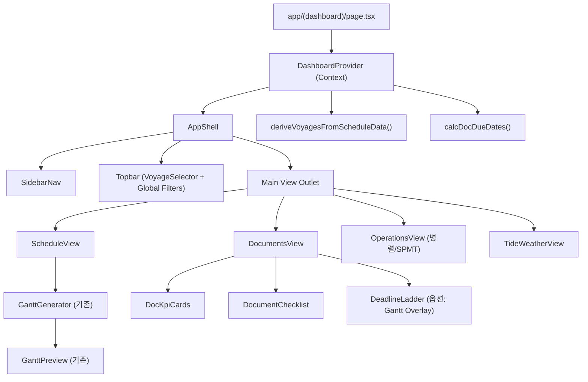

## Exec (기본안: 사이드바 멀티뷰 통합 프로토타입)

* 현행 **GanttGenerator/GanttPreview**(파일 업로드→스케줄 생성→미리보기)를 그대로 “Schedule 뷰”로 유지하고, 상단에 **Voyage Selector**/전역 상태를 두어 **Documents 뷰**와 1:1로 연동합니다.
* 정적 HTML의 강점(문서 패키지·D-4/≥24h·2–3 business days·Tide 참조)을 **DocRule JSON**로 표준화하고, 스케줄 마일스톤에서 **Due Date 자동 계산**하도록 유틸을 추가합니다.
* 구현은 Next.js(App Router) 구조를 유지하며, `zod + date-fns`(이미 스택에 존재)로 스키마 검증/날짜 연산을 고정합니다.
* 성능은 “waterfall 제거/번들 최소화/불필요 re-render 억제” 원칙으로, Gantt 같은 무거운 뷰는 `dynamic import`/memoization으로 격리합니다.

---

## Visual (컴포넌트 분해도: 사이드바 멀티뷰)



---

## Options (A/B/C)

| Option | 구조                                        | 장점                     | 리스크                | Time |
| ------ | ----------------------------------------- | ---------------------- | ------------------ | ---- |
| A      | **Context Provider + 파생계산(useMemo)** (권장) | 최소 침습, 빠른 통합, 타입/검증 고정 | 상태 커지면 Provider 비대 | 1–2일 |
| B      | Zustand 스토어                               | 뷰/탭 증가에 유리, 선택/필터 안정   | 의존성/패턴 추가, 러닝커브    | 2–3일 |
| C      | 서버 저장(프로젝트/상태 영속)                         | 팀 공유/감사로그, 히스토리        | API/DB 설계 필요       | 1–2주 |

---

## Roadmap (Prepare→Pilot→Build→Operate→Scale)

1. **Prepare (반일)**

* DocRule(JSON) 초안 반영: PTW 13 + Loading 4 + NOC 6 + 핵심 운영 룰(D-4/≥24h/2–3 business days)
* 마일스톤 매핑 규칙(이름/패턴) 결정(가정 기반, 미스매치 대비)

2. **Pilot (1일)**

* AppShell + Sidebar + DocumentsView(읽기 전용)
* 일정 업로드/고정데이터 토글 시 DocumentsView KPI 자동 갱신

3. **Build (1–2일)**

* 문서 체크(상태) 로컬 저장(LocalStorage) + Export/Import(JSON)
* DeadlineLadder(오버레이) 1차(선택)

4. **Operate (이후)**

* 담당자/증빙 링크/댓글, 위험 알림(Overdue/At Risk)
* 문서 상태 변경 Audit Trail(간단 로그)

5. **Scale**

* 다중 프로젝트 저장/공유(서버), 권한/RBAC(옵션)

---

## (Auto/QA) 최소 검증 체크리스트

* [ ] 일정 변경(또는 업로드) 시 **Due Date 재계산**이 즉시 반영되는가
* [ ] 마일스톤 누락 시 **Fail-safe(“—” + 원인 표시)** 되는가
* [ ] DocumentsView 렌더가 Gantt 스크롤/줌과 독립적으로 동작(불필요 re-render 억제)

---

## Acc (가정)

* 가정: `ScheduleTask.name` 또는 `activityName`에 “MZP Arrival/Load-out/MZP Departure/AGI Arrival”을 식별 가능한 문자열로 포함(없으면 matcher 테이블로 보완).
* 가정: 문서 상태는 초기엔 사용자 로컬(브라우저) 저장으로 충분(팀 공유는 Phase 2).

---

# 프로토타입 산출물 (컴포넌트/JSON 스키마/마감 계산 유틸)

아래는 **바로 붙여서 실행 가능한 수준**의 최소 파일 세트입니다. (기존 구조/스택과 정합: Next.js App Router, TS, zod, date-fns)

---

## 1) 컴포넌트 (사이드바 멀티뷰)

### `components/app-shell.tsx`

```tsx
"use client";

import * as React from "react";
import { SidebarNav } from "./sidebar-nav";
import { Topbar } from "./topbar";

export type ViewKey = "schedule" | "documents" | "operations" | "tide-weather";

export function AppShell({
  view,
  onViewChange,
  children,
}: {
  view: ViewKey;
  onViewChange: (v: ViewKey) => void;
  children: React.ReactNode;
}) {
  return (
    <div className="h-screen w-full flex">
      <aside className="w-60 border-r border-border bg-card">
        <SidebarNav view={view} onViewChange={onViewChange} />
      </aside>

      <div className="flex-1 flex flex-col min-w-0">
        <header className="h-14 border-b border-border bg-background">
          <Topbar />
        </header>

        <main className="flex-1 min-h-0 overflow-hidden">{children}</main>
      </div>
    </div>
  );
}
```

### `components/sidebar-nav.tsx`

```tsx
"use client";

import { ViewKey } from "./app-shell";
import { Button } from "@/components/ui/button";

const items: Array<{ key: ViewKey; label: string }> = [
  { key: "schedule", label: "Schedule (Gantt)" },
  { key: "documents", label: "Documents" },
  { key: "operations", label: "Operations" },
  { key: "tide-weather", label: "Tide & Weather" },
];

export function SidebarNav({
  view,
  onViewChange,
}: {
  view: ViewKey;
  onViewChange: (v: ViewKey) => void;
}) {
  return (
    <nav className="p-3 space-y-2">
      <div className="text-xs font-semibold text-muted-foreground px-2 py-2">
        Control Tower
      </div>
      {items.map((it) => (
        <Button
          key={it.key}
          variant={view === it.key ? "default" : "ghost"}
          className="w-full justify-start"
          onClick={() => onViewChange(it.key)}
        >
          {it.label}
        </Button>
      ))}
    </nav>
  );
}
```

### `components/topbar.tsx` (Voyage 선택/전역 필터)

```tsx
"use client";

import * as React from "react";
import { useDashboard } from "@/lib/dashboard/dashboard-provider";
import { Select, SelectContent, SelectItem, SelectTrigger, SelectValue } from "@/components/ui/select";

export function Topbar() {
  const { voyages, selectedVoyageId, setSelectedVoyageId } = useDashboard();

  return (
    <div className="h-full px-4 flex items-center gap-4">
      <div className="font-semibold text-sm">AGI TR Dashboard</div>

      <div className="flex-1" />

      <div className="w-[320px]">
        <Select value={selectedVoyageId ?? ""} onValueChange={(v) => setSelectedVoyageId(v)}>
          <SelectTrigger>
            <SelectValue placeholder="Voyage 선택" />
          </SelectTrigger>
          <SelectContent>
            {voyages.map((v) => (
              <SelectItem key={v.id} value={v.id}>
                {v.label}
              </SelectItem>
            ))}
          </SelectContent>
        </Select>
      </div>
    </div>
  );
}
```

---

## 2) 전역 상태(Provider) + 뷰 라우팅(페이지)

### `lib/dashboard/dashboard-provider.tsx`

```tsx
"use client";

import * as React from "react";
import type { ScheduleData } from "@/lib/types"; // 기존 타입 사용 :contentReference[oaicite:11]{index=11}
import { deriveVoyagesFromScheduleData } from "../voyage/derive-voyages";
import { loadDocRules } from "../documents/load-doc-rules";
import { calcDocDueDates } from "../documents/deadline-engine";
import type { DocStatusMap } from "../documents/types";

type DashboardState = {
  scheduleData: ScheduleData | null;
  setScheduleData: (d: ScheduleData | null) => void;

  voyages: Array<{ id: string; label: string; tripKey?: string }>;
  selectedVoyageId: string | null;
  setSelectedVoyageId: (id: string) => void;

  // 문서 상태(체크/담당자/증빙) - 초기엔 로컬 저장
  docStatus: DocStatusMap;
  setDocStatus: (m: DocStatusMap) => void;

  // 계산 결과(선택 Voyage 기준)
  computed: ReturnType<typeof calcDocDueDates> | null;
};

const Ctx = React.createContext<DashboardState | null>(null);

export function DashboardProvider({ children }: { children: React.ReactNode }) {
  const [scheduleData, setScheduleData] = React.useState<ScheduleData | null>(null);
  const [selectedVoyageId, setSelectedVoyageId] = React.useState<string | null>(null);
  const [docStatus, setDocStatus] = React.useState<DocStatusMap>({});

  const voyages = React.useMemo(() => {
    const vs = deriveVoyagesFromScheduleData(scheduleData);
    // 최초 선택 기본값
    if (!selectedVoyageId && vs.length > 0) setSelectedVoyageId(vs[0].id);
    return vs.map((v) => ({ id: v.id, label: v.label, tripKey: v.tripKey }));
  }, [scheduleData]); // eslint-disable-line react-hooks/exhaustive-deps

  const computed = React.useMemo(() => {
    if (!scheduleData || !selectedVoyageId) return null;
    const all = deriveVoyagesFromScheduleData(scheduleData);
    const v = all.find((x) => x.id === selectedVoyageId);
    if (!v) return null;

    const rules = loadDocRules();
    return calcDocDueDates({
      voyage: v,
      rules,
      statusMap: docStatus,
      now: new Date(),
    });
  }, [scheduleData, selectedVoyageId, docStatus]);

  const value: DashboardState = {
    scheduleData,
    setScheduleData,
    voyages,
    selectedVoyageId,
    setSelectedVoyageId,
    docStatus,
    setDocStatus,
    computed,
  };

  return <Ctx.Provider value={value}>{children}</Ctx.Provider>;
}

export function useDashboard() {
  const v = React.useContext(Ctx);
  if (!v) throw new Error("DashboardProvider missing");
  return v;
}
```

### `app/(dashboard)/page.tsx`

```tsx
"use client";

import * as React from "react";
import { AppShell, ViewKey } from "@/components/app-shell";
import { DashboardProvider, useDashboard } from "@/lib/dashboard/dashboard-provider";
import dynamic from "next/dynamic";

// 무거운 뷰는 dynamic import로 분리 (번들/초기 로드 최적화) :contentReference[oaicite:12]{index=12}
const ScheduleView = dynamic(() => import("@/components/views/schedule-view").then(m => m.ScheduleView), { ssr: false });
const DocumentsView = dynamic(() => import("@/components/views/documents-view").then(m => m.DocumentsView), { ssr: false });

function Inner() {
  const [view, setView] = React.useState<ViewKey>("schedule");
  const { computed } = useDashboard();

  return (
    <AppShell view={view} onViewChange={setView}>
      <div className="h-full w-full overflow-auto p-4">
        {view === "schedule" && <ScheduleView />}
        {view === "documents" && <DocumentsView computed={computed} />}
        {view === "operations" && <div>OperationsView (프로토타입: 다음 단계)</div>}
        {view === "tide-weather" && <div>TideWeatherView (프로토타입: 다음 단계)</div>}
      </div>
    </AppShell>
  );
}

export default function Page() {
  return (
    <DashboardProvider>
      <Inner />
    </DashboardProvider>
  );
}
```

### `components/views/schedule-view.tsx` (기존 GanttGenerator 재사용)

```tsx
"use client";

import * as React from "react";
import { useDashboard } from "@/lib/dashboard/dashboard-provider";
import { GanttGenerator } from "@/components/gantt-generator"; // 기존 컴포넌트 :contentReference[oaicite:13]{index=13}

/**
 * 최소 침습 통합:
 * - GanttGenerator 내부에서 scheduleData를 만들고 있으므로,
 *   onScheduleDataChange 콜백을 추가(패치)하면 Provider에 주입 가능.
 */
export function ScheduleView() {
  const { setScheduleData } = useDashboard();

  return (
    <div className="space-y-4">
      <div className="text-sm text-muted-foreground">
        일정 업로드/생성 결과가 Documents 뷰의 Due Date 계산에 즉시 반영됩니다.
      </div>

      <GanttGenerator
        // @ts-expect-error: 프로토타입 패치(아래에 추가 안내)
        onScheduleDataChange={(d) => setScheduleData(d)}
      />
    </div>
  );
}
```

### `components/views/documents-view.tsx`

```tsx
"use client";

import * as React from "react";
import type { ReturnTypeOfCalc } from "@/lib/documents/types";
import { DocumentKpiCards } from "@/components/documents/document-kpi-cards";
import { DocumentChecklist } from "@/components/documents/document-checklist";

export function DocumentsView({ computed }: { computed: ReturnTypeOfCalc | null }) {
  if (!computed) {
    return <div className="text-sm text-muted-foreground">Schedule/Voyage를 먼저 선택하세요.</div>;
  }

  return (
    <div className="space-y-4">
      <DocumentKpiCards computed={computed} />
      <DocumentChecklist computed={computed} />
    </div>
  );
}
```

---

## 3) JSON 스키마 (DocRule/Status/Voyage)

### `lib/documents/schemas.ts` (zod 기반)

```ts
import { z } from "zod";

export const MilestoneKey = z.enum(["MZP_ARRIVAL", "LOAD_OUT", "MZP_DEPARTURE", "AGI_ARRIVAL"]);

export const DocRuleSchema = z.object({
  id: z.string(),
  title: z.string(),
  category: z.enum(["PTW_PACK", "LOADING_DOCS", "NOC", "OTHER"]),
  mandatory: z.boolean().default(true),

  // 마감 기준점(Anchor)
  anchor: MilestoneKey,

  // D-4 같은 규칙(음수면 이전)
  offsetDays: z.number().int(),

  // "2-3 business days" 같은 케이스
  businessDays: z.boolean().default(false),

  // ">=24h" 같은 시간 기준(없으면 null)
  leadHours: z.number().int().nullable().default(null),

  tags: z.array(z.string()).default([]),
});

export const DocStatusSchema = z.object({
  ruleId: z.string(),
  state: z.enum(["NOT_STARTED", "IN_PROGRESS", "SUBMITTED", "APPROVED", "REJECTED"]).default("NOT_STARTED"),
  owner: z.string().nullable().default(null),
  submittedAt: z.string().datetime().nullable().default(null),
  evidenceUrl: z.string().url().nullable().default(null),
  remark: z.string().nullable().default(null),
});

export type DocRule = z.infer<typeof DocRuleSchema>;
export type DocStatus = z.infer<typeof DocStatusSchema>;
```

### `data/doc-rules.default.json` (정적 HTML에서 추출한 초기 룰셋)

* 핵심: **D-4 패키지 완비**, **Land Permit 2–3 business days**, **Marine PTW ≥24h**, PTW Pack 13 items + Loading docs + NOC docs

```json
{
  "version": "0.1.0",
  "rules": [
    { "id": "PTW_RA", "title": "Risk Assessment", "category": "PTW_PACK", "mandatory": true, "anchor": "MZP_ARRIVAL", "offsetDays": -4, "businessDays": false, "leadHours": null, "tags": ["ADPort"] },
    { "id": "PTW_CONSENT", "title": "PTW applicant/receiver consent form", "category": "PTW_PACK", "mandatory": true, "anchor": "MZP_ARRIVAL", "offsetDays": -4, "businessDays": false, "leadHours": null, "tags": ["ADPort"] },
    { "id": "PTW_LAND_APP", "title": "PTW Application for Land oversized & heavy load", "category": "PTW_PACK", "mandatory": true, "anchor": "LOAD_OUT", "offsetDays": -3, "businessDays": true, "leadHours": null, "tags": ["LandPermit", "2-3 business days"] },
    { "id": "PTW_STOWAGE", "title": "Stowage Plan", "category": "PTW_PACK", "mandatory": true, "anchor": "LOAD_OUT", "offsetDays": -4, "businessDays": false, "leadHours": null, "tags": ["stowage"] },
    { "id": "PTW_MS", "title": "Method Statement (incl. weather criteria)", "category": "PTW_PACK", "mandatory": true, "anchor": "MZP_ARRIVAL", "offsetDays": -4, "businessDays": false, "leadHours": null, "tags": ["HSE", "weather"] },
    { "id": "PTW_COUNTDOWN", "title": "Countdown Plan", "category": "PTW_PACK", "mandatory": false, "anchor": "MZP_ARRIVAL", "offsetDays": -3, "businessDays": false, "leadHours": null, "tags": [] },
    { "id": "PTW_UNDERTAKING", "title": "Undertaking Letter", "category": "PTW_PACK", "mandatory": false, "anchor": "MZP_ARRIVAL", "offsetDays": -3, "businessDays": false, "leadHours": null, "tags": [] },
    { "id": "PTW_STABILITY", "title": "Stability Calculation", "category": "PTW_PACK", "mandatory": true, "anchor": "MZP_DEPARTURE", "offsetDays": -2, "businessDays": false, "leadHours": null, "tags": ["stability"] },
    { "id": "PTW_CERTS", "title": "3rd party equipment certificates (SPMT/operator)", "category": "PTW_PACK", "mandatory": false, "anchor": "LOAD_OUT", "offsetDays": -3, "businessDays": false, "leadHours": null, "tags": ["SPMT"] },
    { "id": "PTW_MWS", "title": "Marine Warranty Survey (Required before sailing)", "category": "PTW_PACK", "mandatory": true, "anchor": "MZP_DEPARTURE", "offsetDays": -1, "businessDays": false, "leadHours": 24, "tags": ["MWS", ">=24h"] },
    { "id": "PTW_MOORING", "title": "Mooring Plan", "category": "PTW_PACK", "mandatory": false, "anchor": "LOAD_OUT", "offsetDays": -2, "businessDays": false, "leadHours": null, "tags": ["mooring"] },
    { "id": "PTW_LASHING", "title": "Lashing Plan", "category": "PTW_PACK", "mandatory": true, "anchor": "LOAD_OUT", "offsetDays": -2, "businessDays": false, "leadHours": null, "tags": ["lashing"] },
    { "id": "PTW_TIDE", "title": "Tide table / tide window confirmation (Mina Zayed)", "category": "PTW_PACK", "mandatory": true, "anchor": "LOAD_OUT", "offsetDays": -2, "businessDays": false, "leadHours": null, "tags": ["tide"] },

    { "id": "LOAD_MANIFEST", "title": "Cargo list / manifest (per voyage)", "category": "LOADING_DOCS", "mandatory": false, "anchor": "LOAD_OUT", "offsetDays": -3, "businessDays": false, "leadHours": null, "tags": ["dims/weight/CoG"] },
    { "id": "LOAD_CIPL", "title": "Packing List / CI (if applicable)", "category": "LOADING_DOCS", "mandatory": false, "anchor": "LOAD_OUT", "offsetDays": -3, "businessDays": false, "leadHours": null, "tags": ["CIPL"] },
    { "id": "LOAD_PHOTOS", "title": "Cargo photos (current condition)", "category": "LOADING_DOCS", "mandatory": false, "anchor": "LOAD_OUT", "offsetDays": -2, "businessDays": false, "leadHours": null, "tags": ["photos"] },
    { "id": "LOAD_SEQUENCE", "title": "Load sequence / trailer allocation", "category": "LOADING_DOCS", "mandatory": false, "anchor": "LOAD_OUT", "offsetDays": -2, "businessDays": false, "leadHours": null, "tags": ["sequence"] },

    { "id": "NOC_TRADE", "title": "Local trading license", "category": "NOC", "mandatory": true, "anchor": "MZP_DEPARTURE", "offsetDays": -2, "businessDays": false, "leadHours": null, "tags": [] },
    { "id": "NOC_RA_ERP", "title": "Detailed risk assessment & emergency response plan", "category": "NOC", "mandatory": true, "anchor": "MZP_DEPARTURE", "offsetDays": -2, "businessDays": false, "leadHours": null, "tags": [] },
    { "id": "NOC_NOOBJ", "title": "No objection from relevant authorities", "category": "NOC", "mandatory": true, "anchor": "MZP_DEPARTURE", "offsetDays": -2, "businessDays": false, "leadHours": null, "tags": [] },
    { "id": "NOC_VOYAGEPLAN", "title": "Voyage plan (MZP → AGI)", "category": "NOC", "mandatory": true, "anchor": "MZP_DEPARTURE", "offsetDays": -1, "businessDays": false, "leadHours": null, "tags": [] },
    { "id": "NOC_ROUTEMAP", "title": "Route map", "category": "NOC", "mandatory": false, "anchor": "MZP_DEPARTURE", "offsetDays": -1, "businessDays": false, "leadHours": null, "tags": [] },
    { "id": "NOC_AWARD", "title": "Contract award letter copy", "category": "NOC", "mandatory": false, "anchor": "MZP_DEPARTURE", "offsetDays": -1, "businessDays": false, "leadHours": null, "tags": [] }
  ]
}
```

---

## 4) 마감 계산 유틸 (Due Date Engine)

### `lib/documents/deadlines.ts`

```ts
import { addDays, isWeekend } from "date-fns";

export function addBusinessDaysSafe(date: Date, deltaDays: number) {
  // deltaDays가 음수도 가능
  let d = new Date(date);
  const step = deltaDays >= 0 ? 1 : -1;
  let remain = Math.abs(deltaDays);

  while (remain > 0) {
    d = addDays(d, step);
    if (!isWeekend(d)) remain -= 1;
  }
  return d;
}

export function applyOffset(date: Date, offsetDays: number, businessDays: boolean) {
  if (businessDays) return addBusinessDaysSafe(date, offsetDays);
  return addDays(date, offsetDays);
}

export type RiskTier = "ON_TRACK" | "AT_RISK" | "OVERDUE" | "UNKNOWN";

export function evalRisk(dueAt: Date | null, now: Date, atRiskHours = 48): RiskTier {
  if (!dueAt) return "UNKNOWN";
  const diffMs = dueAt.getTime() - now.getTime();
  const diffHours = diffMs / (1000 * 60 * 60);
  if (diffHours < 0) return "OVERDUE";
  if (diffHours <= atRiskHours) return "AT_RISK";
  return "ON_TRACK";
}
```

### `lib/documents/deadline-engine.ts`

```ts
import type { DocRule } from "./schemas";
import type { VoyageDerived, DocStatusMap, ReturnTypeOfCalc } from "./types";
import { applyOffset, evalRisk } from "./deadlines";

export function calcDocDueDates({
  voyage,
  rules,
  statusMap,
  now,
}: {
  voyage: VoyageDerived;
  rules: DocRule[];
  statusMap: DocStatusMap;
  now: Date;
}): ReturnTypeOfCalc {
  const items = rules.map((r) => {
    const anchorDate = voyage.milestones[r.anchor] ?? null;

    const dueBase = anchorDate ? applyOffset(anchorDate, r.offsetDays, r.businessDays) : null;

    // leadHours(>=24h) 같은 조건은 “최소 제출 마감”으로 해석:
    // - 기준일이 존재하면 dueBase에서 leadHours를 추가 차감하는 방식도 가능
    // - 프로토타입에선 리스크 판정에만 사용(옵션)
    const dueAt = dueBase;

    const risk = evalRisk(dueAt, now, r.leadHours ?? 48);
    const status = statusMap[`${voyage.id}::${r.id}`] ?? { ruleId: r.id, state: "NOT_STARTED" };

    return {
      voyageId: voyage.id,
      rule: r,
      anchorDate,
      dueAt,
      risk,
      status,
    };
  });

  const totals = {
    total: items.length,
    overdue: items.filter((x) => x.risk === "OVERDUE").length,
    atRisk: items.filter((x) => x.risk === "AT_RISK").length,
    done: items.filter((x) => ["SUBMITTED", "APPROVED"].includes(x.status.state)).length,
  };

  return { voyage, items, totals };
}
```

### `lib/documents/load-doc-rules.ts`

```ts
import raw from "@/data/doc-rules.default.json";
import { DocRuleSchema } from "./schemas";

export function loadDocRules() {
  // zod로 규칙을 고정(머신 파싱/회귀 방지)
  return raw.rules.map((r: any) => DocRuleSchema.parse(r));
}
```

### `lib/documents/types.ts`

```ts
import type { DocRule, DocStatus } from "./schemas";

export type DocStatusMap = Record<string, DocStatus>;

export type VoyageDerived = {
  id: string;
  label: string;
  tripKey?: string;
  milestones: Partial<Record<"MZP_ARRIVAL" | "LOAD_OUT" | "MZP_DEPARTURE" | "AGI_ARRIVAL", Date>>;
};

export type CalcItem = {
  voyageId: string;
  rule: DocRule;
  anchorDate: Date | null;
  dueAt: Date | null;
  risk: "ON_TRACK" | "AT_RISK" | "OVERDUE" | "UNKNOWN";
  status: DocStatus;
};

export type ReturnTypeOfCalc = {
  voyage: VoyageDerived;
  items: CalcItem[];
  totals: { total: number; overdue: number; atRisk: number; done: number };
};
```

---

## 5) Voyage 마일스톤 추출(스케줄 → Voyage)

### `lib/voyage/derive-voyages.ts`

```ts
import type { ScheduleData, ScheduleTask } from "@/lib/types"; // 기존 타입 :contentReference[oaicite:15]{index=15}
import type { VoyageDerived } from "@/lib/documents/types";

function toDate(x: string | Date): Date {
  return x instanceof Date ? x : new Date(x);
}

function pickMilestone(tasks: ScheduleTask[], matcher: RegExp): Date | null {
  const hit = tasks.find((t) => matcher.test(String(t.name)));
  if (!hit) return null;
  return toDate(hit.startDate);
}

/**
 * 핵심: Activity ID (2)가 Trip 그룹 키라는 시스템 정의를 그대로 사용 :contentReference[oaicite:16]{index=16}
 */
export function deriveVoyagesFromScheduleData(scheduleData: ScheduleData | null): VoyageDerived[] {
  if (!scheduleData) return [];

  const byTrip = new Map<string, ScheduleTask[]>();
  for (const t of scheduleData.tasks ?? []) {
    const k = String((t as any).activityId2 ?? "UNKNOWN");
    byTrip.set(k, [...(byTrip.get(k) ?? []), t]);
  }

  const out: VoyageDerived[] = [];
  let idx = 1;

  for (const [tripKey, tasks] of byTrip.entries()) {
    // matcher는 프로젝트 네이밍에 맞춰 조정(프로토타입: 기본 패턴)
    const mzpArrival = pickMilestone(tasks, /MZP\s*Arrival|Arrives\s*to\s*MZP/i);
    const loadOut = pickMilestone(tasks, /Load-?out/i);
    const mzpDeparture = pickMilestone(tasks, /MZP\s*Departure|Sail-?away|Transit start/i);
    const agiArrival = pickMilestone(tasks, /AGI\s*Arrival|Arrives\s*to\s*AGI/i);

    out.push({
      id: `V${idx}`,
      label: `Voyage ${idx} (${tripKey})`,
      tripKey,
      milestones: {
        MZP_ARRIVAL: mzpArrival ?? undefined,
        LOAD_OUT: loadOut ?? undefined,
        MZP_DEPARTURE: mzpDeparture ?? undefined,
        AGI_ARRIVAL: agiArrival ?? undefined,
      },
    });

    idx += 1;
  }

  return out;
}
```

---

## 6) Documents UI (KPI + 체크리스트)

### `components/documents/document-kpi-cards.tsx`

```tsx
"use client";

import { Card, CardContent, CardHeader, CardTitle } from "@/components/ui/card";
import type { ReturnTypeOfCalc } from "@/lib/documents/types";

export function DocumentKpiCards({ computed }: { computed: ReturnTypeOfCalc }) {
  const { totals } = computed;

  return (
    <div className="grid grid-cols-4 gap-3">
      <Card>
        <CardHeader><CardTitle className="text-xs">TOTAL</CardTitle></CardHeader>
        <CardContent className="text-2xl font-bold">{totals.total}</CardContent>
      </Card>
      <Card>
        <CardHeader><CardTitle className="text-xs">DONE</CardTitle></CardHeader>
        <CardContent className="text-2xl font-bold">{totals.done}</CardContent>
      </Card>
      <Card>
        <CardHeader><CardTitle className="text-xs">AT RISK</CardTitle></CardHeader>
        <CardContent className="text-2xl font-bold">{totals.atRisk}</CardContent>
      </Card>
      <Card>
        <CardHeader><CardTitle className="text-xs">OVERDUE</CardTitle></CardHeader>
        <CardContent className="text-2xl font-bold">{totals.overdue}</CardContent>
      </Card>
    </div>
  );
}
```

### `components/documents/document-checklist.tsx`

```tsx
"use client";

import * as React from "react";
import type { ReturnTypeOfCalc } from "@/lib/documents/types";
import { useDashboard } from "@/lib/dashboard/dashboard-provider";
import { Card, CardContent, CardHeader, CardTitle } from "@/components/ui/card";
import { Checkbox } from "@/components/ui/checkbox";

function keyOf(voyageId: string, ruleId: string) {
  return `${voyageId}::${ruleId}`;
}

export function DocumentChecklist({ computed }: { computed: ReturnTypeOfCalc }) {
  const { docStatus, setDocStatus } = useDashboard();

  const onToggleSubmitted = (ruleId: string, checked: boolean) => {
    const k = keyOf(computed.voyage.id, ruleId);
    const prev = docStatus[k] ?? { ruleId, state: "NOT_STARTED" as const };

    const next = {
      ...prev,
      state: checked ? "SUBMITTED" : "IN_PROGRESS",
      submittedAt: checked ? new Date().toISOString() : null,
    };

    setDocStatus({ ...docStatus, [k]: next });
  };

  return (
    <Card>
      <CardHeader>
        <CardTitle className="text-sm">Document Checklist</CardTitle>
      </CardHeader>
      <CardContent className="space-y-2">
        {computed.items.map((it) => {
          const k = keyOf(it.voyageId, it.rule.id);
          const st = docStatus[k] ?? it.status;
          const isDone = st.state === "SUBMITTED" || st.state === "APPROVED";

          return (
            <div key={k} className="flex items-center gap-3 rounded-md border border-border p-2">
              <Checkbox checked={isDone} onCheckedChange={(v) => onToggleSubmitted(it.rule.id, Boolean(v))} />
              <div className="flex-1">
                <div className="text-sm font-medium">
                  {it.rule.title}
                  {it.rule.mandatory ? <span className="ml-2 text-xs text-destructive">Mandatory</span> : <span className="ml-2 text-xs text-muted-foreground">Optional</span>}
                </div>
                <div className="text-xs text-muted-foreground">
                  Anchor: {it.rule.anchor} | Offset: {it.rule.offsetDays} days
                  {it.rule.businessDays ? " (businessDays)" : ""} | Risk: {it.risk}
                </div>
              </div>
              <div className="text-xs text-muted-foreground min-w-[140px] text-right">
                Due: {it.dueAt ? it.dueAt.toISOString().slice(0, 10) : "—"}
              </div>
            </div>
          );
        })}
      </CardContent>
    </Card>
  );
}
```

---

# 필수 패치 1개 (기존 GanttGenerator에 콜백 추가)

현행 구조에서 `GanttGenerator`가 최상위 상태를 관리하므로(업로드/생성/미리보기), 생성 결과의 `scheduleData`를 외부로 노출하는 **콜백 1개만 추가**하면 됩니다.

### `components/gantt-generator.tsx` (추가)

```tsx
// props에 추가
export function GanttGenerator({
  onScheduleDataChange,
}: {
  onScheduleDataChange?: (d: any) => void;
}) {
  // ... 기존 로직에서 scheduleData set 하는 지점에
  // setScheduleData(newData);
  // 아래 한 줄 추가:
  // onScheduleDataChange?.(newData);
}
```

---

## 🔧 실행 커맨드(로컬)

```bash
pnpm install
pnpm dev
```

---

## ZERO log

| 단계    | 이유                                                          | 위험 | 요청데이터                            | 다음조치                             |
| ----- | ----------------------------------------------------------- | -- | -------------------------------- | -------------------------------- |
| 해당 없음 | 본 작업은 사용자 제공 파일/구조 기반의 프로토타입 설계로, 규정/요율/실시간 데이터 확정이 필요하지 않음 | 낮음 | (선택) 실제 스케줄 Task 명명 규칙(마일스톤 문자열) | 마일스톤 matcher를 프로젝트 네이밍에 맞게 1회 튜닝 |

---

원하시면 다음 단계로, **DeadlineLadder(문서 마감 세로선) 오버레이**를 `GanttPreview`에 “옵션 컴포넌트”로 붙이는 패치까지 바로 확장하겠습니다. (현재 `GanttPreview` 구조/스크롤 동기화 규칙을 존중하는 방식으로 설계)
